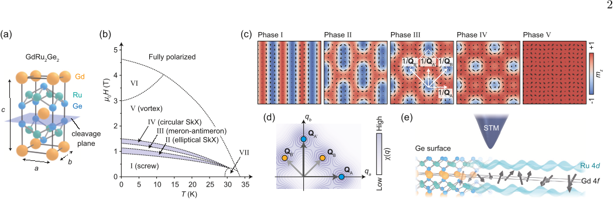
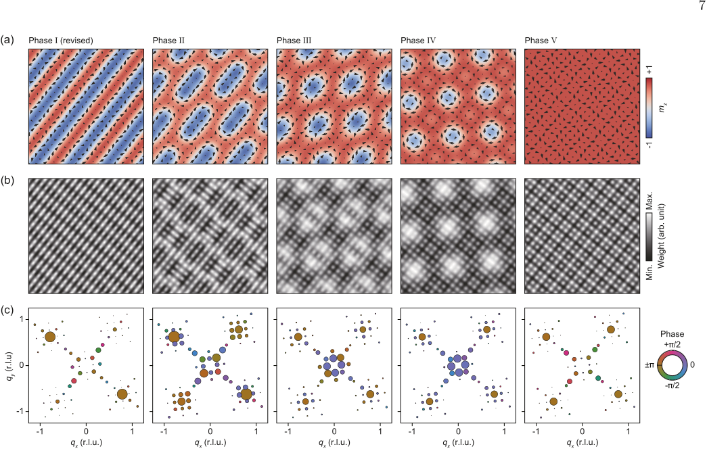
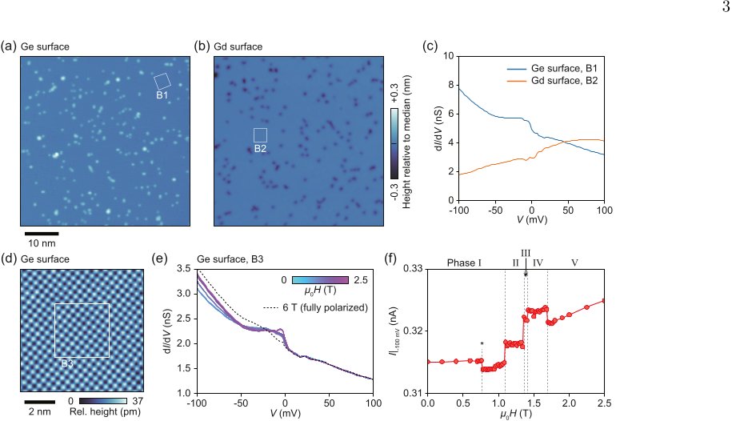
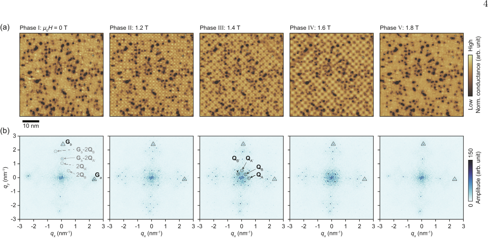

Imagine a world where tiny magnetic whirlpools—called skyrmions—twist and dance within a crystal lattice, their intricate patterns shaping the material’s electronic properties. Recently, scientists have captured atomic-scale images of these fascinating spin textures intertwined with electronic charge patterns in a complex magnet, shedding light on the mysterious forces that stabilize such exotic magnetic phases.

> **TL;DR**
> - Researchers used scanning tunneling microscopy to directly visualize atomic-scale charge modulations linked to complex multi-wavevector spin textures in the skyrmion magnet GdRu2Ge2.
> - They found that the alignment of localized Gd spins strongly correlates with variations in the local electronic density of states of itinerant Ru electrons, revealing an intimate coupling between spin and charge at the atomic scale.

*Note: this summary is based on a preprint — research shared ahead of formal peer review.*

Skyrmions are nanoscale swirling spin configurations that hold promise for future spintronic technologies due to their stability and small size. While skyrmions are often stabilized by asymmetric interactions in non-centrosymmetric crystals, recent discoveries have found surprisingly small skyrmions in centrosymmetric materials where these interactions vanish. In such cases, the mechanisms stabilizing these complex spin patterns remain unclear but are believed to involve interactions mediated by itinerant electrons, such as the Ruderman-Kittel-Kasuya-Yosida (RKKY) interaction. GdRu2Ge2 is a centrosymmetric magnet exhibiting multiple magnetic phases, including two skyrmion crystal phases, making it an ideal system to explore how spin and charge intertwine at the atomic scale.

The researchers cleaved single crystals of GdRu2Ge2 to expose clean Ge-terminated surfaces suitable for scanning tunneling microscopy (STM). STM allowed them to map the local density of electronic states (LDOS) with atomic resolution across different magnetic phases induced by varying magnetic fields. By performing detailed Fourier analysis, including a non-uniform discrete Fourier transform, they extracted both amplitude and phase information of the LDOS modulations corresponding to the underlying multi-wavevector spin textures. Complementing these measurements, they employed simple numerical modeling based on the known spin structures to interpret the observed charge patterns and their relationship to the spin configurations.

The STM images revealed distinct periodic LDOS modulations in each magnetic phase, reflecting the complex multi-Q spin textures present in GdRu2Ge2. Notably, the LDOS patterns exhibited a rich variety of motifs, including a unique 'basketweave' pattern in one skyrmion phase characterized by bond-centered stripe modulations. The analysis showed that the local electronic density of Ru 4d orbitals closely tracks the alignment of neighboring Gd 4f spins, demonstrating a tight coupling between localized spin order and itinerant electron charge distribution. These findings provide direct atomic-scale evidence that multi-Q spin order in the localized moments induces corresponding multi-Q electronic textures in the conduction electrons, highlighting the microscopic intertwining of spin and charge degrees of freedom in this itinerant magnet.

This study advances our understanding of how complex magnetic orders emerge and stabilize in centrosymmetric materials lacking conventional asymmetric interactions. By directly imaging the atomic-scale relationship between spin textures and electronic charge modulations, the work offers a microscopic picture of the mechanisms underpinning exotic magnetic phases such as skyrmion crystals. These insights are crucial for the future design of spintronic devices that exploit skyrmions and related non-collinear spin structures, potentially enabling energy-efficient information storage and processing technologies.

While the imaging and analysis provide compelling evidence of intertwined spin and charge textures, the study focuses on a specific material system and relies on a simplified numerical model to interpret the data. The exact microscopic interactions stabilizing the observed phases, including the role of higher-order spin interactions and electron correlations, require further theoretical and experimental investigation. Additionally, as the work is currently reported on a preprint server, peer-reviewed validation and exploration of the generality of these findings across other materials remain important next steps.

## Figures

*GdRu2Ge2's layered structure and magnetic phases are shown, highlighting how magnetic layers interact through conductive Ru-Ge layers visible via STM. — Figure from Christopher J. Butler et al., [CC BY 4.0](http://creativecommons.org/licenses/by/4.0/), caption edited.*

*Modeled magnetic patterns and their wave-like maps show complex spin structures and their detailed frequency patterns. — Figure from Christopher J. Butler et al., [CC BY 4.0](http://creativecommons.org/licenses/by/4.0/), caption edited.*

*Images show atomic surfaces of GdRu2Ge2 with magnetic field effects on electron conductance revealing subtle magnetic phase changes. — Figure from Christopher J. Butler et al., [CC BY 4.0](http://creativecommons.org/licenses/by/4.0/), caption edited.*

*Images show how magnetic fields change surface patterns on Ge, revealing new details about its magnetic structure. — Figure from Christopher J. Butler et al., [CC BY 4.0](http://creativecommons.org/licenses/by/4.0/), caption edited.*

## Sources

- [Intra-unit-cell resolved intertwining of multi-$Q$ charge and spin textures in an itinerant skyrmion magnet](https://arxiv.org/abs/2608.05528)
- DOI: [10.48550/arxiv.2608.05528](https://doi.org/10.48550/arxiv.2608.05528)

*This article reuses and adapts text and figures from the original research by Christopher J. Butler et al., available via arXiv Materials Science, under the [CC BY 4.0](http://creativecommons.org/licenses/by/4.0/) license.*
