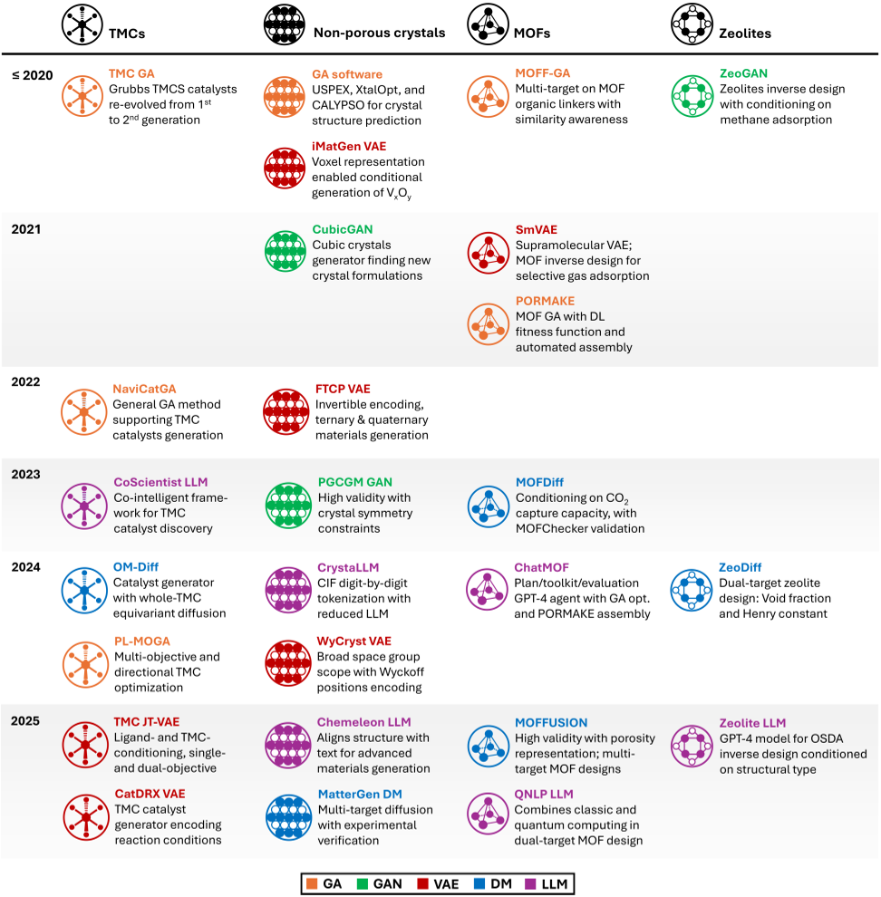
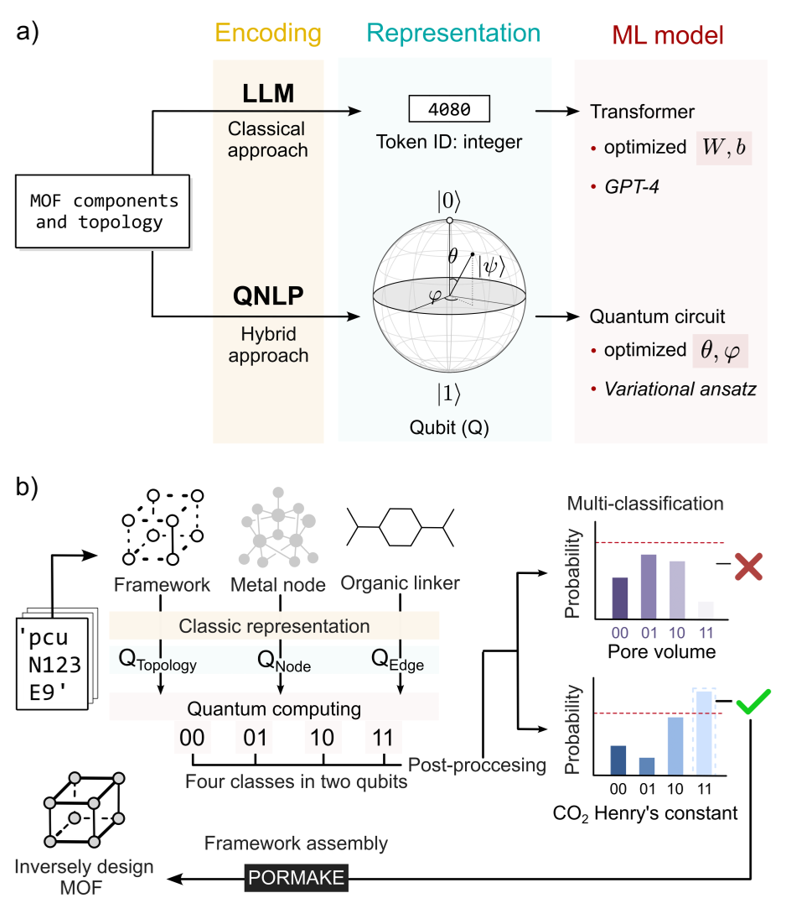
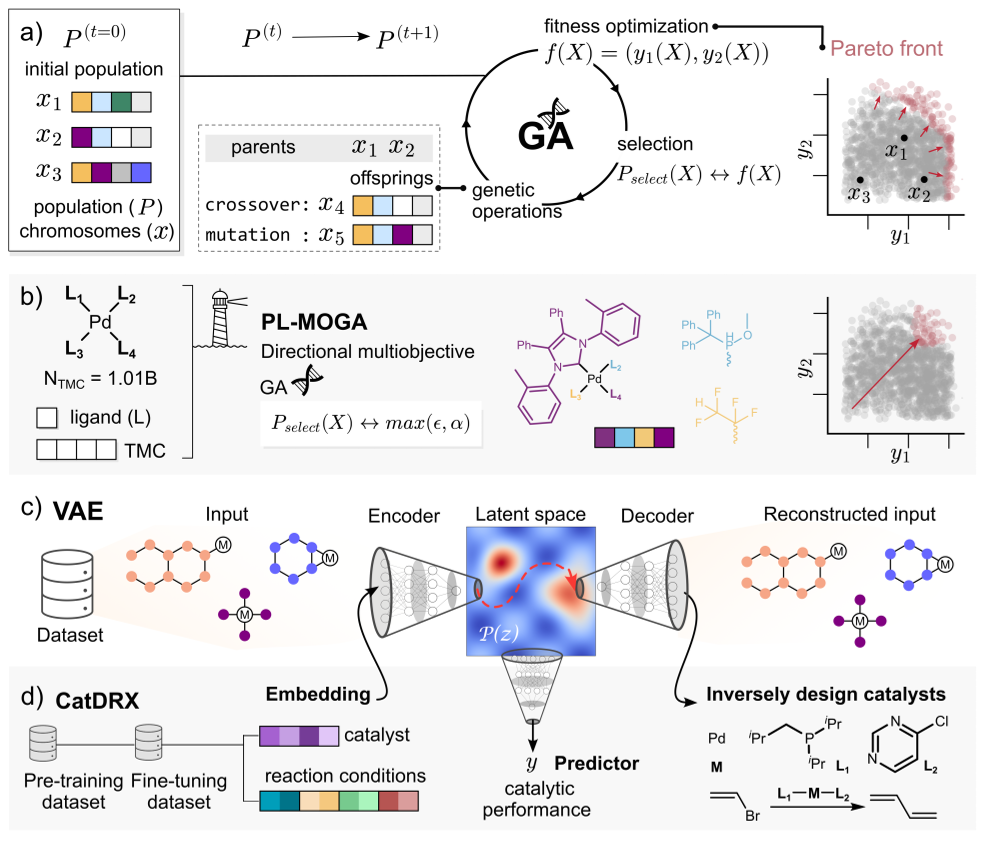
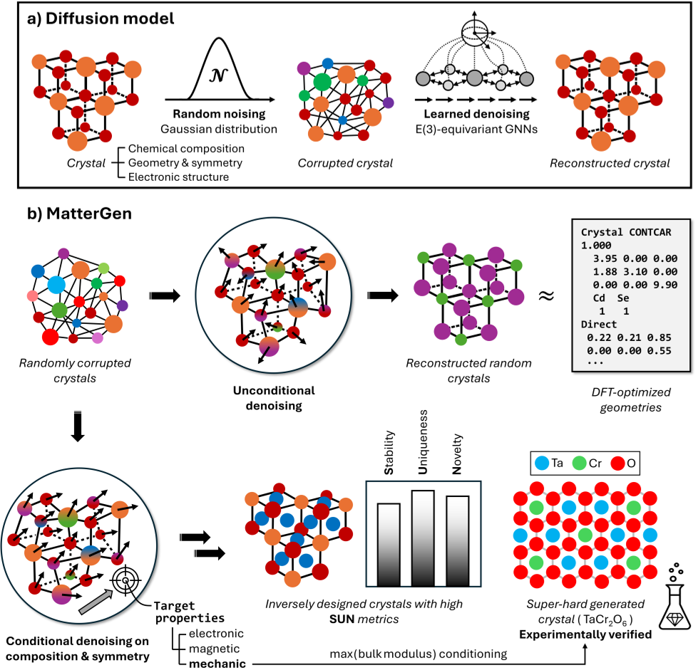

Imagine if we could tell a computer the exact properties we want in a new material—say, a catalyst that speeds up a chemical reaction or a crystal that efficiently captures carbon dioxide—and have it invent the perfect compound from scratch. Thanks to advances in generative artificial intelligence (AI), this is becoming a reality. While AI has already revolutionized organic chemistry and drug discovery, designing inorganic compounds remains a tougher challenge due to their complex structures and diverse elements. In this post, we dive into how researchers are overcoming these hurdles and harnessing generative AI to flip traditional materials discovery on its head.

> **TL;DR**
> - Generative AI reverses the usual approach by designing inorganic compounds based on desired properties, rather than predicting properties from known compounds.
> - Advanced AI models and evolving data representations are enabling the design of complex inorganic materials like transition metal complexes, metal-organic frameworks, and crystals with tailored functions.

*Note: this summary is based on a preprint — research shared ahead of formal peer review.*

Inorganic compounds—such as transition metal complexes, microporous materials like metal-organic frameworks (MOFs) and zeolites, and dense inorganic crystals—play critical roles in catalysis, energy storage, and environmental technologies. Traditionally, developing these materials relied on experimental trial and error or computational predictions that start from a compound and estimate its properties. However, the vast chemical space and intricate structures of inorganic materials make it difficult to efficiently discover new candidates with desired functions. Generative AI offers a promising alternative by enabling inverse design: starting from target properties and generating candidate compounds that meet those criteria.

Generative AI methods for inorganic compound design fall mainly into two categories: deep learning (DL) and evolutionary computing (EC). DL approaches include diffusion models that iteratively refine noisy representations into realistic compounds, variational autoencoders that learn compressed representations of materials, and large language models that generate chemical structures from textual prompts. EC methods, such as genetic algorithms, mimic natural selection by evolving populations of candidate compounds through mutation and crossover, guided by fitness functions that evaluate how well candidates meet target properties. These AI methods rely on rich datasets of inorganic compounds—both experimental and computational—to learn meaningful chemical and structural patterns. Representing inorganic materials digitally is challenging due to their complex geometries, symmetries, and electronic structures, requiring specialized formats beyond those used for organic molecules.

Recent advances have shown that generative AI can successfully navigate the immense space of inorganic compounds to propose novel candidates with tailored properties. For example, AI models have been used to design transition metal complexes with optimized catalytic activity, engineer MOFs with specific pore sizes for gas capture, and generate crystal structures with desired electronic characteristics. These models incorporate chemical composition, geometry, and symmetry into their representations, enabling more accurate and chemically valid designs. However, challenges remain in ensuring the synthesizability and stability of AI-generated compounds, as well as in conditioning generation on multiple simultaneous target properties.

The ability to inverse-design inorganic compounds with generative AI has the potential to accelerate materials discovery dramatically, reducing reliance on costly and time-consuming experiments. This approach could lead to breakthroughs in sustainable energy technologies, environmental remediation, and advanced catalysis by rapidly identifying materials with optimized performance. Furthermore, establishing standardized benchmarks and metrics for evaluating AI-generated inorganic compounds will help the scientific community systematically improve these methods and foster their adoption in research and industry.

Despite promising progress, generative AI for inorganic materials design is still emerging. The complexity of inorganic chemistry means that AI models require large, high-quality datasets and sophisticated representations to perform well. Evaluating the practical viability of generated compounds—such as their stability and ease of synthesis—remains challenging and often requires experimental validation. Additionally, conditioning AI models on multiple properties simultaneously is difficult, and current methods may not fully capture all relevant chemical constraints. Continued interdisciplinary efforts combining AI, chemistry, and materials science are essential to address these limitations and realize the full potential of generative AI in inorganic compound design.

## Figures

*Timeline showing key AI methods used to design inorganic materials like crystals, metal frameworks, and zeolites. — Figure from Hannes Kneiding et al., [CC BY 4.0](http://creativecommons.org/licenses/by/4.0/), caption edited.*

*Figure 5: Comparing classical and quantum language models for materials, using a four-level classification to predict pore volume and CO2 absorption. — Figure from Hannes Kneiding et al., [CC BY 4.0](http://creativecommons.org/licenses/by/4.0/), caption edited.*

*Figure 3 shows AI methods that design metal complexes by evolving solutions, optimizing multiple goals, and encoding structures for new catalyst creation. — Figure from Hannes Kneiding et al., [CC BY 4.0](http://creativecommons.org/licenses/by/4.0/), caption edited.*

*Figure 4: Using advanced AI models to add and remove noise in crystal structures, enabling high-quality crystal design and property prediction. — Figure from Hannes Kneiding et al., [CC BY 4.0](http://creativecommons.org/licenses/by/4.0/), caption edited.*

## Sources

- [Inverse Design of Inorganic Compounds with Generative AI](https://arxiv.org/abs/2604.11827)
- DOI: [10.48550/arxiv.2604.11827](https://doi.org/10.48550/arxiv.2604.11827)

*This article reuses and adapts text and figures from the original research by Hannes Kneiding et al., available via arXiv Materials Science, under the [CC BY 4.0](http://creativecommons.org/licenses/by/4.0/) license.*
