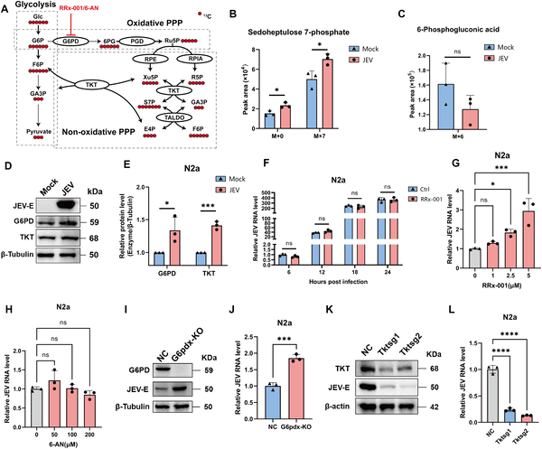

Imagine a virus invading the brain and not just infecting neurons, but actually reprogramming their internal factory lines to produce the raw materials it needs to multiply. This is exactly what researchers have uncovered about Japanese encephalitis virus (JEV), a dangerous brain-infecting virus. By forcing neurons to activate a metabolic pathway they usually keep quiet, JEV ensures a steady supply of nucleotides—the building blocks of its genetic material—helping it replicate rapidly within the central nervous system.

> **TL;DR**
> - JEV infection triggers neurons to activate de novo purine biosynthesis, a complex metabolic pathway rarely used in mature brain cells, to supply nucleotides needed for viral RNA replication.
> - Inhibiting key enzymes in this purine biosynthesis pathway reduces viral replication and neuroinflammation in mice, highlighting promising targets for new antiviral therapies.

Japanese encephalitis virus is a neurotropic flavivirus that can cross the blood-brain barrier and infect neurons, causing severe brain inflammation with high mortality and long-term neurological effects. Despite its global health significance, particularly across Asia and parts of Australia, effective antiviral treatments remain elusive. Neurons normally rely on nucleotide salvage pathways rather than energy-intensive de novo synthesis to maintain their nucleotide pools. Understanding how JEV manipulates neuronal metabolism to meet its replication needs is crucial for developing targeted therapies.

To unravel this viral strategy, scientists infected mice and cultured neuronal cells with JEV and performed comprehensive metabolomic profiling using liquid chromatography-mass spectrometry (LC-MS). They integrated these data with transcriptomic analyses to identify changes in gene expression of metabolic enzymes. Pharmacological inhibitors targeting key enzymes of the de novo purine biosynthesis (DNPB) pathway were tested in neuronal cultures and in infected mice to assess effects on viral replication and neuroinflammation.

The study revealed that JEV infection profoundly reshapes neuronal metabolism, notably enhancing nucleotide synthesis through activation of the DNPB pathway. This pathway, typically dormant in mature neurons, was transcriptionally upregulated along with supporting pathways including one-carbon metabolism and the pentose phosphate pathway, which supply essential precursors for purine synthesis. Blocking enzymes such as GART and IMPDH in this network significantly suppressed viral replication in neurons and reduced viral loads and inflammation in infected mouse brains. These results demonstrate that JEV hijacks a complex metabolic network to fulfill its nucleotide demands for genome replication.

This research redefines our understanding of how neurotropic viruses like JEV exploit host cell metabolism, revealing a precise program of metabolic reprogramming in neurons that supports viral growth. Importantly, it identifies specific enzymes within the purine biosynthesis pathway as promising therapeutic targets. Since current treatments for Japanese encephalitis are limited to supportive care, these findings open new avenues for host-directed antiviral strategies that could mitigate viral replication and brain inflammation, potentially improving outcomes for affected patients.

While these findings are compelling, the study primarily used mouse models and cultured neuronal cells, so further research is needed to confirm whether similar metabolic hijacking occurs in human neurons during JEV infection. Additionally, pharmacological inhibitors targeting purine biosynthesis must be carefully evaluated for safety and efficacy, as these pathways are also essential for normal cellular functions. Nonetheless, this work provides a strong foundation for developing targeted therapies against JEV and possibly other neurotropic viruses.

## Figures

*JEV virus changes brain cell metabolism to boost building blocks for its growth by relying on a specific sugar-processing pathway.*

## Sources

- [Japanese encephalitis virus hijacks the host purine biosynthetic network to promote viral replication in neurons](https://journals.plos.org/plospathogens/article?id=10.1371/journal.ppat.1014335)
- DOI: [10.1371/journal.ppat.1014335](https://doi.org/10.1371/journal.ppat.1014335)
