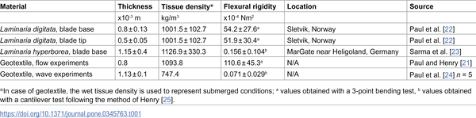
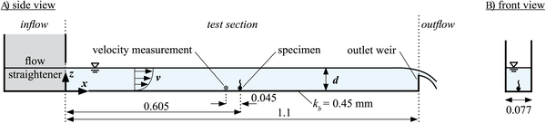
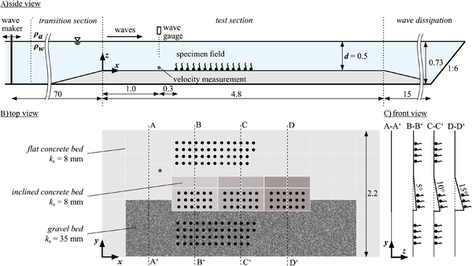

Kelp forests are underwater powerhouses, supporting marine life, buffering coastlines, and even capturing carbon. But as these vital ecosystems decline worldwide, scientists are turning to innovative restoration methods. One promising approach is “green gravel”—tiny stones seeded with kelp spores and scattered on the seafloor to grow new kelp forests. But for this method to work, these kelp-stone units must resist being swept away by waves and currents long enough for kelp to take root. What controls whether green gravel stays put or gets tossed around by the ocean? A recent study dives into the physics and biology behind this question, revealing how the size of kelp relative to its stone and the roughness of the ocean floor determine stability under hydrodynamic forces.

> **TL;DR**
> - The stability of kelp-seeded stones (“green gravel”) depends more on the roughness of the seabed and the size ratio between kelp and stone than on stone size or slope alone.
> - A refined metric based on the Shields parameter helps predict when these kelp-stone systems will start to move under different water flow conditions, improving restoration planning.

Kelp forests provide critical habitat and ecosystem services but are declining globally due to climate change and other stressors. Traditional restoration methods—planting adult kelp by divers—are labor-intensive and costly. The green gravel method offers a scalable alternative by growing kelp spores on small stones in the lab, then deploying them to the ocean floor. However, if these kelp-stone units move before kelp can attach firmly, restoration fails. Understanding the interplay between hydrodynamic forces, stone characteristics, kelp size, and seabed texture is essential to optimize this approach. This study, conducted in controlled laboratory flumes simulating waves and currents, investigates these factors systematically to guide effective kelp restoration.

Researchers used artificial kelp made from geotextile material attached to natural stones of two size classes to mimic real kelp-stone systems. Experiments were conducted in two setups: a narrow flume generating steady unidirectional flow and a large wave flume simulating wave conditions. The seabed was prepared with different roughness levels—flat concrete, inclined slabs, and gravel beds—to represent natural substrates. Flow velocities and wave heights were gradually increased until the kelp-stone units began to move. Critical shear stress—the force needed to initiate movement—was measured, and stone and kelp dimensions carefully recorded. The team introduced a stability correction to the classical Shields parameter, a dimensionless number used in sediment transport, to better capture the dynamics of these composite kelp-stone systems.

The experiments showed that the roughness of the ocean floor had a stronger effect on kelp-stone stability than stone size or slope angle. Larger kelp frontal areas relative to stone size actually reduced the critical shear stress needed to move the units, meaning bigger kelp can make stones easier to displace. The refined Shields parameter incorporating kelp size and stone diameter correlated well with the onset of movement across different conditions. Interestingly, subtle rocking or tilting motions occurred even before full displacement, which could hinder kelp attachment despite the stones not moving positionally. These insights highlight the delicate balance between biological growth and physical forces in kelp restoration.

By quantifying how kelp size, stone dimensions, and seabed roughness interact to influence green gravel stability, this study provides practical guidance for restoration practitioners. Selecting appropriate stone sizes and deploying green gravel on suitably rough substrates can increase the chances that kelp spores establish successfully. The improved predictive model based on the Shields parameter helps identify sites where hydrodynamic forces are unlikely to dislodge kelp-stone units prematurely. Ultimately, these findings contribute to more effective, scalable restoration of kelp forests, which are essential for marine biodiversity, coastal protection, and carbon sequestration.

While the laboratory experiments controlled many variables, natural marine environments are more complex, with variable wave patterns, currents, sediment types, and biological interactions. The artificial kelp surrogates, though biomechanically similar to real kelp, cannot capture all biological behaviors such as growth dynamics or adhesion strength changes over time. Additionally, subtle pre-movement rocking observed in the lab may be influenced by factors not fully replicated in experiments. Future field studies will be necessary to validate these findings and refine models for diverse real-world conditions.

## Figures

*Table comparing mechanical traits of surrogate material and Laminaria seaweed, showing average values with variation and sample size.*

*Diagram showing the flow experiment setup from the side and front views with measurements in meters.*

*Diagram showing side, top, and front views of the wave experiment setup with different bed types and roughness levels (sizes in meters).*

## Sources

- [Kelp-stone ratio and bed roughness control green gravel stability under hydrodynamic forces](https://journals.plos.org/plosone/article?id=10.1371/journal.pone.0345763)
- DOI: [10.1371/journal.pone.0345763](https://doi.org/10.1371/journal.pone.0345763)
