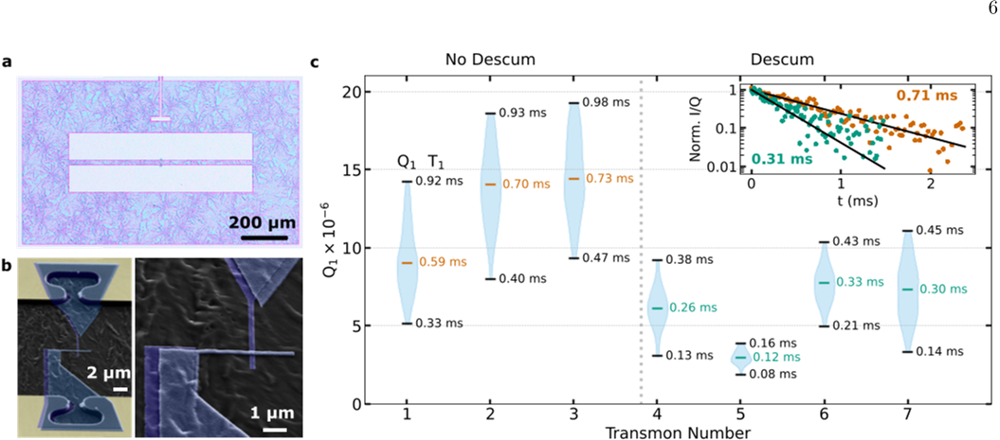
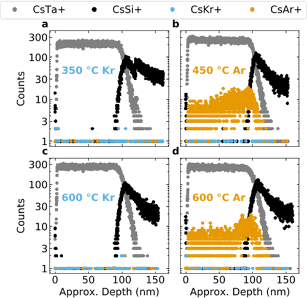
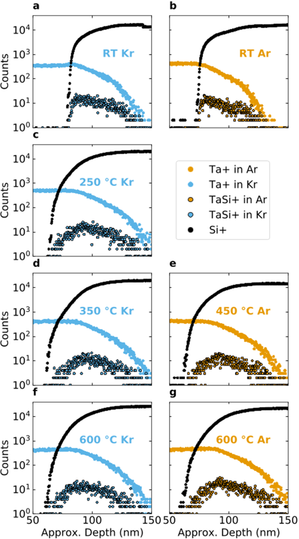
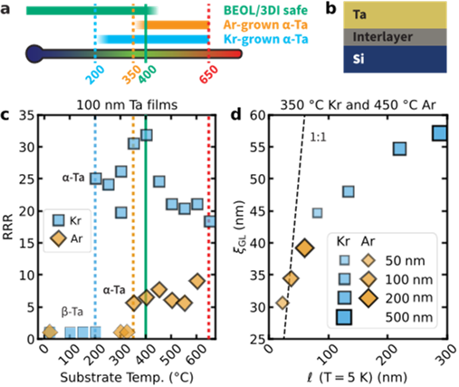

Quantum computers promise to revolutionize computing by harnessing the strange properties of quantum bits, or qubits. Among the many challenges in building practical quantum machines, creating high-quality superconducting qubits that can be reliably manufactured at scale is crucial. A recent advance shows that simply switching the gas used during tantalum film deposition—from argon to krypton—allows these films to be grown at much lower temperatures, opening the door to scalable, high-performance quantum chips.

> **TL;DR**
> - Using krypton gas instead of argon enables the growth of high-quality body-centered cubic tantalum films on silicon at temperatures as low as 200°C, compatible with standard semiconductor fabrication.
> - Quantum devices made with these krypton-sputtered tantalum films achieve record-high microwave resonator quality factors and transmon qubit coherence times, demonstrating a scalable path for quantum hardware manufacturing.

*Note: this summary is based on a preprint — research shared ahead of formal peer review.*

Superconducting qubits are a leading platform for quantum computing, with tantalum thin films recently emerging as a top-performing material due to their low microwave losses and long qubit coherence times. However, producing the desirable body-centered cubic (BCC) phase of tantalum typically requires substrate temperatures above 400°C during deposition, which conflicts with standard semiconductor back-end-of-line (BEOL) processing limits. This temperature incompatibility poses a significant barrier to scaling up quantum device fabrication using existing semiconductor manufacturing infrastructure.

The research team explored magnetron sputtering of tantalum films onto silicon wafers, comparing the traditional argon sputter gas with krypton. They carefully controlled deposition parameters such as gas pressure and substrate temperature, examining films grown from room temperature up to 600°C. They used a suite of characterization techniques including X-ray diffraction to confirm crystal phases, atomic force microscopy and transmission electron microscopy to study film morphology and interfaces, and electrical transport measurements to assess superconducting properties. Microwave resonators and transmon qubits were fabricated from these films to evaluate device performance.

Switching from argon to krypton as the sputter gas enabled the formation of the BCC α-tantalum phase at substrate temperatures as low as 200°C, well within BEOL-compatible limits. Krypton-sputtered films exhibited significantly higher electronic conductivity and longer electron mean free paths, indicating cleaner superconducting behavior. Microscopy revealed that lower-temperature krypton films had less intermixing at the tantalum-silicon interface, a region critical to device performance. Microwave resonators made from these films showed state-of-the-art quality factors around 4 million at single-photon power levels, while transmon qubits demonstrated median quality factors up to 14 million, reflecting exceptionally low loss.

This work presents a practical materials science advance that directly addresses a key bottleneck in scaling superconducting quantum devices. By enabling high-quality tantalum film growth at lower temperatures compatible with semiconductor fabrication processes, the approach facilitates integration of quantum hardware manufacturing into existing industrial lines. The improved film purity and interface quality translate into superior qubit coherence and resonator performance, essential for building larger, more reliable quantum processors. Such scalable fabrication methods are critical steps toward realizing the full potential of quantum computing.

While the results are promising, the study is currently based on detailed experimental validation but has yet to undergo peer review. Some variability in film properties and device performance at higher deposition temperatures remains to be fully understood, particularly regarding interface intermixing and sensitivity to cleaning treatments. Additionally, the technical nature of sputtering gas selection and thin film phases may limit immediate broad public interest, though the implications for quantum technology are significant. Further work will be needed to translate these findings into industrial-scale production and to explore long-term device stability.

## Figures

*Images show a transmon device, its junction details, and quality comparisons of qubits made with and without oxygen cleaning over 12 hours. — Figure from Maciej W. Olszewski et al., [CC BY 4.0](http://creativecommons.org/licenses/by/4.0/), caption edited.*

*SIMS data showing element counts in 100 nm Ta films made with Kr and Ar at different temperatures using cesium sputtering. — Figure from Maciej W. Olszewski et al., [CC BY 4.0](http://creativecommons.org/licenses/by/4.0/), caption edited.*

*Data showing how 100 nm Ta films made with Kr and Ar at different temperatures contain Ta, Si, and TaSi elements. — Figure from Maciej W. Olszewski et al., [CC BY 4.0](http://creativecommons.org/licenses/by/4.0/), caption edited.*

*This figure shows how temperature and gas type affect α-Ta film growth, electrical resistance, and superconductivity on silicon wafers. — Figure from Maciej W. Olszewski et al., [CC BY 4.0](http://creativecommons.org/licenses/by/4.0/), caption edited.*

## Sources

- [Krypton-sputtered tantalum films for scalable high-performance quantum devices](https://arxiv.org/abs/2601.20091)
- DOI: [10.1038/s41563-026-02718-z](https://doi.org/10.1038/s41563-026-02718-z)

*This article reuses and adapts text and figures from the original research by Maciej W. Olszewski et al., available via arXiv Materials Science, under the [CC BY 4.0](http://creativecommons.org/licenses/by/4.0/) license.*
