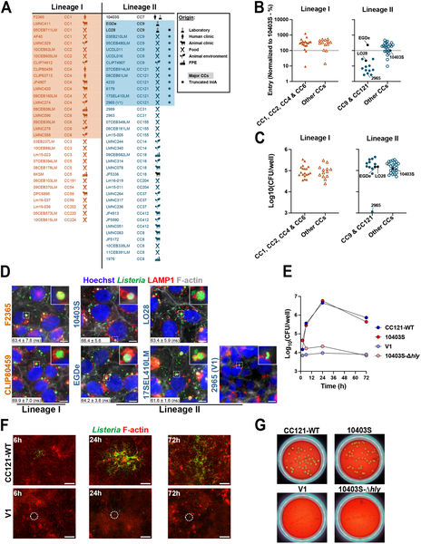
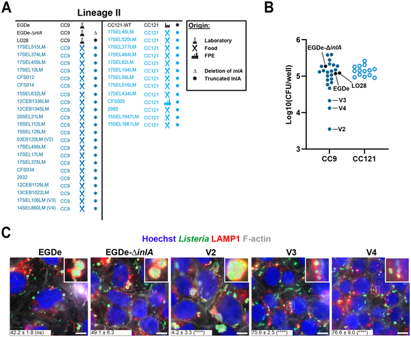

Did you know some bacteria can hide inside our cells in secret compartments to avoid detection? Listeria monocytogenes, a bacterium known for causing serious foodborne illness, has long been considered a pathogen that freely moves within the cell’s cytosol. But recent discoveries show it can switch gears, retreating into specialized intracellular vacuoles where it goes dormant, effectively evading immune defenses and antibiotic treatments. How does Listeria pull off this stealthy survival trick? A new large-scale study sheds light on the genetic and metabolic features that enable this hidden lifestyle.

> **TL;DR**
> - Listeria monocytogenes can persist inside epithelial cells by entering acidic vacuoles called LisCVs, where it becomes metabolically dormant.
> - Folate metabolism is a key regulator of this persistence, controlling bacterial motility and the production of a surface protein, ActA, essential for spreading between cells.

Listeria monocytogenes is a bacterium responsible for listeriosis, a severe infection often linked to contaminated food. Although infections are relatively rare, the bacterium is commonly found in food and the environment, and many people and animals carry it without symptoms. Inside host cells, Listeria was traditionally thought to escape vacuoles quickly and multiply freely in the cytosol, using a protein called ActA to hijack the host’s actin machinery and spread to neighboring cells. However, recent evidence reveals a more complex picture: after initial invasion and spread, Listeria can stop producing ActA and become trapped inside acidic vacuoles—called Listeria-containing vacuoles or LisCVs—where it enters a dormant, stress-resistant state. This hidden lifestyle may contribute to silent carriage and treatment challenges, but until now, the prevalence of this persistence strategy across different Listeria strains and the underlying bacterial factors were not well understood.

To explore how widespread and genetically controlled this persistence is, researchers screened over 100 Listeria isolates representing the species’ major evolutionary lineages and diverse ecological origins, including clinical, food, and environmental samples. They infected human placental epithelial cells (JEG-3) with these strains and used microscopy to detect LisCV formation after three days. They also measured bacterial entry efficiency, intracellular growth, and persistence. For strains showing altered persistence, they performed comparative genomic analyses to identify mutations linked to changes in vacuolar survival. Live-cell imaging and detailed microscopy further examined bacterial motility, ActA protein levels, and intercellular spreading.

The study found that nearly all Listeria strains tested—regardless of their origin or genetic lineage—could form LisCVs and persist inside epithelial cells, confirming that vacuolar persistence is a widespread and conserved feature of Listeria pathogenesis. However, a few hypo-virulent strains associated with food sources, carrying mutations that truncate the invasion protein InlA, showed altered persistence. Among these, two isolates had defects early in infection due to mutations in key virulence genes (hly and gshF). Notably, two other strains exhibited a specific defect in the persistence stage, with reduced ability to form LisCVs. Comparative genomics pinpointed a mutation in the folP gene, essential for folate biosynthesis, as responsible for impaired persistence. This mutation led to decreased bacterial motility and intercellular spreading, despite increased ActA levels on the bacterial surface. These results reveal that folate metabolism critically regulates the switch to persistence by modulating ActA activity and bacterial movement, enabling Listeria to enter and maintain the dormant vacuolar niche.

This research uncovers a novel survival strategy used by Listeria monocytogenes, linking central metabolic pathways to its ability to hide inside host cells in a dormant state. Understanding this persistence mechanism is important because it may explain why some Listeria infections are difficult to eradicate and why the bacterium can silently colonize hosts without causing symptoms. The identification of folate biosynthesis as a key regulator opens new avenues for exploring metabolic interventions that could disrupt bacterial persistence and improve treatment outcomes. Moreover, the widespread nature of this persistence phenotype across diverse Listeria strains highlights its fundamental role in the bacterium’s lifecycle and pathogenesis.

While the study robustly demonstrates the prevalence of vacuolar persistence and implicates folate metabolism in regulating this state, it primarily uses in vitro infection models with epithelial cell lines. How these findings translate to in vivo infections and human disease remains to be fully established. The direct clinical implications, such as impacts on antibiotic treatment efficacy, require further investigation. Additionally, the complex interplay between bacterial metabolism, host cell responses, and immune evasion during persistence warrants deeper exploration to develop targeted therapies.

## Figures

*Fig 1 shows how 70 bacterial strains differ in entering and growing inside placental cells, with images highlighting key strain behaviors.*

*Three Listeria variants show different spread and cell structure changes in infected human cells after 72 hours.*

## Sources

- [Large-scale phenotyping and comparative genomics reveal genetic features of Listeria persistence in epithelial cells](https://journals.plos.org/plospathogens/article?id=10.1371/journal.ppat.1013323)
- DOI: [10.1371/journal.ppat.1013323](https://doi.org/10.1371/journal.ppat.1013323)
