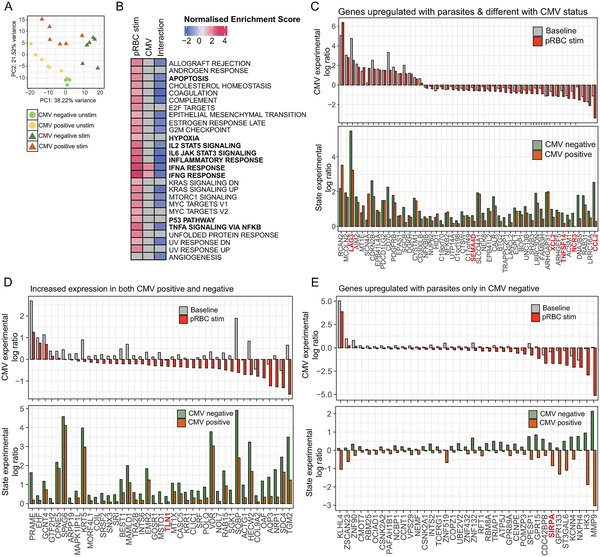
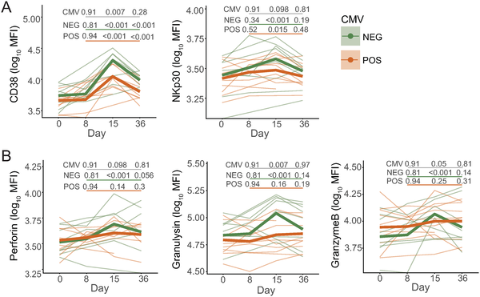

Did you know that a silent viral infection lurking in your body could weaken your immune system’s initial fight against malaria? Malaria, caused by the parasite Plasmodium falciparum, remains a major global health challenge. Meanwhile, many people worldwide carry cytomegalovirus (CMV) without symptoms, a virus that quietly shapes the immune system over a lifetime. Recent research uncovers how this hidden viral passenger can subtly disrupt the immune cells that form our first line of defense against malaria, potentially influencing how well the body controls the parasite during initial infection.

> **TL;DR**
> - Latent CMV infection reduces the activation and cytotoxic function of innate natural killer (NK) cells in response to malaria parasites.
> - This dampened NK cell response is linked to higher parasite growth but fewer clinical symptoms during first malaria infections in adults.

Natural killer (NK) cells are crucial immune cells that respond rapidly to infections, including malaria. They help control parasites by producing inflammatory signals and killing infected cells. NK cells are diverse, with different subtypes performing distinct roles. One factor that drives this diversity is prior infection with cytomegalovirus (CMV), a common herpesvirus that establishes lifelong latent infection. CMV reshapes the NK cell population, expanding subsets with altered functions. While it was known that CMV can affect adaptive immunity to malaria, its impact on the innate NK cell response was unclear until now.

Researchers studied blood samples from healthy adults who had never had malaria, comparing those with and without latent CMV infection. They exposed immune cells in the lab to malaria-infected red blood cells and analyzed gene activity in NK cells. They also examined NK cell responses in adults undergoing their first controlled human malaria infection, tracking immune markers and parasite levels over time. By combining transcriptional profiling and clinical data, the team assessed how CMV status influenced NK cell activation and parasite control.

The study found that NK cells from CMV-positive individuals showed a weaker gene activation response to malaria parasites compared to CMV-negative individuals. This reduced activation was seen across multiple NK cell subtypes. Key molecules involved in NK cell killing and signaling were less expressed in CMV-positive donors. During first malaria infections, NK cells in CMV-positive adults displayed lower levels of activation and cytotoxic markers such as perforin and granzyme B. Interestingly, these individuals had higher parasite growth rates but experienced milder clinical symptoms. The researchers also observed that CMV-positive individuals produced less IL-12, a cytokine from myeloid cells that normally boosts NK cell responses to malaria.

These findings reveal a previously unrecognized way that latent CMV infection can shape innate immune defenses against malaria. By dampening NK cell activation, CMV may impair early parasite control, potentially influencing disease progression and the development of immunity. Understanding this interplay between chronic viral infections and responses to other pathogens could help improve malaria treatment and vaccine strategies. It highlights the importance of considering an individual’s infection history when studying immune responses and disease outcomes.

While the study provides compelling evidence linking CMV infection to altered NK cell responses and parasite control, it involved relatively small participant numbers and focused on controlled human malaria infections in adults. Further research is needed to explore how these findings translate to natural malaria exposure, different age groups, and populations with varying CMV prevalence. Additionally, the mechanisms by which CMV suppresses NK cell function warrant deeper investigation to identify potential therapeutic targets.

## Figures

*NK cells from people with or without CMV show different gene activity after malaria parasite exposure, revealing unique immune responses.*

*This figure shows how immune cells called CD56 dim NK cells activate differently during malaria infection in people with or without prior CMV exposure.*

## Sources

- [Latent cytomegalovirus disrupts innate NK cell responses to P. falciparum and impairs parasite control in first infection in adults](https://journals.plos.org/plospathogens/article?id=10.1371/journal.ppat.1014372)
- DOI: [10.1371/journal.ppat.1014372](https://doi.org/10.1371/journal.ppat.1014372)
