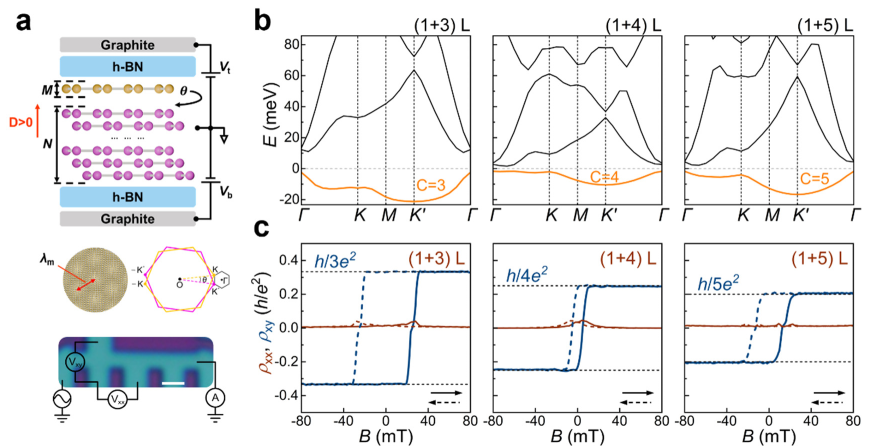
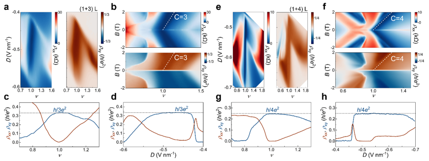

Imagine a material where you can dial in exotic quantum states simply by stacking layers of graphene and applying an electric field. Scientists have now shown that twisted graphene layers can be engineered to host quantum anomalous Hall states whose fundamental quantum property — the Chern number — can be programmed by the number of layers and switched on demand with electrical control. This breakthrough offers a new playground for exploring topological quantum matter and lays groundwork for future quantum devices that can be reconfigured electrically.

> **TL;DR**
> - Twisted rhombohedral graphene stacks exhibit quantum anomalous Hall (QAH) states with Chern numbers directly set by the number of graphene layers.
> - The chirality and even the Chern number of these QAH states can be switched electrically via doping and displacement fields, demonstrating programmable quantum topology.

*Note: this summary is based on a preprint — research shared ahead of formal peer review.*

The quantum anomalous Hall effect is a remarkable quantum phenomenon where a material exhibits a quantized Hall resistance and zero longitudinal resistance without any external magnetic field. This effect arises from the material’s topological properties, characterized by an integer called the Chern number, which counts the number of dissipationless edge channels. Materials with tunable and higher Chern numbers are highly sought after for potential low-power quantum electronics and for studying exotic quantum phases. Graphene, a single layer of carbon atoms, has been a versatile platform for quantum materials research. When multiple graphene layers are stacked with a slight twist, they form moiré patterns that dramatically alter their electronic properties. Rhombohedral stacking of graphene layers is known to host flat electronic bands that enhance electron interactions, making it a promising candidate for engineering QAH states.

The researchers fabricated devices by stacking twisted monolayer or bilayer graphene on top of rhombohedral multilayer graphene with precisely controlled small twist angles. These van der Waals heterostructures were encapsulated in hexagonal boron nitride and equipped with dual graphite gates to independently tune carrier density and displacement field. Raman spectroscopy confirmed the rhombohedral stacking. Transport measurements at low temperatures revealed quantized Hall resistances corresponding to different Chern numbers. The team combined experimental measurements with theoretical band structure calculations using Hartree-Fock methods to understand the topological nature of the observed states.

The study revealed that in twisted monolayer-rhombohedral N-layer graphene (where N = 3, 4, or 5), the Chern number of the QAH state at one electron per moiré unit cell equals the number of layers N. This direct relationship between layer number and topological invariant was confirmed by quantized Hall resistances of h/(Ne²). Moreover, in a twisted monolayer-trilayer device, the sign of the Chern number — which determines the chirality of the edge states — could be switched electrically by changing carrier density or applying a displacement field. Most notably, in a twisted Bernal bilayer-rhombohedral tetralayer graphene device, the researchers demonstrated a displacement-field-induced topological phase transition between QAH states with Chern numbers 3 and 4 within the same device. These results establish a platform where topological quantum states can be both designed by layer engineering and dynamically tuned by electrical means.

This work marks a significant advance in the field of topological quantum materials by demonstrating programmable and electrically tunable quantum anomalous Hall states in graphene-based systems. The ability to control the Chern number and chirality on demand moves topological quantum matter from a discovery phase toward purposeful design. Such reconfigurable topological states could enable future quantum electronics with multiple dissipationless channels and new functionalities. While still foundational, this platform opens exciting possibilities for exploring correlated topological phases and developing quantum devices that can be dynamically programmed via simple electrical controls.

Although the results are compelling, they come from an advanced experimental setup with carefully fabricated twisted graphene heterostructures measured at cryogenic temperatures. The work is currently at a preprint stage and has not yet undergone peer review. Practical applications will require further research to improve operating temperatures, device stability, and scalability. Additionally, the quantum phenomena involved are subtle and require sophisticated interpretation. Nonetheless, this study provides a clear proof of concept for programmable topological states in graphene, laying a foundation for future exploration.

## Figures

*Twisted graphene layers show unique magnetic and electronic behaviors depending on the number of layers and twist angle. — Figure from Zhangyuan Chen et al., [CC BY 4.0](http://creativecommons.org/licenses/by/4.0/), caption edited.*

*Twisted graphene shows unique electrical behaviors at very low temperatures, revealing special quantum effects. — Figure from Zhangyuan Chen et al., [CC BY 4.0](http://creativecommons.org/licenses/by/4.0/), caption edited.*

## Sources

- [Layer-engineered quantum anomalous Hall effect in twisted rhombohedral graphene](https://arxiv.org/abs/2601.14014)
- DOI: [10.48550/arxiv.2601.14014](https://doi.org/10.48550/arxiv.2601.14014)

*This article reuses and adapts text and figures from the original research by Zhangyuan Chen et al., available via arXiv Materials Science, under the [CC BY 4.0](http://creativecommons.org/licenses/by/4.0/) license.*
