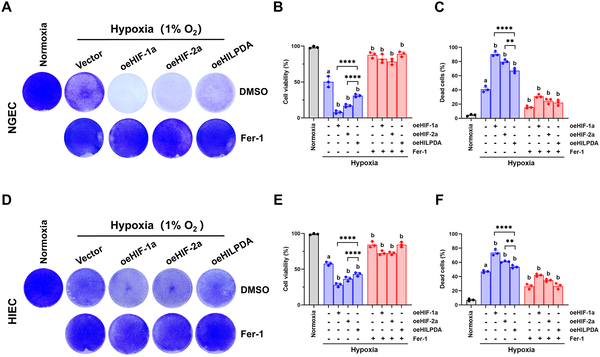
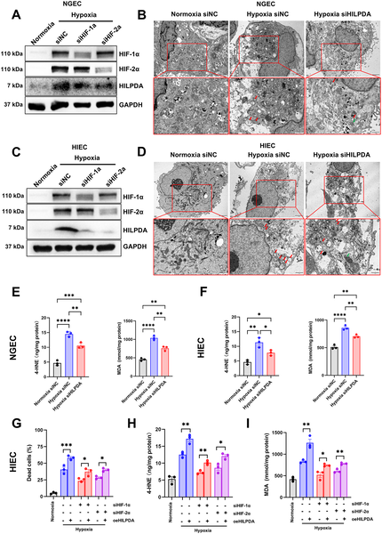
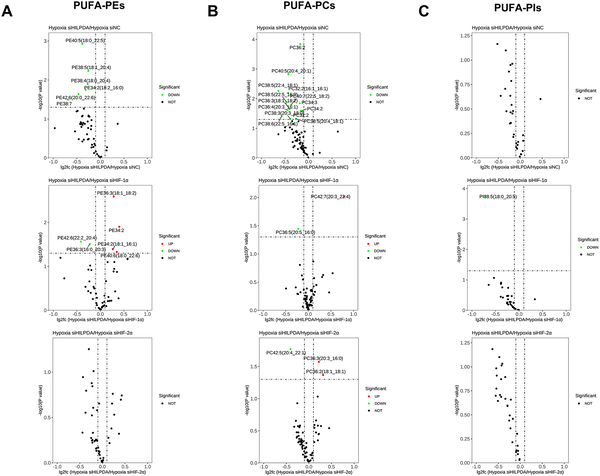

Every year, millions of people travel to high-altitude regions where the air is thin and oxygen is scarce. While the breathtaking views are unforgettable, the low oxygen environment—known as hypoxia—poses a serious challenge to our bodies, especially our digestive system. Many experience nausea, vomiting, or stomach discomfort, but what exactly happens inside our gut cells when oxygen runs low? Recent research uncovers a molecular pathway involving a small protein called HILPDA that makes gut cells more vulnerable to a specific kind of cell death under hypoxia, shedding light on how low oxygen triggers damage in the stomach and intestines.

> **TL;DR**
> - HILPDA, a protein induced by low oxygen, promotes ferroptosis—a form of cell death driven by lipid damage—in human gastric and intestinal cells.
> - HILPDA acts by increasing polyunsaturated phospholipids in cell membranes through the enzyme LPCAT3, making cells more susceptible to oxidative damage under hypoxia.

Hypoxia, or reduced oxygen availability, is a common stressor for people ascending to high altitudes above 2500 meters. It affects many organs, including the gastrointestinal tract, often causing symptoms like nausea and bleeding. At the cellular level, hypoxia triggers complex responses regulated by proteins called hypoxia-inducible factors (HIF-1α and HIF-2α), which help cells adapt but can also lead to cell death if the stress is prolonged. One particular form of cell death, ferroptosis, is driven by iron-dependent lipid peroxidation—damage to the fatty components of cell membranes. Understanding how hypoxia leads to ferroptosis in gut cells is key to developing treatments for altitude-related gastrointestinal issues.

Researchers studied normal human gastric and small intestinal epithelial cells cultured in the lab under low oxygen conditions to mimic hypoxia. They manipulated levels of HIF-1α, HIF-2α, and HILPDA proteins using genetic techniques to either increase or decrease their expression. Cell survival was measured using staining methods and metabolic assays. They also examined lipid peroxidation—the oxidative damage to membrane fats—using biochemical assays and visualized mitochondrial changes with electron microscopy. Lipidomic analysis was performed to profile changes in specific lipid molecules, focusing on polyunsaturated phospholipids. Finally, they tested the role of LPCAT3, an enzyme involved in lipid remodeling, to see how it interacts with HILPDA in regulating ferroptosis.

The study found that increasing HILPDA levels alongside HIF-1α and HIF-2α worsened cell death under hypoxia, which could be prevented by a ferroptosis inhibitor. Reducing HILPDA expression lowered lipid peroxidation and protected mitochondria from ferroptotic damage. Lipidomic data revealed that HILPDA knockdown decreased the abundance of polyunsaturated phosphatidylcholines and phosphatidylethanolamines—lipids prone to oxidative damage. Importantly, HILPDA controls the expression of LPCAT3, an enzyme that enriches membranes with these vulnerable lipids. Overexpressing LPCAT3 reversed the protective effect of HILPDA knockdown, confirming the critical role of the HILPDA-LPCAT3 axis in promoting ferroptosis during hypoxia.

These findings uncover a molecular pathway—HIF-1α/2α regulating HILPDA, which in turn drives LPCAT3-mediated lipid remodeling—that sensitizes gut cells to ferroptosis under low oxygen conditions. This insight advances our understanding of how hypoxia causes gastrointestinal injury, a common problem for high-altitude travelers and patients with conditions that reduce oxygen supply. Targeting components of this pathway, such as HILPDA or LPCAT3, could offer new therapeutic strategies to protect the stomach and intestines from hypoxia-induced damage and improve outcomes in related diseases.

While the study provides compelling evidence from cultured human cells, the complexity of hypoxia responses in living organisms involves additional factors not captured in vitro. The exact contribution of HILPDA and LPCAT3 in diverse tissues and in clinical settings remains to be fully explored. Furthermore, lipid metabolism and ferroptosis are influenced by many enzymes and pathways, so targeting HILPDA or LPCAT3 would require careful evaluation to avoid unintended effects. Future studies in animal models and human patients will be essential to validate these findings and develop safe interventions.

## Figures

*Increasing HIF-1α/2α or HILPDA levels worsens cell damage under low oxygen, but a treatment can reduce this harm.*

*Blocking HILPDA reduces cell damage caused by low oxygen by preventing ferroptosis, a type of cell death linked to mitochondrial changes.*

*This figure shows how different proteins affect certain fat molecules in cells under low oxygen, highlighting key differences in their regulation.*

## Sources

- [Lipid droplet associated protein HILPDA promotes hypoxia-induced ferroptosis by driving LPCAT3-mediated polyunsaturated phospholipids enrichment](https://journals.plos.org/plosone/article?id=10.1371/journal.pone.0350129)
- DOI: [10.1371/journal.pone.0350129](https://doi.org/10.1371/journal.pone.0350129)
