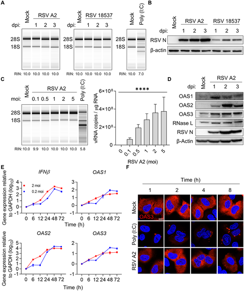
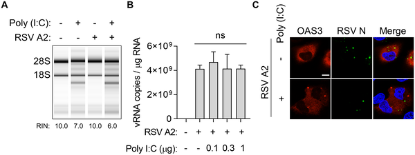
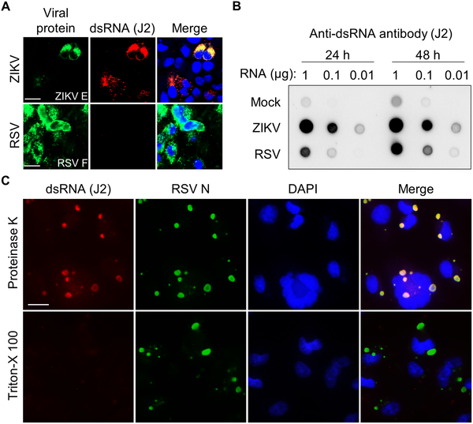
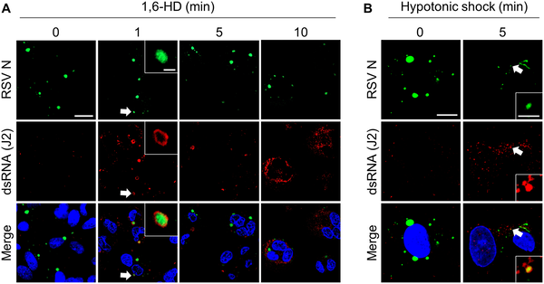

Discover how a common respiratory virus hides its genetic material inside liquid droplets to escape our immune system! Respiratory syncytial virus (RSV), a leading cause of severe respiratory illness in infants and older adults, cleverly shelters its viral RNA within specialized compartments called inclusion bodies. These liquid-like droplets help RSV evade detection by a crucial antiviral defense mechanism, allowing the virus to keep replicating undisturbed inside our cells.

> **TL;DR**
> - RSV forms liquid phase-separated inclusion bodies that compartmentalize viral RNA, preventing its recognition by the host immune sensor OAS and the antiviral enzyme RNase L.
> - Disrupting these inclusion bodies releases viral double-stranded RNA, triggering the OAS-RNase L pathway and inhibiting viral replication.

Viruses like RSV must evade the immune system to survive and replicate within host cells. One important antiviral defense relies on detecting viral double-stranded RNA (dsRNA), a replication intermediate, via the 2′-5′ oligoadenylate synthetase (OAS) proteins. Upon sensing dsRNA, OAS enzymes produce molecules that activate RNase L, an enzyme that indiscriminately degrades RNA to halt viral replication. While this pathway is effective against many viruses, RSV has long puzzled researchers by its ability to replicate without triggering this defense. Understanding how RSV escapes this immune surveillance is critical, especially given the virus’s significant health impact worldwide.

Researchers infected human lung cells with RSV and monitored activation of the OAS-RNase L pathway by assessing RNA degradation patterns and protein localization. They used immunofluorescence microscopy with antibodies specific to dsRNA and viral proteins to visualize viral RNA inside cells. To test the role of viral inclusion bodies, they employed treatments that disrupt liquid-liquid phase separation (LLPS), the physical process forming these compartments. They also compared RSV infection with infections by other viruses like Zika virus, known to activate the OAS-RNase L pathway, to highlight differences in immune evasion strategies.

The study found that RSV infection does not activate the OAS-RNase L pathway despite robust viral replication and increased expression of OAS proteins. Imaging revealed that viral dsRNA was sequestered within phase-separated inclusion bodies formed by RSV proteins. These liquid droplets effectively concealed dsRNA from immune sensors, preventing activation of RNase L. When LLPS was disrupted, dsRNA leaked out of inclusion bodies into the cytoplasm, triggering the antiviral pathway and leading to RNA degradation. Notably, artificially activating RNase L in RSV-infected cells did not suppress viral replication unless the inclusion bodies were compromised, confirming their protective role.

This research uncovers a novel immune evasion mechanism where RSV uses liquid-liquid phase separation to create protective compartments that hide its viral RNA from host antiviral defenses. By structurally masking dsRNA within inclusion bodies, RSV avoids detection and degradation by the OAS-RNase L pathway, enabling persistent viral replication. These insights expand our understanding of viral-host interactions and highlight phase separation as a critical factor in viral immune evasion. Targeting the formation or stability of these viral inclusion bodies could represent a new avenue for antiviral therapies against RSV and potentially other viruses employing similar strategies.

While the study provides compelling evidence for RSV’s use of phase-separated inclusion bodies to evade the OAS-RNase L pathway, direct clinical applications remain distant. The experiments were conducted primarily in cultured lung cells, and further research is needed to confirm these mechanisms in vivo. Additionally, the complexity of immune responses in whole organisms means that RSV likely employs multiple strategies to evade immunity. Understanding how these inclusion bodies interact with other antiviral pathways and immune cells will be important for developing comprehensive antiviral approaches.

## Figures

*RSV infection in lung cells does not activate the OAS-RNase L antiviral pathway, shown by RNA, protein, and imaging analyses.*

*RSV avoids the cell's antiviral defense by evading the OAS–RNase L pathway, shown in infected lung cells treated with viral RNA mimic.*

*Images show how RSV and ZIKV viruses trap double-stranded RNA inside infected cells, highlighting virus-specific structures and RNA detection methods.*

*Breaking viral inclusion bodies in infected cells causes double-stranded RNA to leak out, shown by specific staining under a microscope.*

## Sources

- [Liquid-liquid phase separation mediated immune evasion of respiratory syncytial virus against oligoadenylate synthetase-RNase L pathway](https://journals.plos.org/plospathogens/article?id=10.1371/journal.ppat.1014089)
- DOI: [10.1371/journal.ppat.1014089](https://doi.org/10.1371/journal.ppat.1014089)
