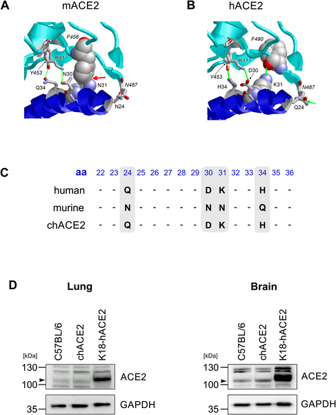
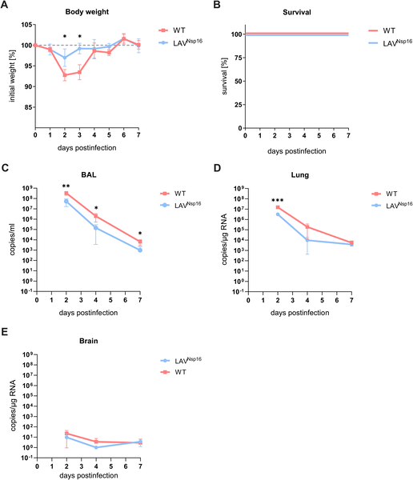
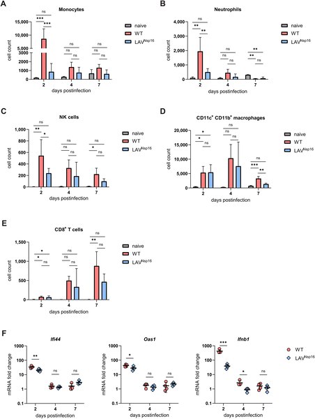

COVID-19 hits older adults hardest, with age being the greatest risk factor for severe illness and death. While vaccines have saved countless lives, emerging variants continue to challenge protection, especially in the elderly. To develop better vaccines, scientists need animal models that accurately reflect how the virus behaves in older humans. A recent study introduces a new mouse model engineered to express a human-like receptor for SARS-CoV-2, enabling researchers to study severe COVID-19 in aged mice. Using this model, they tested a live attenuated vaccine candidate that showed strong protection against the virus, offering a promising path forward for safeguarding vulnerable populations.

> **TL;DR**
> - Scientists created a novel mouse model with a chimeric human-mouse ACE2 receptor that supports SARS-CoV-2 infection and mimics severe COVID-19 in aged animals without fatal brain infection.
> - A live attenuated vaccine candidate lacking a key viral enzyme (Nsp16) induced robust immune responses and protected aged mice from severe disease caused by multiple SARS-CoV-2 variants.

SARS-CoV-2, the virus behind COVID-19, enters human cells by binding to a receptor called ACE2. Mouse ACE2 differs enough from the human version that normal mice are largely resistant to infection, complicating efforts to study the virus and test vaccines. Existing mouse models that overexpress human ACE2 often suffer from unnatural viral spread to the brain, leading to rapid death that doesn’t reflect typical human disease. Moreover, older adults face the highest risk from COVID-19, yet most models don’t capture age-related disease severity. This study addresses these challenges by engineering mice to express a chimeric ACE2 receptor that combines human and mouse features, allowing natural expression levels and tissue distribution. This model better replicates how SARS-CoV-2 infects and causes disease in elderly humans, providing a valuable tool to evaluate vaccines tailored for this vulnerable group.

Using CRISPR/Cas9 gene editing, the researchers introduced four human amino acid changes into the mouse ACE2 gene, creating a chimeric receptor (chACE2) that binds SARS-CoV-2 more effectively. This chACE2 receptor is expressed at physiological levels, avoiding the overexpression seen in previous models. They infected young and aged chACE2 mice with either wild-type SARS-CoV-2 or a live attenuated vaccine candidate virus lacking the viral 2’-O-methyltransferase enzyme (Nsp16), which is important for evading immune detection. Viral replication, disease symptoms, immune responses, and survival were monitored over seven days. The vaccine’s ability to protect aged mice from reinfection with different SARS-CoV-2 variants was also tested.

The chACE2 mice supported robust SARS-CoV-2 infection without the lethal brain invasion observed in other mouse models. Importantly, aged chACE2 mice developed more severe disease, reflecting the increased vulnerability seen in elderly humans. The live attenuated vaccine candidate (LAV Nsp16) was highly attenuated, causing minimal disease but inducing strong mucosal and systemic immune responses. Vaccinated aged mice were protected from severe illness upon exposure to both the original virus and variant strains, with significantly reduced viral replication and lung damage. These results demonstrate that the chACE2 model is suitable for studying COVID-19 pathogenesis and vaccine efficacy in aged animals and that targeting Nsp16 is a promising approach for live attenuated vaccine development.

This study offers two key advances: a more realistic mouse model that captures age-dependent COVID-19 severity and a promising live attenuated vaccine candidate that elicits broad protective immunity in aged hosts. The chACE2 mice allow longer-term studies of infection and immune responses without the confounding effects of unnatural brain infection. Meanwhile, the LAV Nsp16 vaccine’s ability to protect aged mice against multiple variants highlights its potential as a next-generation vaccine, especially important as SARS-CoV-2 continues to evolve. Together, these tools can accelerate the development and evaluation of vaccines designed to protect the elderly, who remain at greatest risk from COVID-19 complications.

While the chACE2 mouse model improves upon previous systems, it remains an animal model and may not capture all aspects of human COVID-19, particularly complex immune aging processes. The live attenuated vaccine candidate showed promising results in mice but requires extensive safety and efficacy testing in humans before clinical use. Additionally, the study focused on relatively short-term outcomes; longer-term immunity and potential side effects need further investigation. Finally, as SARS-CoV-2 continues to mutate, ongoing evaluation of vaccine effectiveness against emerging variants will be necessary.

## Figures

*Scientists created a new mouse model with a mixed human-mouse ACE2 receptor to better study how COVID-19 infects cells.*

*Chimeric ACE2 mice infected with SARS-CoV-2 show changes in weight, survival, and virus levels in lungs, brain, and airways over seven days.*

*This figure shows immune cell levels and antiviral gene activity in mouse lungs after infection with normal or weakened virus over several days.*

## Sources

- [Live attenuated vaccination protects aged chimeric ACE2 mice from severe SARS-CoV-2 pathogenicity in vivo](https://journals.plos.org/plospathogens/article?id=10.1371/journal.ppat.1014167)
- DOI: [10.1371/journal.ppat.1014167](https://doi.org/10.1371/journal.ppat.1014167)
