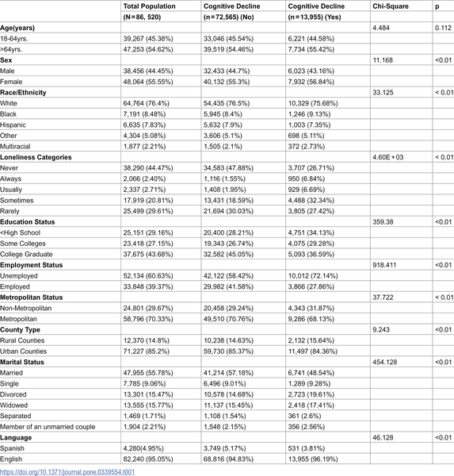
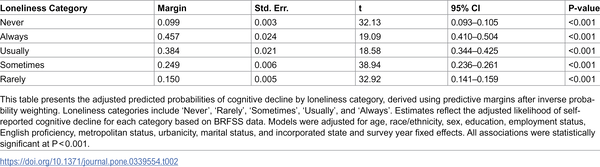

Could loneliness be quietly harming your brain? New research reveals a clear link between how often adults feel lonely and their likelihood of experiencing subjective cognitive decline—a self-perceived worsening of memory and thinking abilities. This connection is especially strong for those who feel lonely chronically, highlighting the importance of social connections for brain health.

> **TL;DR**
> - The more frequently adults report feeling lonely, the higher their chances of experiencing subjective cognitive decline, showing a strong dose-response relationship.
> - Women and middle-aged adults who are chronically lonely are particularly vulnerable to cognitive decline, while racial and ethnic differences in this association are minimal.

Loneliness, a distressing feeling that one’s social relationships are inadequate, has become a growing public health concern. It differs from social isolation, which is an objective lack of social contacts, but the two often overlap. In the U.S., about one-third of adults aged 45 and older report feeling lonely. Meanwhile, cognitive decline and dementia affect millions globally, with subjective cognitive decline (SCD) serving as an early warning sign. Understanding modifiable factors like loneliness that may contribute to cognitive decline is vital for improving brain health across the population.

Researchers analyzed data from over 85,000 U.S. adults aged 18 and older who participated in the nationally representative Behavioral Risk Factor Surveillance System (BRFSS) surveys between 2016 and 2023. Participants reported how often they felt lonely, choosing from five categories: never, rarely, sometimes, usually, or always. The primary outcome was subjective cognitive decline, measured by self-reports of worsening memory or confusion in the past year. The study used survey-weighted logistic regression models to estimate the adjusted probabilities of cognitive decline across loneliness levels, accounting for factors such as age, sex, race/ethnicity, education, and geographic variables. The analysis also explored how these associations differed by sex, age groups, and race/ethnicity.

The study found a striking dose-response relationship: adults who never felt lonely had about a 10% chance of reporting cognitive decline, while those who always felt lonely had nearly a 46% chance. Women who were always lonely had a notably higher risk—about 11 percentage points more—compared to men at the same loneliness level. Age differences were generally small, but among those always lonely, adults over 64 years had worse predicted cognitive function than younger adults. Racial and ethnic differences were minimal, with only a slight lower risk among non-Hispanic Black adults who never felt lonely compared to Whites. These results suggest that chronic loneliness is strongly linked to subjective cognitive decline, with certain demographic groups more affected than others.

This research highlights loneliness as a significant, modifiable social determinant of cognitive health. Given the growing prevalence of loneliness and cognitive decline, especially among aging populations, these findings underscore the potential benefits of social connection initiatives. Targeted efforts to reduce chronic loneliness—particularly among women and middle-aged adults—could help preserve cognitive function and delay or prevent more serious cognitive impairments. The study adds valuable population-level evidence supporting the integration of social well-being into public health strategies for brain health.

While the study benefits from a large, nationally representative sample and rigorous statistical methods, it is cross-sectional, meaning it captures associations at one point in time and cannot prove causality. The measure of loneliness reflects general frequency rather than a specific timeframe, and subjective cognitive decline is self-reported, which may introduce bias. Additionally, individuals without reliable phone access or those severely socially isolated may be underrepresented. Future longitudinal research is needed to clarify the directionality of the relationship and to explore underlying biological mechanisms.

## Figures

*Table showing basic background info of adults grouped by whether they experienced cognitive decline or not.*

*Table shows how loneliness levels relate to the chance of cognitive decline after adjusting for other factors.*

## Sources

- [Loneliness and cognitive decline among U.S. adults: A stratified analysis of the BRFSS](https://journals.plos.org/plosone/article?id=10.1371/journal.pone.0339554)
- DOI: [10.1371/journal.pone.0339554](https://doi.org/10.1371/journal.pone.0339554)
