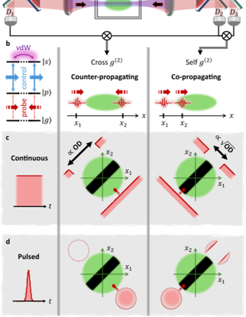
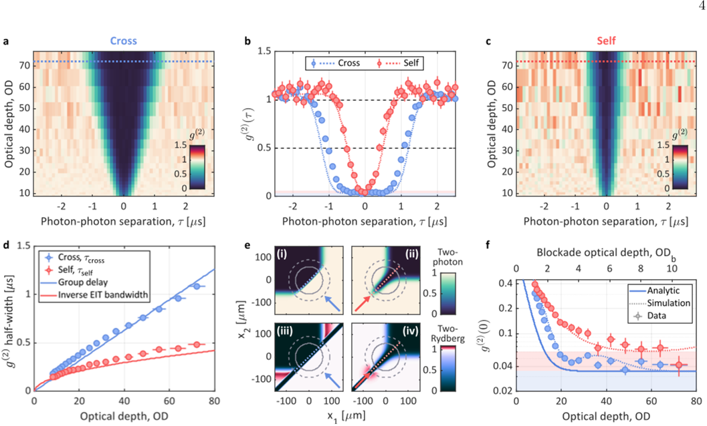
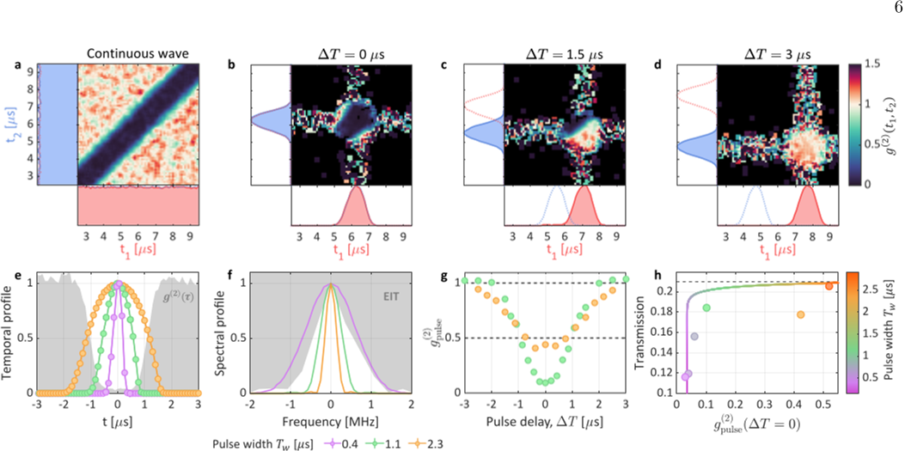

What if photons—the fundamental particles of light—could block each other like billiard balls, despite normally passing through one another without interaction? Scientists at the Weizmann Institute have just made this happen by sending photons in opposite directions through a cloud of ultracold atoms, enabling them to interact strongly over unprecedentedly long times. This breakthrough could pave the way for more reliable quantum computing and new ways to manipulate light at the quantum level.

> **TL;DR**
> - Counter-propagating photons interacting via Rydberg polaritons exhibit record-long anti-correlation times exceeding one microsecond, more than twice that of photons traveling in the same direction.
> - This extended interaction range enables complete photon blockade of entire pulses, tunable by timing, and reveals enhanced three-photon interactions, promising advances in deterministic photonic quantum operations.

*Note: this summary is based on a preprint — research shared ahead of formal peer review.*

In quantum nonlinear optics, achieving strong interactions between individual photons is crucial for developing photonic quantum computers and engineering exotic quantum states of light. Typically, photons do not interact directly, so researchers use matter—such as ultracold atoms excited to high-energy Rydberg states—to mediate effective photon-photon interactions. Previous experiments mostly sent photons traveling in the same direction, but this approach limits the interaction range and control. The new study explores photons traveling in opposite directions through a cloud of rubidium atoms, forming hybrid light-matter states called Rydberg polaritons. This geometry allows photons to interact over longer times and distances, overcoming fundamental bandwidth and timing constraints.

The experiment traps and cools rubidium atoms into an elongated cloud about 75 micrometers long. Two probe laser beams, each carrying photons, are sent from opposite ends of the cloud, while a control laser couples the atoms to a high-lying Rydberg state. Under electromagnetically induced transparency conditions, the photons become Rydberg polaritons—slow-moving hybrid particles combining light and atomic excitation. When two polaritons come within a blockade radius of roughly 10 micrometers, strong van der Waals interactions shift atomic energy levels, causing one photon to scatter and effectively block the other. Photon detectors at both ends record arrival times, allowing measurement of temporal correlations between photons traveling in the same or opposite directions. The team varied optical depth and pulse durations to characterize the interaction strength and timing.

The researchers observed deep quantum anti-correlations between counter-propagating photons, with anti-correlation times exceeding one microsecond—more than double the duration seen for co-propagating photons. This extended interaction time arises because photons traveling in opposite directions cross paths throughout the medium's length, allowing them to influence each other even if they enter at different times. By tuning pulse durations to fit within the system’s bandwidth and interaction range, they achieved complete photon blockade of entire pulses, meaning one photon can deterministically block another. Extending the study to three photons, they found enhanced suppression when a single photon met a counter-propagating photon pair, revealing richer few-photon dynamics. These experimental results align well with analytical theory and numerical simulations.

This work demonstrates a powerful new platform for engineering photon-photon interactions with unprecedented temporal range and control. The ability to achieve deterministic photon blockade over long distances and times is a key step toward scalable photonic quantum computing, where photons serve as quantum bits (qubits). Unlike previous approaches limited by short interaction ranges or probabilistic operations, counter-propagating Rydberg polaritons enable tunable, strong nonlinearities that can be harnessed for quantum logic gates and complex quantum state manipulation. Furthermore, the findings open new avenues for exploring few-body quantum physics with light, potentially leading to novel quantum technologies and fundamental insights.

While the results are promising, the experiments rely on ultracold atomic clouds and carefully controlled laser fields, which currently require sophisticated laboratory setups. The photon blockade is demonstrated in a dissipative regime, where some photons are scattered and lost, which may limit efficiency in practical devices. Scaling the system to more photons and integrating it into compact quantum circuits remain challenges. Additionally, the underlying physics involves complex interactions and bandwidth tradeoffs that require further theoretical and experimental exploration to fully harness these effects in real-world quantum technologies.

## Figures

*Two photons sent opposite ways through atoms interact over longer distances than same-direction photons, enabling better control of light signals. — Figure from Bankim Chandra Das et al., [CC BY 4.0](http://creativecommons.org/licenses/by/4.0/), caption edited.*

*Photon pairs traveling opposite ways show longer quantum anti-correlation times than same-direction pairs, revealing unique light interaction effects. — Figure from Bankim Chandra Das et al., [CC BY 4.0](http://creativecommons.org/licenses/by/4.0/), caption edited.*

*Photon interactions between light pulses show timing-dependent correlations and transmission, revealing how pulse length affects photon behavior. — Figure from Bankim Chandra Das et al., [CC BY 4.0](http://creativecommons.org/licenses/by/4.0/), caption edited.*

## Sources

- [Long-Range Blockade Between Counter-Propagating Photons](https://arxiv.org/abs/2506.01124)
- DOI: [10.1364/optica.586318](https://doi.org/10.1364/optica.586318)

*This article reuses and adapts text and figures from the original research by Bankim Chandra Das et al., available via Optica,13,1056-1064(2026), under the [CC BY 4.0](http://creativecommons.org/licenses/by/4.0/) license.*
