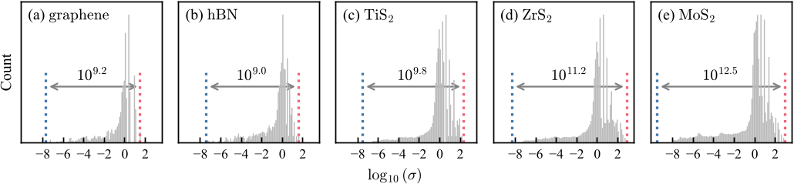
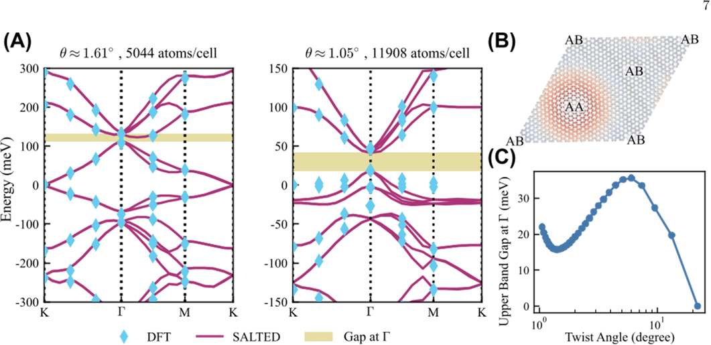
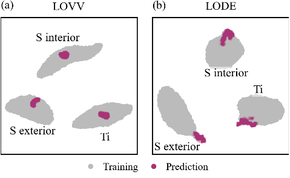
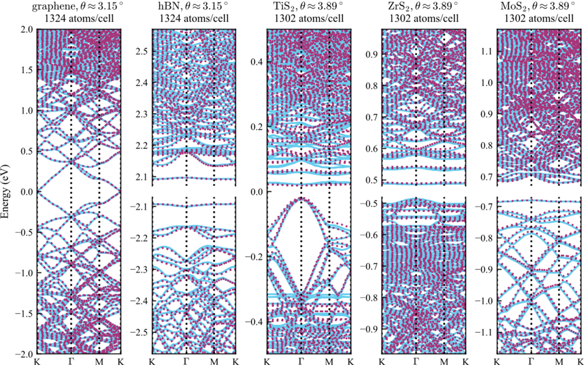

Imagine stacking two ultra-thin sheets of material, like graphene, but twisting one slightly relative to the other. This simple twist creates mesmerizing moiré patterns and unlocks a treasure trove of exotic quantum behaviors—from superconductivity to novel magnetic states. However, understanding these effects at the atomic level requires simulating enormous atomic structures, a task so computationally demanding that it often remains out of reach. Now, scientists have developed a clever machine learning method that can predict the electron distribution in these twisted bilayers, opening a new window into their mysterious quantum world.

> **TL;DR**
> - Researchers created a machine learning model that predicts electron densities in large twisted bilayer 2D materials with high accuracy, even for systems containing thousands of atoms.
> - This approach captures long-range quantum interactions, enabling reliable predictions of complex phenomena like flat electronic bands and spin-orbit coupling, which are key to quantum device applications.

*Note: this summary is based on a preprint — research shared ahead of formal peer review.*

Two-dimensional materials, such as graphene and transition metal dichalcogenides (TMDCs), exhibit unique electronic properties when stacked in layers. When one layer is slightly twisted relative to another, moiré superlattices form, drastically altering the electronic landscape. These twisted bilayers can host fascinating quantum phases, including unconventional superconductivity and correlated insulating states. However, simulating their electronic structure using traditional quantum mechanical methods like density functional theory (DFT) quickly becomes computationally prohibitive as the twist angle decreases and the moiré pattern grows larger, involving thousands of atoms. Existing shortcuts like continuum or tight-binding models simplify the problem but often lack transferability or accuracy for different materials or twist angles.

To overcome these challenges, the researchers extended a machine learning framework called SALTED (Symmetry-Adapted Learning of Three-dimensional Electron Densities). They trained a Gaussian process regression model on electron density data from small bilayer structures with various displacements. Crucially, they introduced long-range descriptors that capture non-local geometric features beyond the typical locality assumption in many ML models. This enables the model to extrapolate electron densities accurately to much larger moiré supercells needed to describe small twist angles. They tested three types of descriptors—short-range SOAP, and two long-range variants LODE and LOVV—finding that LOVV best captured the essential long-range physics. From the predicted electron densities, they derived electronic properties like band structures and electrostatic potentials, validating their approach against full DFT calculations.

The model with long-range LOVV descriptors reliably predicted electron densities and band structures for twisted bilayers of graphene, hexagonal boron nitride (hBN), and several TMDCs, even for supercells containing over 1,300 atoms. It accurately captured key quantum phenomena such as the formation of flat electronic bands, bandwidth narrowing with decreasing twist angle, and spin-orbit coupling effects. In contrast, models relying on short-range descriptors failed to extrapolate well to large moiré patterns, especially for TMDC materials. The machine learning predictions matched detailed DFT results within a few millielectronvolts, while achieving speedups of one to two orders of magnitude. This efficiency allowed the team to explore trends in band widths and gaps down to twist angles below 4 degrees, a regime previously inaccessible to direct simulation. The approach also integrated seamlessly with spin-orbit coupling perturbations, enabling comprehensive electronic structure predictions without retraining.

This work represents a significant advance in computational materials science by combining physics-informed machine learning with long-range descriptors to tackle the complexity of twisted bilayer 2D materials. By enabling accurate and efficient predictions of electron densities and derived electronic properties in large moiré superlattices, it opens the door to systematic exploration of quantum phenomena in these systems. Such capabilities are essential for designing next-generation quantum devices, including superconductors and spintronic components, based on moiré materials. More broadly, the methodology provides a general framework for studying electronic structures in large-scale systems where long-range interactions play a crucial role, potentially impacting a wide range of materials beyond the studied examples.

While the machine learning model shows impressive accuracy and efficiency, it currently relies on training data generated from density functional theory calculations, which themselves have limitations in describing certain strongly correlated or topological effects. The model’s performance near metal-insulator transitions or very small energy gaps can be less reliable due to sensitivity to subtle density errors. Additionally, the approach has been demonstrated on a select group of 2D materials; extending it to other materials or more complex heterostructures may require further validation and training. Experimental validation of the predicted electronic properties remains an important future step to confirm the model’s practical applicability.

## Figures

*Graph shows how overlap matrix values vary in different materials, with MoS2 having much higher variation than lighter elements. — Figure from Zekun Lou et al., [CC BY 4.0](http://creativecommons.org/licenses/by/4.0/), caption edited.*

*Predicted band structures and atomic shifts in twisted bilayer graphene show how layers relax to lower energy and affect electronic gaps at different angles. — Figure from Zekun Lou et al., [CC BY 4.0](http://creativecommons.org/licenses/by/4.0/), caption edited.*

*UMAP maps show atomic descriptors for TiS2 cluster by atom type and position, with training and test data mostly overlapping for LOVV but less so for LODE. — Figure from Zekun Lou et al., [CC BY 4.0](http://creativecommons.org/licenses/by/4.0/), caption edited.*

*Accurate predictions of energy bands in twisted bilayer materials show strong agreement with detailed calculations across diverse 2D systems. — Figure from Zekun Lou et al., [CC BY 4.0](http://creativecommons.org/licenses/by/4.0/), caption edited.*

## Sources

- [Long-Range Machine Learning of Electron Density for Twisted Bilayer Moiré Materials](https://arxiv.org/abs/2602.09938)
- DOI: [10.1103/4575-9cmx](https://doi.org/10.1103/4575-9cmx)

*This article reuses and adapts text and figures from the original research by Zekun Lou et al., available via arXiv Materials Science, under the [CC BY 4.0](http://creativecommons.org/licenses/by/4.0/) license.*
