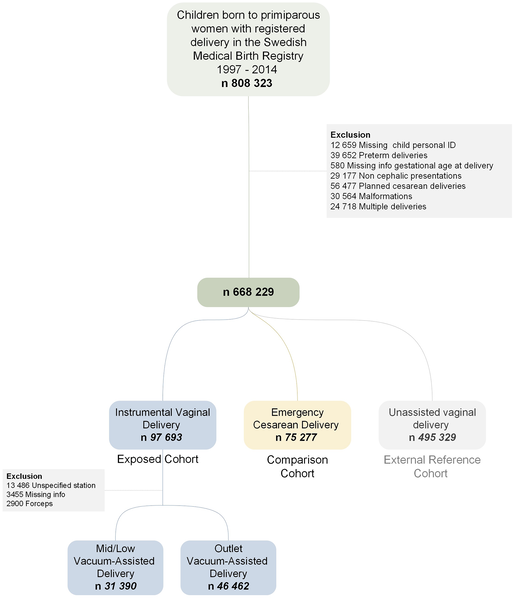

Vacuum-assisted delivery (VAD) is a common obstetric procedure used to help babies safely enter the world when labor stalls or complications arise. Yet, many expectant parents and healthcare providers wonder: does this intervention affect a child's brain development years down the line? A comprehensive new study from Sweden sheds light on this question by examining over 600,000 births and tracking children’s neurodevelopment for up to two decades.

> **TL;DR**
> - Mid/low vacuum-assisted deliveries are linked to some increased neonatal complications but show no heightened risk of long-term neurodevelopmental disorders.
> - Outlet vacuum-assisted deliveries have similar or even lower risks of neurodevelopmental issues compared to emergency cesarean sections and spontaneous vaginal births.

Vacuum-assisted delivery involves using a suction device to gently guide the baby’s head through the birth canal. It is often chosen when labor is prolonged or the baby shows signs of distress. While VAD is widely used—accounting for 6-9% of births in countries like Sweden—concerns linger about potential brain injuries or developmental disorders in children delivered this way, particularly when the vacuum is applied at higher fetal head stations (mid or low pelvis). Previous studies on long-term outcomes have been limited in size or scope, leaving important questions unanswered.

To address this gap, researchers analyzed data from Swedish national health registers, including all singleton births to first-time mothers between 1997 and 2014. The study followed 630,985 children for a median of 13-14 years, tracking diagnoses of attention deficit/hyperactivity disorder (ADHD), autism spectrum disorder (ASD), cerebral palsy (CP), epilepsy, and intellectual disability (ID). Delivery modes were categorized as outlet VAD, mid/low VAD, emergency cesarean delivery (ECD), or spontaneous vaginal delivery. The team adjusted for numerous factors such as maternal age, body mass index, diabetes, smoking status, and socioeconomic variables to isolate the effects of delivery mode on outcomes.

The study found that mid/low VAD was associated with higher odds of certain neonatal complications like intracranial hemorrhage and seizures compared to emergency cesarean delivery. However, when looking at long-term neurodevelopmental disorders, mid/low VAD did not increase risks for ADHD, ASD, CP, or epilepsy and was linked to a slightly reduced risk of intellectual disability. Outlet VAD, which typically involves a lower fetal head station and is a shorter procedure, showed no increased neonatal or long-term risks and in some cases had lower rates of neurodevelopmental disorders than emergency cesarean delivery. These findings held true even after accounting for child sex and other confounding factors.

This large, well-controlled study provides important reassurance that vacuum-assisted delivery, when performed appropriately, does not appear to compromise long-term brain development. This evidence is valuable for clinicians counseling expectant parents and supports continued use of VAD as a safe option in obstetric care. It also highlights the importance of distinguishing between outlet and mid/low VAD, as risks differ by fetal head station. Maintaining access to safe instrumental deliveries like VAD is crucial globally, especially in settings where cesarean sections may carry higher risks or be less accessible.

While the study’s scale and follow-up duration are strengths, some limitations remain. The researchers lacked data on why each delivery intervention was chosen and whether emergency cesarean sections occurred before or after full cervical dilation, which could influence outcomes. Additionally, the observational design means that unmeasured clinical factors might affect results. Therefore, these findings should not be interpreted as direct guidance for choosing delivery mode during labor but rather as valuable information about the long-term safety profile of vacuum-assisted delivery.

## Figures

*Flowchart showing how children born in Sweden (1997-2014) were grouped by birth method for the study.*

## Sources

- [Long-term neurodevelopmental outcomes after vacuum-assisted delivery: A population-based cohort study](https://journals.plos.org/plosmedicine/article?id=10.1371/journal.pmed.1004825)
- DOI: [10.1371/journal.pmed.1004825](https://doi.org/10.1371/journal.pmed.1004825)
