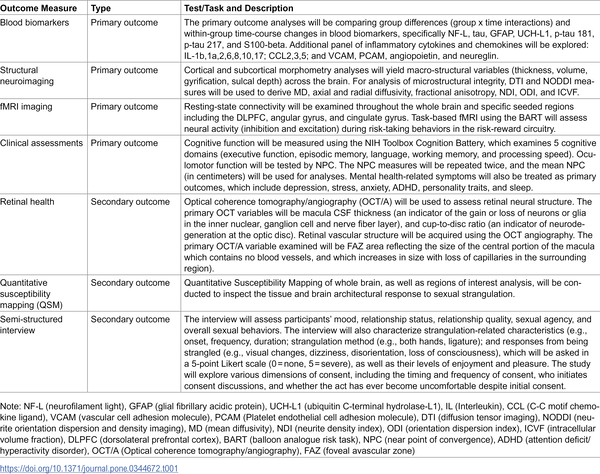
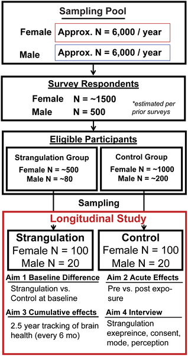

Could a popular sexual practice be silently affecting the brains of young adults? Sexual strangulation, often called choking during sex, has become increasingly common, especially among young women. While many describe it as consensual, scientists are now asking important questions about its potential neurological consequences. A new, carefully designed study aims to explore how this behavior might impact brain health both immediately and over the long term.

> **TL;DR**
> - Sexual strangulation involves external neck compression that can disrupt blood flow and oxygen to the brain, raising concerns about possible neural injury.
> - This prospective cohort study will track brain structure, function, and mental health over 30 months in young adults with and without frequent exposure to sexual strangulation, using multimodal assessments.

Sexual strangulation is a behavior that has gained popularity among young adults and is disproportionately reported by females. Surveys indicate that over half of college-aged women have experienced being strangled during sex at least once. Despite its prevalence, the neurological and physiological effects of this practice remain poorly understood. Previous pilot studies have hinted at links between frequent sexual strangulation and changes in brain biomarkers, structure, and mental health symptoms, but these studies were limited by small sample sizes and cross-sectional designs. Understanding whether and how sexual strangulation affects the brain is crucial for developing informed clinical advice and sexual health education.

To address these gaps, researchers have launched a prospective cohort study enrolling 200 young adult females—divided evenly between those frequently exposed to sexual strangulation and those with no history of it—and a pilot group of 40 males. Participants undergo comprehensive evaluations including blood tests for neural injury and inflammation markers, multimodal MRI scans to assess brain structure and connectivity, cognitive and eye-movement testing, retinal imaging, and mental health assessments. Acute effects are measured about 24 hours after a sexual event involving strangulation (or non-strangulation sex for controls), with follow-ups every six months over 30 months to monitor cumulative effects. Semi-structured interviews at each visit capture detailed information about strangulation practices, consent, motivations, and symptoms.

While results are forthcoming, the study builds on earlier pilot data suggesting that frequent sexual strangulation may be associated with elevated blood biomarkers indicating neural injury, changes in brain cortical thickness and connectivity, and increased mental health symptoms. Acute effects observed in prior research include impairments in eye coordination and increases in inflammatory markers shortly after strangulation events. This longitudinal study will clarify whether these neurological changes persist, worsen, or improve over time and how they relate to the frequency and context of strangulation experiences.

This research is groundbreaking in its scope and design, aiming to provide the first comprehensive, longitudinal evidence on how sexual strangulation might affect brain health. By integrating biological, cognitive, and experiential data, the study could inform clinical guidelines, sexual health education, and harm-reduction strategies. Given the rising prevalence of this sexual practice, understanding its neurological risks is essential for public health and individual well-being.

It is important to note that this study is observational and cannot establish definitive causation. The sensitive nature of the topic and potential confounding factors—such as other health behaviors and individual differences—may complicate interpretations. Additionally, results are pending, and findings will need to be replicated and expanded upon in future research, including larger male cohorts and diverse populations. Careful communication will be necessary to balance awareness of potential risks with respect for consensual sexual practices.

## Figures

*Diagram showing the overall plan and steps of the study.*

*Overview of the study design showing key steps and methods used.*

## Sources

- [Longitudinal brain health and neurological correlates of sexual strangulation in young adults: Study protocol for a prospective cohort study](https://journals.plos.org/plosone/article?id=10.1371/journal.pone.0344672)
- DOI: [10.1371/journal.pone.0344672](https://doi.org/10.1371/journal.pone.0344672)
