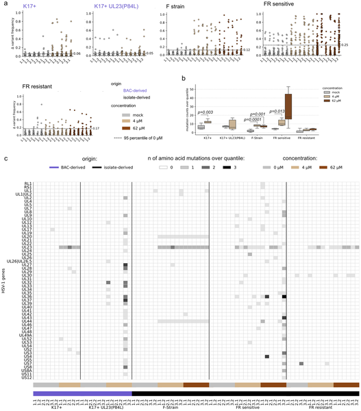

Did you know that tiny, nearly invisible mutations lurking within herpes simplex virus populations can foreshadow the virus’s ability to resist antiviral drugs even before treatment begins? Recent research shows that these rare genetic variants, present at extremely low levels, can rapidly expand under drug pressure, leading to treatment failure. Understanding this hidden viral diversity could transform how we detect and manage antiviral resistance in herpes infections.

> **TL;DR**
> - Low-frequency mutations in HSV-1, present before drug treatment, can rapidly expand under antiviral pressure to cause drug resistance.
> - Ultra-deep whole-genome sequencing can detect these rare variants early, offering a potential tool for predicting and managing antiviral resistance.

Herpes simplex virus type 1 (HSV-1) infects the majority of people worldwide and typically causes mild symptoms. However, in immunocompromised patients, HSV-1 can cause severe and potentially life-threatening diseases such as viral hepatitis or pneumonia. The frontline treatment for serious HSV-1 infections is aciclovir (ACV), a drug that inhibits viral replication with relatively low toxicity. Unfortunately, prolonged treatment can lead to the emergence of ACV-resistant HSV-1 strains, complicating therapy and sometimes requiring more toxic alternatives. While mutations in two viral genes—UL23 (thymidine kinase) and UL30 (DNA polymerase)—are known to confer resistance, it has been unclear whether these mutations arise spontaneously during treatment or already exist at low levels before drug exposure.

To investigate this, researchers cultured different HSV-1 strains in the laboratory with and without ACV at concentrations reflecting those found in patients. They monitored viral growth and resistance development over multiple passages. Crucially, they employed ultra-deep, full-genome Illumina sequencing, achieving coverage up to 100,000-fold, to detect mutations present at very low frequencies—far below the detection limits of standard sequencing methods. By comparing viral populations before and after ACV treatment, they tracked how specific mutations changed in frequency under drug pressure.

The study revealed that resistance-conferring mutations in UL23 and UL30 were already present at extremely low frequencies in the parental, drug-naïve viral populations. Upon exposure to ACV, these minor variants rapidly increased in frequency, enabling the virus to replicate despite the drug. This resistance developed within a single passage in cell culture and remained stable through subsequent passages, even without continued drug exposure. Additional mutations outside UL23 and UL30 were not consistently observed, suggesting resistance primarily arises from selection of preexisting minor variants rather than new mutations. Furthermore, repeated viral passaging increased the proportion of these low-frequency variants, supporting the idea that ongoing viral replication maintains a diverse mutant swarm poised for adaptation.

These findings highlight the crucial role of hidden viral diversity in driving antiviral resistance. Detecting low-frequency resistance mutations before or early during treatment could allow clinicians to anticipate and counteract resistance development, improving patient outcomes. Ultra-deep sequencing technologies thus offer a promising approach for enhanced antiviral stewardship, particularly in vulnerable immunocompromised populations where resistance is most problematic. Understanding how minor viral variants contribute to treatment failure also deepens our knowledge of viral evolution under drug pressure, informing future drug development and therapeutic strategies.

While the study provides compelling evidence from in vitro experiments, the dynamics of resistance development in patients may be more complex due to immune system interactions and other factors. The ultra-deep sequencing approach, though powerful, is currently resource-intensive and not yet routine in clinical diagnostics. Further research is needed to validate these findings in clinical settings and to develop practical methods for early resistance detection. Additionally, the study focused on ACV resistance in HSV-1; whether similar mechanisms operate in other viruses or with other antiviral drugs remains to be explored.

## Figures

*Deep sequencing reveals changes in virus mutations after ACV treatment, highlighting differences between treated and untreated samples.*

## Sources

- [Low frequency variants can predetermine antiviral drug resistance development in herpes simplex virus type 1](https://journals.plos.org/plospathogens/article?id=10.1371/journal.ppat.1014296)
- DOI: [10.1371/journal.ppat.1014296](https://doi.org/10.1371/journal.ppat.1014296)
