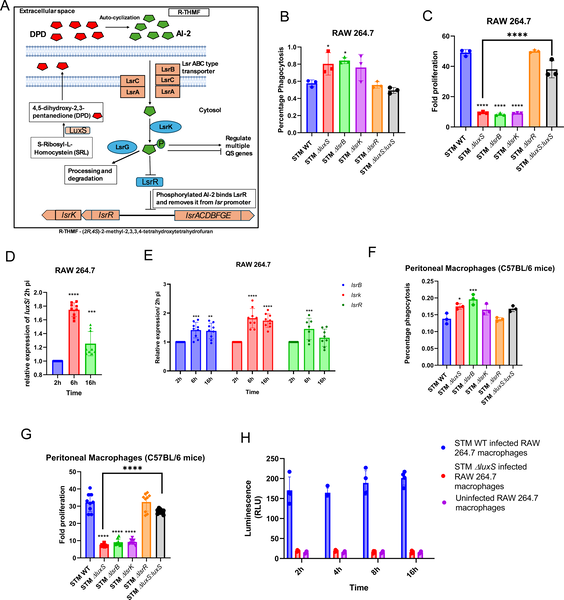
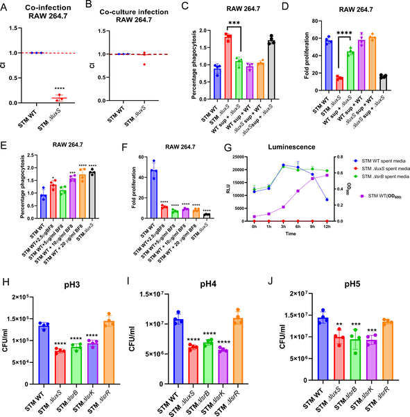
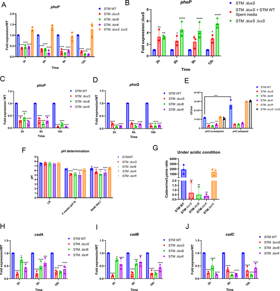
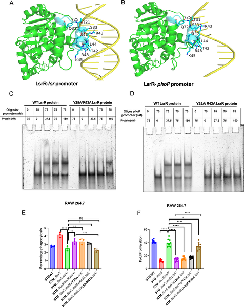

Imagine being trapped inside a hostile environment where the air burns your lungs and the walls close in on you. For Salmonella Typhimurium, a common bacterial pathogen, this is the reality inside the acidic compartments of our immune cells. Yet, these bacteria have evolved a remarkable way to 'talk' to each other using chemical signals, allowing them to adapt and survive these deadly conditions. Recent research uncovers how Salmonella’s chemical conversations, mediated by a molecule called Autoinducer-2 (AI-2), regulate key survival pathways to outsmart our immune defenses.

> **TL;DR**
> - Salmonella increases production and uptake of the quorum sensing molecule AI-2 under acidic conditions, helping it maintain internal pH balance and survive inside immune cells.
> - AI-2 signaling regulates the two-component system phoP/phoQ through a novel mechanism involving direct DNA binding by the LsrR protein, fine-tuning acid tolerance and virulence gene expression essential for infection.

Bacteria are not solitary creatures; many species communicate through chemical signals in a process called quorum sensing. This communication coordinates group behaviors such as biofilm formation, virulence, and stress responses. Salmonella Typhimurium, an intestinal pathogen responsible for foodborne illness worldwide, produces and senses a universal quorum sensing molecule known as Autoinducer-2 (AI-2). While AI-2’s role in bacterial communication has been studied, how it helps Salmonella survive the acidic environments inside host cells has remained unclear. The acidic pH inside macrophages—a type of immune cell tasked with destroying pathogens—poses a significant challenge to Salmonella’s survival during infection.

Researchers investigated how AI-2 signaling influences Salmonella’s survival under acidic conditions and during infection of macrophages. They measured AI-2 production and uptake at different bacterial growth phases and pH levels, using genetic mutants lacking key quorum sensing components such as luxS (AI-2 synthase), lsrB (AI-2 receptor), and lsrR (transcriptional repressor). The team assessed bacterial uptake and proliferation inside cultured macrophages and primary immune cells from mice. Molecular techniques including gene expression analysis and DNA-binding assays were used to explore how AI-2 signaling regulates the phoP/phoQ two-component system and acid tolerance genes. Finally, mouse infection models tested the importance of AI-2 signaling for colonization of infection sites.

The study found that Salmonella boosts AI-2 production and transport when exposed to acidic conditions, such as those inside macrophages. Mutants deficient in AI-2 synthesis or sensing were more readily engulfed by immune cells but showed impaired survival inside them. Importantly, the AI-2 responsive regulator LsrR was discovered to bind directly to the promoter region of the phoP gene—a master regulator of acid stress response—via specific amino acid residues, repressing its expression in the absence of AI-2. When AI-2 levels rise, LsrR repression is relieved, allowing phoP/phoQ activation, which helps maintain bacterial cytosolic pH and triggers acid tolerance mechanisms involving lysine and cadaverine metabolism. This signaling cascade also modulates the expression of Salmonella Pathogenicity Island-2 genes critical for intracellular survival and virulence. Mouse infection experiments confirmed that AI-2 signaling is essential for effective colonization of both primary and secondary infection sites.

This research uncovers a previously unrecognized regulatory circuit in Salmonella, where quorum sensing via AI-2 directly modulates the phoP/phoQ system through non-canonical DNA binding by LsrR. By linking chemical communication to acid stress survival and virulence gene expression, the study advances our understanding of how bacterial pathogens adapt to hostile host environments. These insights could inform the development of novel antimicrobial strategies that disrupt quorum sensing pathways, potentially weakening bacterial defenses and improving infection control. Moreover, the findings highlight the sophisticated ways bacteria coordinate their behavior to thrive within the complex ecosystem of the host.

While the study provides compelling evidence for AI-2’s role in regulating acid tolerance and virulence in Salmonella, the molecular interactions were primarily characterized under laboratory conditions. The complexity of host environments and interactions with other microbial species may influence quorum sensing dynamics in ways not fully captured here. Additionally, although mouse models demonstrated the importance of AI-2 signaling for infection, translating these findings to human infections requires further investigation. Future work could explore how disrupting AI-2 signaling affects Salmonella behavior in more complex or clinical settings and whether similar mechanisms operate in other bacterial pathogens.

## Figures

*Salmonella uses LuxS/AI-2 signaling to survive and multiply inside immune cells called macrophages during infection.*

*STM ∆ luxS bacteria gain AI-2 signals from STM WT during growth, affecting infection and survival in immune cells and varying pH conditions.*

*The LuxS/AI-2 system helps bacteria sense and adapt to acidic conditions by regulating phoP gene expression and acid tolerance.*

*Salmonella's LuxS/AI-2 signals control gene expression by LsrR binding DNA, affecting survival and growth inside cells.*

## Sources

- [LuxS/AI-2 regulates phoP/phoQ by a non-canonical mechanism to enhance acid stress survival in Salmonella Typhimurium](https://journals.plos.org/plospathogens/article?id=10.1371/journal.ppat.1014244)
- DOI: [10.1371/journal.ppat.1014244](https://doi.org/10.1371/journal.ppat.1014244)
