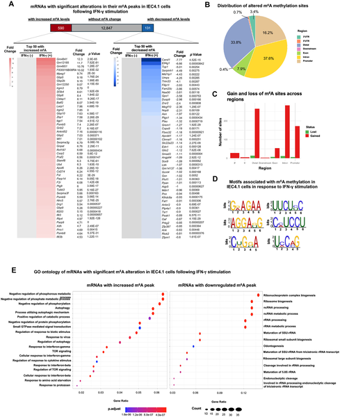
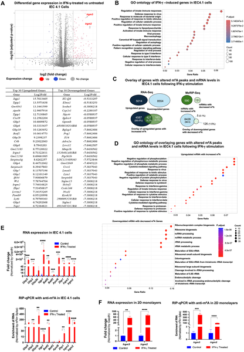
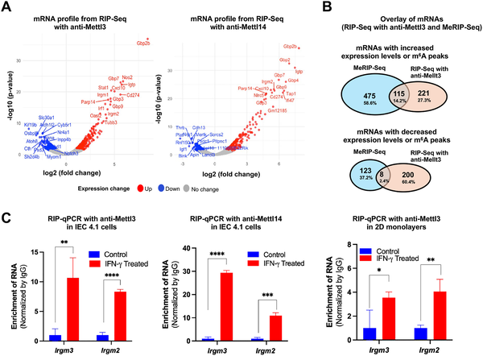

Inside your gut, a microscopic battle unfolds every day. Intestinal cells are constantly on guard, defending against invading microbes like the parasite Cryptosporidium, a cause of severe diarrheal disease worldwide. But how do these cells mount such a defense? Recent research reveals that tiny chemical tags on RNA molecules—known as m6A methylation—play a crucial role in empowering intestinal cells to fight off this parasite. Even more intriguingly, the parasite has evolved a way to hijack this system and evade immune attack.

> **TL;DR**
> - m6A RNA methylation increases on key immune-related RNAs in intestinal epithelial cells stimulated by the immune molecule IFN-γ, strengthening their defense against Cryptosporidium infection.
> - Cryptosporidium counters this defense by delivering viral double-stranded RNAs into host cells, which suppress the m6A methylation of immune RNAs, weakening the cell's antiparasitic response.

Intestinal epithelial cells (IECs) line the gut and serve as a frontline barrier against pathogens. They can autonomously combat intracellular invaders through cell-intrinsic defense mechanisms, many of which are triggered by interferon-gamma (IFN-γ), a key immune signaling molecule. One family of genes critical in this defense is the immunity-related GTPases (IRGM), which help disrupt pathogen survival inside cells. Meanwhile, RNA modifications, particularly N6-methyladenosine (m6A), have emerged as important regulators of gene expression and immune responses. However, how m6A methylation influences IEC-intrinsic defense against parasites like Cryptosporidium remained unclear until now.

Researchers used a mouse-derived intestinal epithelial cell line (IEC4.1) and treated these cells with IFN-γ to simulate immune activation. They mapped the m6A methylation landscape across the entire transcriptome using methylated RNA immunoprecipitation sequencing (MeRIP-seq). They also performed RNA sequencing to measure gene expression changes. To identify which RNAs physically interact with the m6A methylation machinery, they conducted RNA immunoprecipitation sequencing (RIP-seq) targeting the methyltransferase proteins METTL3 and METTL14. Finally, they infected cells with Cryptosporidium and examined how infection altered m6A methylation and immune gene expression, focusing on the role of viral double-stranded RNAs derived from a virus harbored within the parasite.

The study found that IFN-γ stimulation leads to widespread changes in m6A methylation across hundreds of mRNAs in intestinal epithelial cells. Notably, immune-related transcripts, including those from the IRGM gene family (Irgm2 and Irgm3), showed increased m6A methylation. This modification correlated with enhanced protein expression and stronger cell-intrinsic defense against Cryptosporidium. However, when cells were infected with Cryptosporidium, the parasite delivered viral double-stranded RNAs (CSpV1-dsRNAs) into the host cells. These viral RNAs suppressed the m6A methylation of Irgm2/3 transcripts, reducing their protein levels despite increased RNA abundance, effectively weakening the IFN-γ-induced defense. This reveals a sophisticated parasite evasion mechanism targeting host RNA modifications.

This research uncovers a previously unrecognized role of m6A RNA methylation in regulating intestinal epithelial cell defense against a clinically important parasite. By demonstrating that m6A modifications enhance IFN-γ-stimulated antiparasitic responses and that Cryptosporidium can subvert this by delivering viral RNAs, the study highlights a novel molecular battleground in host-pathogen interactions. These insights could inform the development of new therapeutic strategies aimed at boosting host RNA methylation pathways or blocking parasite-mediated suppression, potentially improving treatments for cryptosporidiosis, a disease with limited current options.

While these findings provide compelling evidence of m6A methylation’s role in epithelial defense and parasite evasion, the work was primarily conducted in cell culture models, which may not fully capture the complexity of the intestinal environment in living organisms. Further studies in animal models and human tissues are needed to confirm these mechanisms in vivo. Additionally, the precise molecular details of how the parasite-derived viral RNAs inhibit host m6A methylation remain to be fully elucidated. As with many early-stage mechanistic studies, translating these insights into therapies will require additional research.

## Figures

*IFN-γ changes chemical tags on RNA in intestinal cells, altering gene activity and affecting key cell functions.*

*Gene activity and RNA changes in intestinal cells after 6-hour IFN-γ treatment reveal key immune response shifts.*

*IFN-γ boosts Mettl3/14 binding to specific RNAs in intestinal cells, altering their m6A methylation and gene regulation.*

## Sources

- [m6A RNA methylation modulates IFN-γ-stimulated intestinal epithelial cell-intrinsic antiparasitic defense](https://journals.plos.org/plospathogens/article?id=10.1371/journal.ppat.1014442)
- DOI: [10.1371/journal.ppat.1014442](https://doi.org/10.1371/journal.ppat.1014442)
