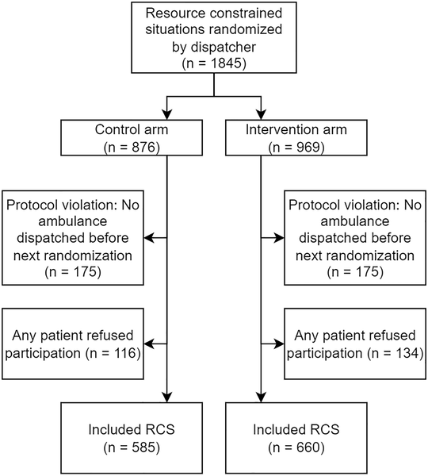

Imagine an emergency dispatch center where more patients need ambulances than there are ambulances available. Dispatchers face the tough task of deciding who gets help first—sometimes with only seconds to decide and limited information. Could artificial intelligence offer a helping hand in these high-pressure moments? A recent randomized controlled trial in Sweden explored whether a machine learning (ML) tool could improve dispatchers’ ability to identify the most urgent low-priority patients during such resource constraints.

> **TL;DR**
> - The study found that dispatchers using the ML-based risk assessment tool correctly prioritized the most critically ill low-priority patients about 68% of the time, compared to 62.5% without the tool.
> - While the improvement was modest, this trial provides evidence that ML decision support can influence ambulance dispatch decisions and potentially improve patient outcomes in emergency settings with limited resources.

Emergency Medical Dispatch (EMD) centers often face 'resource constrained situations' (RCS) where the number of patients needing ambulances exceeds the ambulances available. Dispatchers must quickly decide which patient to send the first ambulance to, balancing urgency and limited resources. Traditionally, dispatch decisions rely on clinical protocols and dispatcher experience, but these can be imperfect, especially under pressure. Machine learning models, which analyze large amounts of data to predict patient risk, have shown promise in healthcare but have rarely been tested in real-world emergency dispatch through randomized trials. This study, called the MADLAD trial, aimed to fill that gap by evaluating an ML tool designed to assist dispatchers in prioritizing low-acuity patients during RCS.

The trial was conducted at two dispatch centers in Sweden, covering nearly half a million people and staffed by dispatch nurses and ambulance dispatchers. The study focused on adult patients assessed as low-priority (priority 2A or 2B) but still requiring an ambulance. When multiple such patients awaited ambulances simultaneously, the situation qualified as an RCS. In these cases, the ML tool generated risk scores predicting patient deterioration based on structured call data and free-text notes, using a gradient boosting algorithm trained on historical data. Dispatchers were randomized to either receive ML risk scores to guide their decisions or to proceed with standard clinical practice without ML input. The primary measure was whether the first available ambulance was sent to the patient who later showed the highest National Early Warning Score (NEWS 2), a standard clinical measure of patient acuity.

Out of 1,245 resource constrained situations included, dispatchers using the ML tool correctly prioritized the most critical patient 68.3% of the time, compared to 62.5% in the control group. This difference corresponded to an odds ratio of 1.28, reaching statistical significance with a p-value of 0.047. Secondary analyses suggested the tool also improved differentiation based on a composite risk score of ambulance interventions and hospital outcomes. However, the study was limited to low-priority patients in two Swedish regions and did not reach its originally planned sample size, which limits the strength and generalizability of the conclusions.

This trial is among the first randomized studies to test machine learning decision support in emergency medical dispatch, a critical and high-stakes setting. The modest but meaningful improvement suggests that ML tools can augment dispatchers’ assessments, helping to better allocate scarce ambulance resources to patients at greater risk of deterioration. As ambulance demand and resource constraints grow globally, such tools could become valuable aids in emergency response systems. Moreover, the study demonstrates the feasibility of integrating ML into real-time dispatch workflows and highlights the importance of rigorous evaluation before widespread adoption.

Despite promising results, several caveats apply. The study focused only on adult patients deemed low-priority, so it is unclear if the tool would help with higher-acuity cases or those not requiring ambulances. The trial was conducted in two Swedish regions with specific dispatch protocols and a relatively small sample size, limiting generalizability. The improvement, while statistically significant, was incremental rather than dramatic. Also, the ML model required ongoing monitoring and retraining to maintain performance over time, underscoring the challenges of deploying AI in dynamic clinical environments. Further research is needed to validate these findings in larger, more diverse populations and to evaluate impacts on patient outcomes beyond dispatch decisions.

## Figures

*Flowchart showing how participants moved through the study, including those in resource-limited settings.*

## Sources

- [Machine learning assisted differentiation of low acuity patients at dispatch: The MADLAD randomized controlled trial](https://journals.plos.org/plosmedicine/article?id=10.1371/journal.pmed.1004770)
- DOI: [10.1371/journal.pmed.1004770](https://doi.org/10.1371/journal.pmed.1004770)
