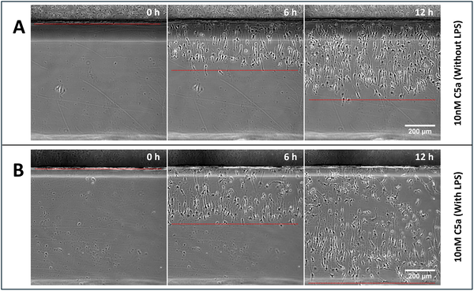

Did you know that immune cells don’t just passively follow chemical signals to find infections—they can actually create their own chemical trails? Recent research shows that macrophages, frontline defenders in our immune system, actively sculpt the very chemical gradients they use to navigate toward danger zones. This discovery sheds light on how our body’s defenders hunt down threats with surprising sophistication.

> **TL;DR**
> - Mouse macrophages migrate toward the complement protein C5a by actively depleting it from their surroundings, creating self-generated chemical gradients that guide their movement.
> - Human macrophages use a different mechanism to inactivate C5a, highlighting species-specific strategies but a conserved overall approach to immune navigation.

Macrophages are vital immune cells that respond rapidly to infections and tissue damage. They rely on chemotaxis—the ability to move directionally in response to chemical signals—to reach affected sites. One of the strongest chemoattractants for macrophages is C5a, a small protein fragment produced during complement activation, a key part of the immune response. However, in the body, C5a often exists in uniform or shallow concentrations, making it challenging for macrophages to detect clear directional cues. How do macrophages navigate effectively in such environments? This study explores the fascinating strategy of self-generated chemotactic gradients, where cells locally modify their chemical environment to produce sharper guidance signals.

The researchers used mouse bone marrow–derived macrophages (BMDMs) placed in a chamber initially filled with uniform concentrations of fluorescently labeled C5a. They observed macrophage migration in real time, tracking how cells depleted C5a locally to form gradients. Computational simulations modeled these dynamics, confirming that receptor-mediated endocytosis of C5a by macrophages could explain the formation of self-generated gradients. The team also compared mouse macrophages with human macrophages, examining different biochemical pathways responsible for C5a inactivation. Additionally, they tested macrophage responses at various C5a concentrations and under inflammatory activation by lipopolysaccharide (LPS).

The study found that mouse macrophages actively remove C5a from their immediate environment primarily through C5a receptor 1 (C5aR1)-dependent endocytosis. This depletion creates steep, localized gradients even when the initial C5a concentration is uniform, guiding macrophages efficiently toward the source. Different C5a concentrations triggered distinct waves of migration, with optimal chemotaxis occurring below 10 nM. Increasing C5a levels recruited more cells but slowed the onset of directional migration. In contrast, human macrophages mainly inactivate C5a via enzymatic degradation by carboxypeptidases, resulting in a higher optimal concentration (~30 nM) and different migratory behavior. Both species also sharpen externally imposed C5a gradients by depleting the attractant, enhancing directional guidance. LPS activation improved the accuracy and coordination of macrophage migration but was not essential for self-generated chemotaxis.

This work reveals a previously unrecognized mechanism by which macrophages not only respond to chemical signals but actively shape them to improve navigation toward infection and tissue damage. The concept of self-generated gradients adds a new layer of complexity to our understanding of immune cell migration. By uncovering species-specific mechanisms for C5a inactivation, the study highlights evolutionary adaptations in immune navigation strategies. These insights could inform future therapeutic approaches that modulate immune cell trafficking in infections, inflammation, and cancer.

While the study provides compelling evidence for self-generated chemotaxis in macrophages, it was conducted primarily in vitro using bone marrow–derived cells and controlled chamber environments. The complexity of tissue environments in living organisms may introduce additional factors influencing macrophage migration. Moreover, the distinct mechanisms observed between mouse and human macrophages suggest caution when extrapolating findings across species. Further in vivo studies are needed to confirm how these self-generated gradients operate within the dynamic and heterogeneous contexts of actual infections or wounds.

## Figures

*Macrophages move toward C5a signals, with LPS stimulation boosting their accuracy and coordination during migration.*

## Sources

- [Macrophages self-generate and refine chemotactic gradients during migration towards complement C5a](https://journals.plos.org/plosbiology/article?id=10.1371/journal.pbio.3003728)
- DOI: [10.1371/journal.pbio.3003728](https://doi.org/10.1371/journal.pbio.3003728)
