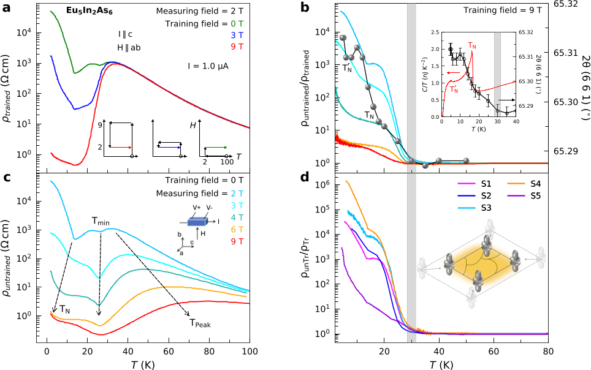
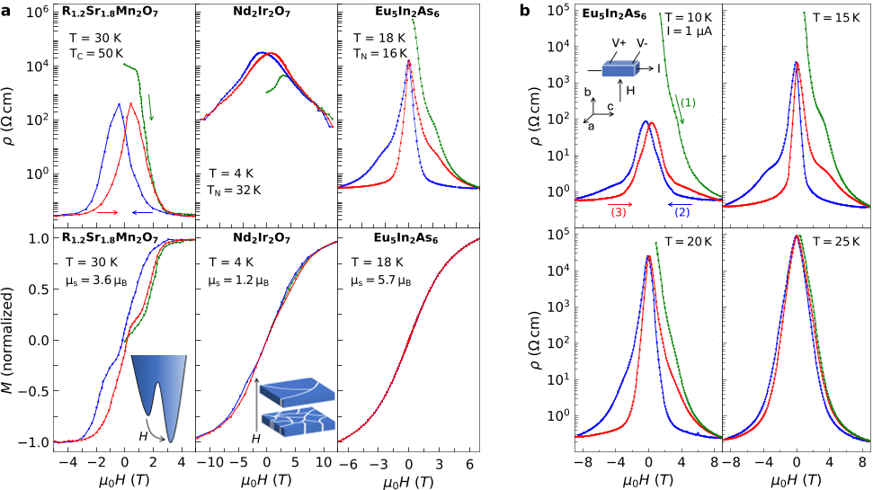
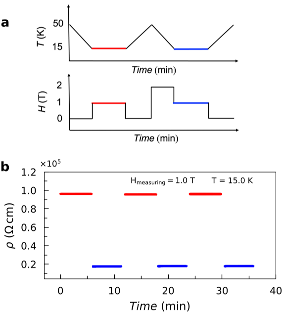
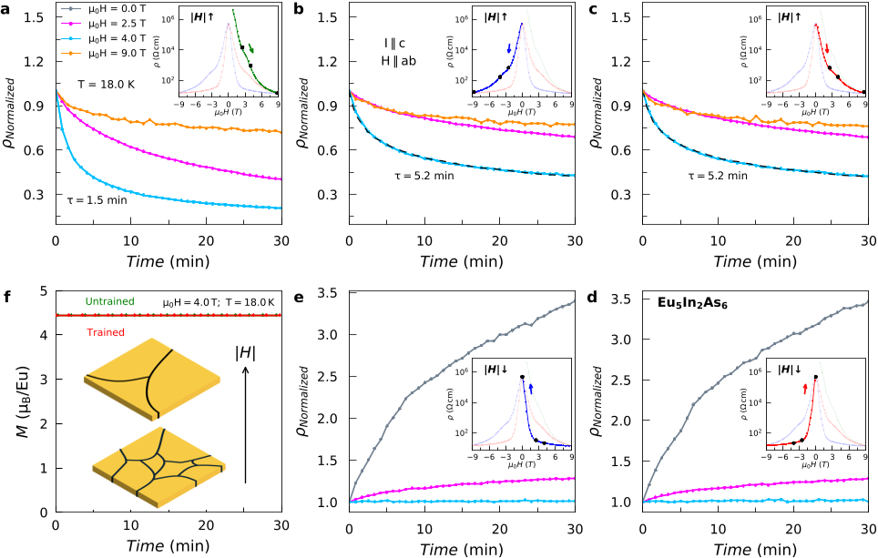

Imagine a memory device that remembers magnetic fields not because it contains permanent magnets, but because it harbors hidden magnetic states that persist even when the material is magnetically disordered. Scientists have discovered such a phenomenon in Eu5In2As6, a material that exhibits a novel kind of magnetoresistive memory well above its magnetic ordering temperature — a surprising and rare effect that challenges our understanding of magnetic materials.

> **TL;DR**
> - Eu5In2As6 shows a magnetoresistive memory effect in its paramagnetic phase, where magnetic moments are usually disordered, unlike previously known materials that require magnetic order.
> - This memory effect depends on the history of applied magnetic fields and is linked to hidden or short-range magnetic correlations, suggesting new pathways for quantum sensing and memory devices.

*Note: this summary is based on a preprint — research shared ahead of formal peer review.*

Magnetoresistance—the change in electrical resistance under a magnetic field—is fundamental to modern data storage and magnetic sensing technologies. In some rare materials, resistivity not only changes with the magnetic field strength but also 'remembers' the magnetic field history, a phenomenon known as magnetoresistive memory (MRM). Until now, MRM has only been observed in materials with long-range magnetic order, such as manganites and iridates, where stable magnetic domains or domain walls underpin the memory effect. Eu5In2As6 breaks this mold by exhibiting MRM in its paramagnetic phase, where magnetic moments typically fluctuate freely without forming ordered patterns.

Researchers studied single crystals of Eu5In2As6, a magnetic semiconductor with a small band gap and low carrier concentration. They measured electrical resistivity and magnetization while varying temperature and magnetic field strength. By cooling the samples under different magnetic fields (a process called 'training') and then measuring resistivity during magnetic field sweeps, they tracked how the material's electrical properties depended on both the current field and the field history. Complementary x-ray and specific heat measurements helped explore possible structural or thermodynamic changes accompanying the memory effect.

The team found that Eu5In2As6’s resistivity depends strongly on its magnetic field history, displaying a pronounced hysteresis loop even at temperatures twice its antiferromagnetic transition temperature (16 K), deep in the paramagnetic phase. Unlike manganites and iridates, this memory effect shows no corresponding changes in magnetization, indicating that it does not arise from conventional magnetic domains. Instead, the data suggest the presence of a hidden order or fluctuating short-range magnetic correlations that break time-reversal symmetry without long-range magnetic order. The resistivity changes can be 'trained' by applying magnetic fields, and this memory persists over time, hinting at metastable magnetic states or domain walls of a hidden order. Additionally, subtle lattice contractions observed near the onset of MRM point to magnetoelastic coupling playing a role.

Discovering magnetoresistive memory in the paramagnetic phase challenges the prevailing notion that long-range magnetic order is necessary for such effects. This opens exciting new avenues for designing magnetic memory and quantum sensing devices that operate under conditions previously thought unsuitable. The hidden magnetic states in Eu5In2As6 could serve as a platform for novel quantum technologies, potentially enabling memory devices that rely on subtle electronic or magnetic correlations rather than classical magnetism. Moreover, this work encourages the search for similar phenomena in related materials, broadening the landscape of functional magnetic materials.

While the experimental evidence for magnetoresistive memory in Eu5In2As6 is robust, the precise microscopic origin of the effect remains uncertain. The proposed hidden order or fluctuating magnetic correlations require further investigation using advanced spectroscopic and scattering techniques. The absence of clear thermodynamic signatures also suggests that the hidden order, if present, has a subtle entropic footprint. Additionally, the material’s low carrier concentration and semiconducting nature differentiate it from previously studied metallic systems, complicating direct comparisons. Future studies will be necessary to clarify the mechanisms and assess practical device integration.

## Figures

*MRM appears below 30 K, showing changes in resistivity linked to magnetic training and lattice shifts in the material. — Figure from Sudhaman R. Balguri et al., [CC BY 4.0](http://creativecommons.org/licenses/by/4.0/), caption edited.*

*This figure shows how magnetic field affects electrical resistance and magnetization in three materials, highlighting changes with temperature and magnetic history. — Figure from Sudhaman R. Balguri et al., [CC BY 4.0](http://creativecommons.org/licenses/by/4.0/), caption edited.*

*Training changes how a crystal conducts electricity, showing consistent results after repeated cycles under magnetic fields. — Figure from Sudhaman R. Balguri et al., [CC BY 4.0](http://creativecommons.org/licenses/by/4.0/), caption edited.*

*Resistivity changes over time at 18K under different magnetic fields show how hidden-order domain walls form, while magnetization stays constant. — Figure from Sudhaman R. Balguri et al., [CC BY 4.0](http://creativecommons.org/licenses/by/4.0/), caption edited.*

## Sources

- [Magnetoresistive Memory in the Paramagnetic Phase of Eu$_5$In$_2$As$_6$](https://arxiv.org/abs/2607.20287)
- DOI: [10.48550/arxiv.2607.20287](https://doi.org/10.48550/arxiv.2607.20287)

*This article reuses and adapts text and figures from the original research by Sudhaman R. Balguri et al., available via arXiv Materials Science, under the [CC BY 4.0](http://creativecommons.org/licenses/by/4.0/) license.*
