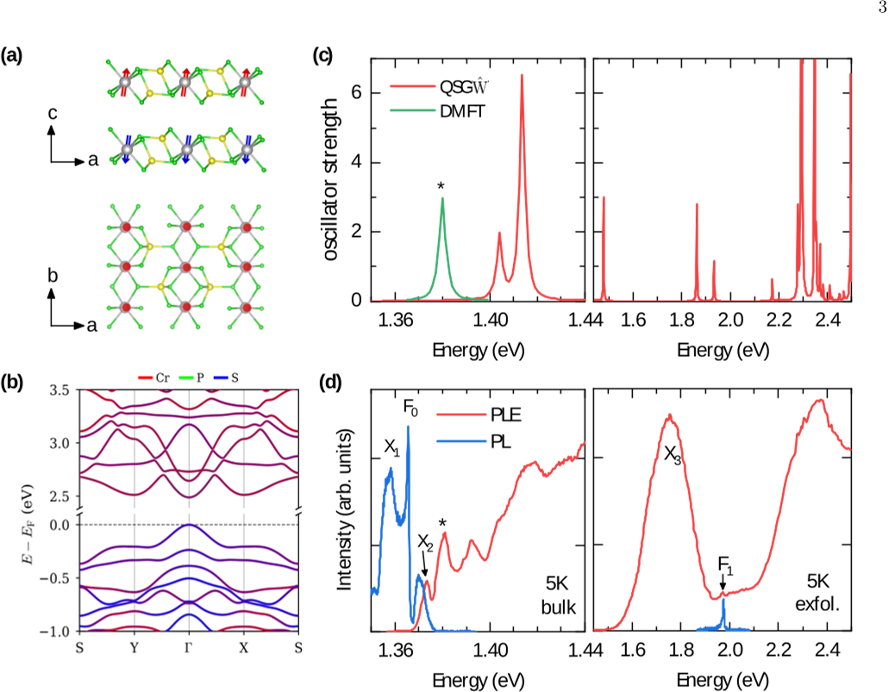
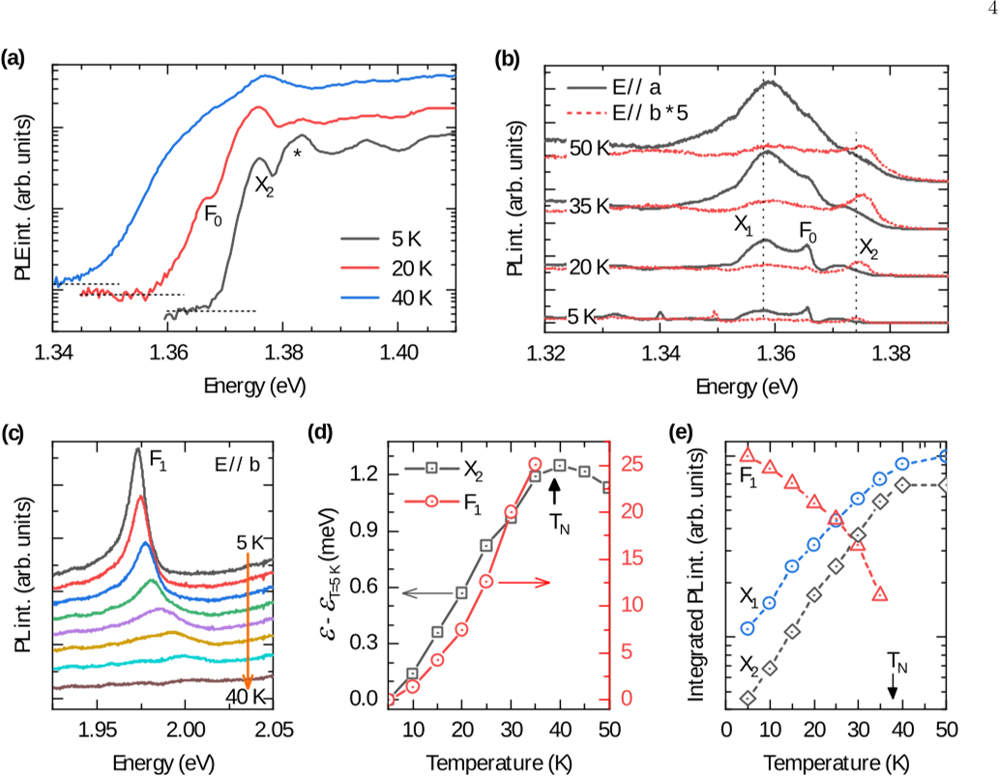
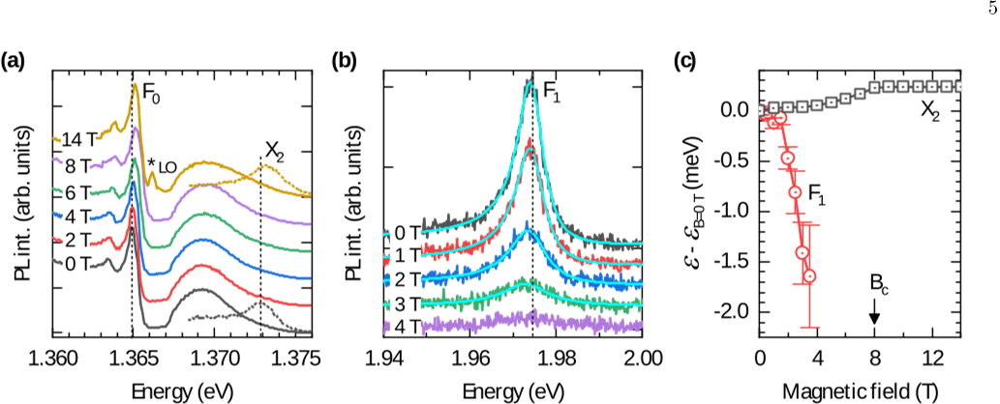

Imagine a crystal so thin and delicately layered that it acts as a playground for tiny particles of light and magnetism to dance together. In the layered magnetic semiconductor CrPS4, researchers have discovered that light particles called excitons not only reveal hidden magnetic states but can also be controlled by temperature and magnetic fields. This opens intriguing possibilities for sensing and manipulating magnetism using light in ultra-thin materials.

> **TL;DR**
> - CrPS4 is a layered antiferromagnetic semiconductor whose excitons—bound states of electrons and holes—are sensitive probes of its magnetic order.
> - By varying temperature and applying magnetic fields, researchers can manipulate exciton states, revealing clear optical signatures of magnetic phase transitions and suggesting routes for optical control of magnetism.

*Note: this summary is based on a preprint — research shared ahead of formal peer review.*

Two-dimensional magnetic materials have become a hot topic in physics and materials science because they combine magnetism with unique electronic and optical properties. CrPS4 is one such material, where chromium ions carry magnetic moments arranged in an antiferromagnetic pattern—neighboring layers have opposing spins. Understanding how light interacts with these magnetic states is challenging but promising, as it could enable new ways to read and write magnetic information without electrical currents. Excitons, which are pairs of negatively charged electrons and positively charged holes bound together by attraction, play a key role here because their energy and behavior depend on the magnetic environment.

The researchers combined advanced theoretical calculations with precise optical experiments to study CrPS4. They used many-body perturbation theory and dynamical mean-field theory to predict the electronic band structure and excitonic transitions, capturing both spin-allowed and spin-flip excitations localized on chromium ions. Experimentally, they performed photoluminescence (PL) and photoluminescence excitation (PLE) spectroscopy at low temperatures and under varying magnetic fields to observe how exciton energies and intensities change. This multi-pronged approach allowed them to link theoretical predictions with observed optical signatures of magnetic order.

The study revealed that CrPS4 has a direct electronic bandgap of about 2.48 eV in its antiferromagnetic phase, with several excitonic transitions near 1.4 eV. Among these, spin-allowed excitons dominate, while a distinct spin-flip exciton appears at slightly lower energy. As temperature increases toward and beyond the Néel temperature of 38 K, exciton energies shift (blueshift) and their intensities change, reflecting the transition from antiferromagnetic to paramagnetic states. Applying magnetic fields up to 8 Tesla induces further shifts and modifications in exciton behavior, corresponding to spin reorientation transitions in the material. These optical changes provide clear fingerprints of the underlying magnetic phases and their transformations.

This work demonstrates that excitons in CrPS4 serve as sensitive optical probes of magnetic order and can be manipulated by temperature and magnetic fields. Such control suggests exciting possibilities for all-optical sensing of magnetic states and potentially for light-driven control of magnetism in two-dimensional materials. As researchers seek energy-efficient ways to read and write magnetic information, understanding and harnessing exciton-magnetism interplay in layered semiconductors like CrPS4 could open new frontiers in spintronics and quantum technologies.

While the results provide valuable insights into excitonic and magnetic coupling in CrPS4, the optical control of magnetism remains exploratory. The complexity of electron correlations and phonon interactions means that fully understanding and exploiting these effects will require further theoretical and experimental work. Additionally, the phenomena observed here occur at low temperatures and high magnetic fields, which may limit immediate practical applications. Nonetheless, this study lays important groundwork for future advances in optical manipulation of magnetism.

## Figures

*CrPS4's atomic structure, magnetic order, electronic bands, light absorption, and low-temp light emission reveal its unique magnetic and optical properties. — Figure from Dipankar Jana et al., [CC BY 4.0](http://creativecommons.org/licenses/by/4.0/), caption edited.*

*Spectra show how light emission from CrPS4 changes with temperature and polarization, highlighting key shifts near 38 K. — Figure from Dipankar Jana et al., [CC BY 4.0](http://creativecommons.org/licenses/by/4.0/), caption edited.*

*Low-temp light emission from CrPS4 changes with magnetic field, showing key shifts at 8T where magnetic state flips from AFM to FM. — Figure from Dipankar Jana et al., [CC BY 4.0](http://creativecommons.org/licenses/by/4.0/), caption edited.*

## Sources

- [Manipulation of localized excitons in CrPS$_4$ by temperature and magnetic field](https://arxiv.org/abs/2608.03543)
- DOI: [10.48550/arxiv.2608.03543](https://doi.org/10.48550/arxiv.2608.03543)

*This article reuses and adapts text and figures from the original research by Dipankar Jana et al., available via arXiv Materials Science, under the [CC BY 4.0](http://creativecommons.org/licenses/by/4.0/) license.*
