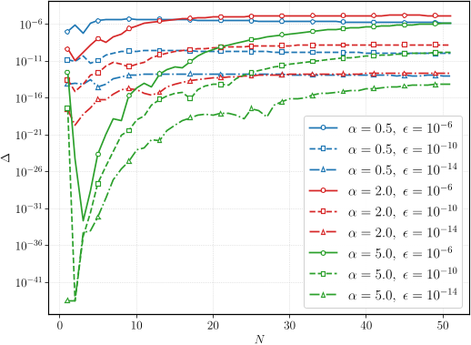
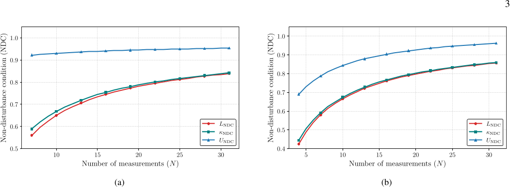
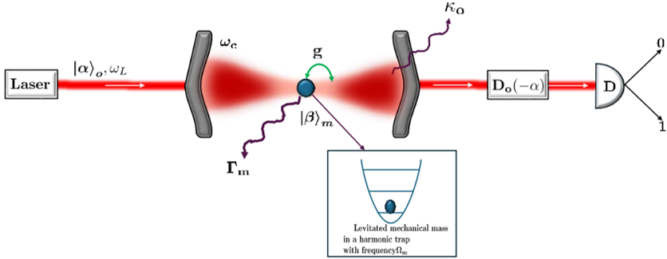

What if we could 'freeze' the quantum behavior of large objects, making their subtle quantum effects easier to observe? While quantum phenomena are well-known at the microscopic scale, seeing these effects in massive objects remains a significant challenge. Recent theoretical work proposes using the Quantum Zeno Effect—a phenomenon where frequent measurements can inhibit a system's evolution—to amplify and reveal quantum signatures in macroscopic mechanical oscillators.

> **TL;DR**
> - Repeated quantum measurements can amplify tiny quantum disturbances in massive mechanical oscillators, potentially making quantum effects observable at scales larger than ever before.
> - A proposed experimental scheme uses optomechanical setups to implement these measurements, enabling a tunable way to witness the Quantum Zeno Effect in macroscopic systems despite environmental noise.

*Note: this summary is based on a preprint — research shared ahead of formal peer review.*

Quantum mechanics famously governs the behavior of particles at atomic and subatomic scales, but its principles become increasingly difficult to observe as systems grow larger and interact with their environment. This transition from the quantum to the classical world is a fundamental puzzle in physics. Traditionally, experiments have focused on creating and detecting quantum superpositions in relatively large molecules or tiny mechanical resonators cooled to near absolute zero. However, environmental interactions tend to wash out these quantum effects, making them hard to detect in truly massive objects. Instead of trying only to suppress these environmental effects, the new approach focuses on amplifying the inherently quantum disturbance caused by measurement itself, using the Quantum Zeno Effect to 'freeze' the system's evolution and enhance its quantum signatures.

The proposed method involves preparing a massive mechanical oscillator—a tiny object trapped and cooled to its quantum ground state—in a coherent quantum state. The system is then subjected to a sequence of repeated measurements that check whether it remains in this initial state. Each measurement is realized through a beam-splitter-type interaction between the mechanical oscillator and an optical field inside a cavity, followed by photon detection. By adjusting the number and timing of these measurements, the Quantum Zeno Effect can be harnessed to inhibit the oscillator’s natural evolution, effectively amplifying the quantum disturbance caused by measurement. Theoretical analysis quantifies this effect using a testable witness known as the non-disturbance condition (NDC), which compares the system’s behavior with and without intermediate measurements.

The analysis shows that as the number of repeated measurements increases, the survival probability—the chance that the oscillator remains in its initial state—approaches unity, indicating that the system’s evolution is effectively frozen by the Quantum Zeno Effect. Without intermediate measurements, this survival probability diminishes over time. The difference between these two scenarios provides a direct, operational signature of quantum measurement-induced disturbance. Importantly, the effect remains appreciable even when accounting for realistic experimental factors such as optomechanical damping and environmental noise. Numerical simulations confirm that the measurable quantum disturbance grows with the number of measurements, bounded within analytically derived limits, suggesting the feasibility of observing this phenomenon in near-term experiments.

This work offers a novel route to probe quantum mechanics in the macroscopic domain by exploiting the fundamental disturbance caused by quantum measurements rather than solely trying to isolate systems from their environment. Demonstrating the Quantum Zeno Effect in massive mechanical oscillators could deepen our understanding of the quantum-classical boundary and provide new experimental tests of quantum theory at unprecedented scales. Such insights are relevant not only for foundational physics but also for emerging quantum technologies that rely on controlling and measuring large-scale quantum systems.

While theoretically promising, the proposed scheme faces practical challenges. Realizing the necessary trapping, cooling, and precise measurement protocols for massive oscillators requires advanced optomechanical setups operating under ultrahigh vacuum and cryogenic conditions. Environmental decoherence and technical noise remain significant hurdles that could mask the subtle quantum signatures. Moreover, the current results are primarily theoretical and await experimental validation. The amplification of quantum effects via the Quantum Zeno Effect, although conceptually clear, must be demonstrated in practice to confirm its utility for macroscopic quantum tests.

## Figures

*Comparison of survival probabilities from two methods during repeated measurements on a harmonic oscillator, showing differences as measurements increase. — Figure from Debarshi Das et al., [CC BY 4.0](http://creativecommons.org/licenses/by/4.0/), caption edited.*

*Graph shows upper (blue), lower (red) limits, and computed values (green) of κNDC for different parameters and N ranges. — Figure from Debarshi Das et al., [CC BY 4.0](http://creativecommons.org/licenses/by/4.0/), caption edited.*

*A levitated mass in a cavity interacts with laser light, enabling precise control and measurement through optical detection. — Figure from Debarshi Das et al., [CC BY 4.0](http://creativecommons.org/licenses/by/4.0/), caption edited.*

## Sources

- [Maximizing Nonclassicality of Massive Objects via Quantum Zeno Effect](https://arxiv.org/abs/2608.13942)
- DOI: [10.48550/arxiv.2608.13942](https://doi.org/10.48550/arxiv.2608.13942)

*This article reuses and adapts text and figures from the original research by Debarshi Das et al., available via arXiv Quantum Physics, under the [CC BY 4.0](http://creativecommons.org/licenses/by/4.0/) license.*
