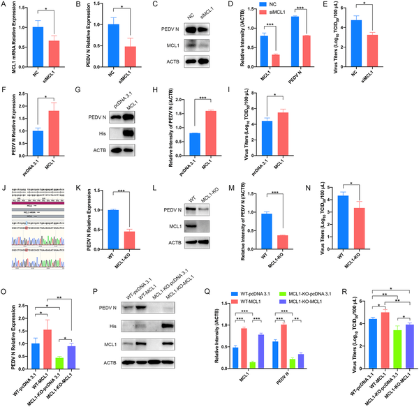
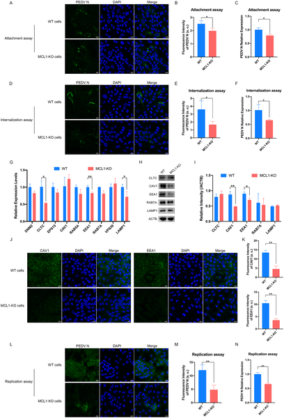
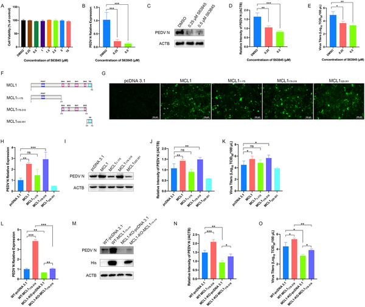

Porcine epidemic diarrhea virus (PEDV) is a highly contagious virus that devastates pig populations worldwide, causing severe intestinal disease and threatening the global pork industry. While vaccines struggle to keep up with emerging viral variants, scientists are uncovering how the virus exploits the pig’s own cellular machinery to replicate. A recent study shines light on a surprising host protein, MCL1, which teams up with another protein to hijack fat metabolism inside cells, fueling the virus’s replication. Understanding this molecular teamwork could open new avenues to control this economically significant animal disease.

> **TL;DR**
> - The host protein MCL1 promotes PEDV replication by facilitating the mitochondrial breakdown of arachidonic acid, a key fatty acid, through its BH domain.
> - MCL1 partners with ACSBG1, a metabolic enzyme, to enhance arachidonic acid β-oxidation, providing energy that supports viral replication inside pig cells.

Porcine epidemic diarrhea virus is an Alphacoronavirus that causes severe diarrhea and high mortality in piglets, leading to substantial economic losses in pig farming worldwide. Despite vaccination efforts, highly virulent PEDV variants continue to emerge, challenging disease control. Viruses like PEDV rely heavily on host cell factors to complete their life cycle, but many of these host-virus interactions remain poorly understood. Previous genome-wide CRISPR screens identified MCL1, a cellular protein known for regulating cell survival and mitochondrial function, as important for PEDV replication. However, the precise mechanisms by which MCL1 supports the virus were unclear until now.

The researchers used a combination of genetic and biochemical approaches in porcine kidney cells susceptible to PEDV infection. They created MCL1 knockout cells using CRISPR-Cas9 gene editing and assessed how loss of MCL1 affected viral replication. They also performed domain-mapping experiments by expressing truncated versions of MCL1 to pinpoint which part of the protein was critical for supporting the virus. Transcriptome sequencing and metabolic assays were conducted to explore changes in cellular metabolism, particularly focusing on arachidonic acid pathways. Protein interaction studies identified ACSBG1 as a partner of MCL1, and functional assays tested how these proteins cooperated to regulate fatty acid metabolism and viral replication.

The study revealed that MCL1 is essential for efficient PEDV replication in pig cells. Deleting MCL1 significantly reduced viral RNA and protein levels as well as infectious virus production. The BH domain of MCL1 was identified as the key region promoting viral replication. Loss of MCL1 disrupted the mitochondrial β-oxidation of arachidonic acid, causing accumulation of free arachidonic acid and activation of secondary metabolic pathways that inhibited the virus. The researchers discovered that ACSBG1 binds to the N-terminal region of MCL1 and together they enhance arachidonic acid β-oxidation. This metabolic cooperation fuels the energy-intensive replication phase of PEDV infection, highlighting a novel role for MCL1 beyond its classical anti-apoptotic functions.

This work uncovers a previously unknown mechanism by which PEDV exploits host fatty acid metabolism to support its replication. By showing that MCL1 and ACSBG1 jointly regulate arachidonic acid breakdown to meet the virus’s energetic needs, the study provides new insights into the metabolic crosstalk during viral infection. These findings could inform the development of antiviral strategies targeting host metabolic pathways, offering a complementary approach to vaccines for controlling PEDV outbreaks. Given the global impact of PEDV on swine health and agriculture, understanding these host-virus interactions is a valuable step toward mitigating economic losses.

While the study convincingly demonstrates the role of MCL1 and ACSBG1 in PEDV replication in cultured cells, further research is needed to validate these findings in live pigs and in diverse viral strains. The metabolic pathways involved are complex, and targeting them therapeutically may have unintended effects on host cell function. Additionally, the interplay between viral factors and host metabolism likely involves multiple proteins and pathways beyond MCL1 and ACSBG1. Thus, while promising, these results represent an early step in translating molecular insights into practical disease control measures.

## Figures

*Reducing MCL1 lowers PEDV virus levels in cells, while increasing MCL1 boosts virus infection and production.*

*Removing MCL1 protein blocks early and late stages of PEDV virus infection in cells, shown by reduced virus levels and gene activity.*

*MCL1 helps PEDV virus grow, and blocking its BH domain reduces infection and virus levels in cells.*

## Sources

- [MCL1 promotes porcine epidemic diarrhea virus replication by modulating arachidonic acid metabolic pathway](https://journals.plos.org/plospathogens/article?id=10.1371/journal.ppat.1014170)
- DOI: [10.1371/journal.ppat.1014170](https://doi.org/10.1371/journal.ppat.1014170)
