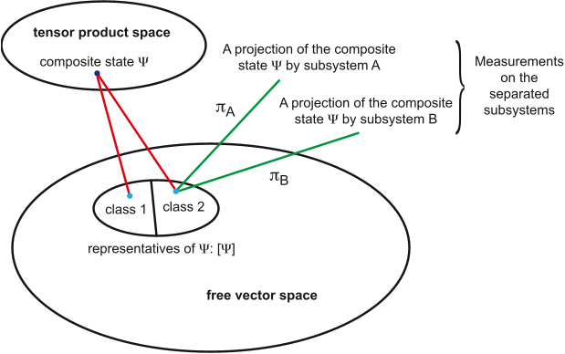

How can measuring one particle instantly affect another far away without any interaction? This puzzling phenomenon, known as quantum nonlocality, has fascinated scientists and philosophers for nearly a century. At the heart of this mystery lies the quantum measurement problem: how does a quantum system, described by a superposition of many possibilities, suddenly 'collapse' to a single definite outcome when observed? Recent theoretical advances offer a fresh perspective that could clarify these foundational questions without resorting to extra assumptions or modifications of quantum mechanics.

> **TL;DR**
> - A new theoretical framework shows how measurements on parts of an entangled quantum system yield definite outcomes naturally within standard quantum mechanics.
> - This approach also explains the origin of nonlocal correlations between distant entangled particles without requiring any direct interaction or mysterious 'spooky action at a distance.'

*Note: this summary is based on a preprint — research shared ahead of formal peer review.*

Quantum mechanics describes physical systems with wavefunctions that can exist in superpositions—multiple states at once. Yet, when we measure such a system, we observe a single definite result. This apparent 'collapse' of the wavefunction has long challenged physicists because the fundamental equations of quantum mechanics are linear and deterministic, making the abrupt collapse seem at odds with the theory. Moreover, entangled particles exhibit correlations that defy classical intuition, famously highlighted by Einstein, Podolsky, and Rosen in 1935 and later tested through Bell's inequalities. Understanding how measurements produce definite outcomes and how these nonlocal correlations arise remains a central problem in the foundations of quantum physics.

The new approach builds on a concept called the 'contextual phase model,' which considers how measurements project the overall entangled state onto separated subsystems. By carefully defining what it means for subsystems to be 'separated' and analyzing the mathematical structure of their combined state spaces, the theory reveals that the wavefunction encodes a set of statistical outcomes rather than a single predetermined result. Using analogies like quantum beam splitters, the model shows how measurement devices map superpositions onto distinct output states. Crucially, it demonstrates that the apparent collapse and nonlocal correlations emerge from interference effects tied to hidden phase information in the projected subsystem states, all within the standard linear framework of quantum mechanics.

This framework explains why measurements on each subsystem yield definite outcomes without invoking nonlinear dynamics or ad hoc collapse postulates. It clarifies that the 'collapse' is effectively an interference phenomenon arising from the contextual phases associated with the subsystems. Furthermore, it accounts for the strong correlations observed between entangled particles measured at distant locations, showing these nonlocal correlations do not require any physical interaction or communication between the subsystems. The theory aligns with experimental violations of Bell inequalities, confirming it is not a hidden local variable model but a natural consequence of the quantum formalism when properly understood.

By providing a coherent explanation for both the measurement problem and quantum nonlocality within the existing theory, this work addresses two of the most profound puzzles in quantum mechanics. It offers a conceptual framework that could deepen our understanding of quantum reality and guide future explorations of quantum information and entanglement. While primarily theoretical and abstract, clarifying these foundational issues is essential for the ongoing development of quantum technologies and for resolving long-standing debates about the nature of measurement and reality in quantum physics.

As this work is currently presented as a theoretical preprint on arXiv without peer review, its claims require further scrutiny and validation by the scientific community. The concepts involved are highly abstract and may be challenging to visualize or test directly. Additionally, while the framework explains measurement and nonlocality within standard quantum mechanics, it does not yet offer immediate practical applications or experimental predictions beyond existing theory. Further research will be needed to explore its implications and to confirm its consistency with all aspects of quantum phenomena.

## Figures

*Diagram linking combined states to groups of vectors representing two separate parts in a shared mathematical space. — Figure from Grgeory D. Scholes, [CC BY 4.0](http://creativecommons.org/licenses/by/4.0/), caption edited.*

## Sources

- [Measurement of quantum states and nonlocal correlations](https://arxiv.org/abs/2605.21243)
- DOI: [10.48550/arxiv.2605.21243](https://doi.org/10.48550/arxiv.2605.21243)

*This article reuses and adapts text and figures from the original research by Grgeory D. Scholes, available via arXiv Quantum Physics, under the [CC BY 4.0](http://creativecommons.org/licenses/by/4.0/) license.*
