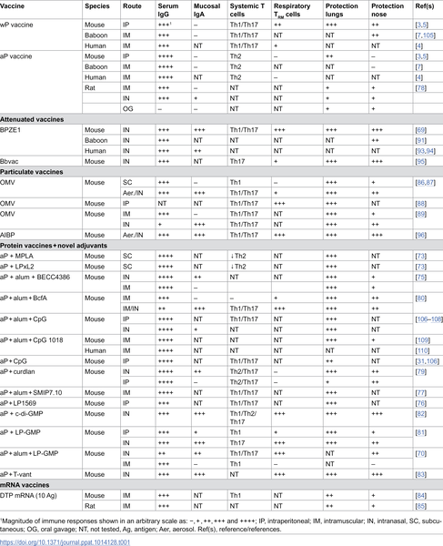

Why is whooping cough making a comeback even though most people get vaccinated? Whooping cough, caused by the bacterium Bordetella pertussis, was once well controlled by vaccines, yet recent years have seen a resurgence of this respiratory disease. Understanding how our immune system fights this infection—and why current vaccines might not be enough—can shed light on new approaches designed to stop the spread of whooping cough at its source: the nose and lungs.

> **TL;DR**
> - Natural infection with B. pertussis induces a broad immune response involving antibodies and specialized T cells that reside in the respiratory tract, helping clear bacteria and prevent reinfection.
> - Current acellular pertussis vaccines protect against disease but do not induce strong local immunity in the nose and lungs, allowing bacteria to persist and spread; new nasal vaccines aim to fix this by stimulating local immune defenses.

Whooping cough, or pertussis, is a severe respiratory illness especially dangerous for infants. It spreads through airborne droplets, initially infecting the upper respiratory tract before moving deeper into the lungs. Historically, whole-cell pertussis vaccines dramatically reduced disease incidence, but concerns about side effects led to the adoption of acellular vaccines. These newer vaccines generate strong antibody responses in the blood but do not effectively stimulate immune cells in the respiratory tract where the bacteria first take hold. This gap in local immunity has contributed to the recent resurgence of pertussis, even in highly vaccinated populations.

Researchers have studied immunity to B. pertussis using animal models, particularly mice and baboons, alongside human clinical observations. They have characterized how innate immune cells like macrophages, dendritic cells, neutrophils, and natural killer cells respond early in infection. Importantly, studies have focused on tissue-resident memory T cells (TRM) in the respiratory tract, which produce key signaling molecules such as IL-17 and IFN-γ that recruit other immune cells and help clear bacteria. Vaccine studies compare responses induced by natural infection versus current acellular vaccines, highlighting differences in local versus systemic immunity.

Natural infection triggers a coordinated immune response involving antibodies and T cells that reside in the nasal and lung tissues. IL-17-secreting respiratory TRM cells recruit neutrophils to the site of infection, aiding bacterial clearance. However, acellular pertussis vaccines primarily induce circulating antibodies and a Th2-biased immune response, failing to generate these critical local T cell populations or mucosal antibodies like IgA. As a result, vaccinated individuals can still harbor and transmit B. pertussis despite being protected from severe disease. New vaccine candidates delivered nasally aim to induce TRM cells and mucosal immunity, potentially blocking bacterial colonization and transmission.

This understanding of immune mechanisms explains why whooping cough has resurged despite vaccination and points to a path forward for improved vaccines. By targeting immune responses directly in the respiratory tract, next-generation vaccines could not only protect individuals from disease but also reduce the spread of B. pertussis in the community. Such vaccines would represent a significant advancement in controlling pertussis outbreaks and protecting vulnerable populations, especially infants who are most at risk.

While animal models have provided valuable insights into immune responses to B. pertussis, translating these findings to humans requires further clinical research. The safety and efficacy of nasal-delivered vaccines must be carefully evaluated in trials. Additionally, the complex interplay of bacterial virulence factors and host immunity means that no vaccine is likely to be perfect, and ongoing surveillance and vaccine updates may be necessary to maintain control of whooping cough.

## Figures

*Table showing how vaccines help the body fight the whooping cough bacteria, Bordetella pertussis.*

## Sources

- [Mechanisms of natural and vaccine-induced immunity to Bordetella pertussis](https://journals.plos.org/plospathogens/article?id=10.1371/journal.ppat.1014128)
- DOI: [10.1371/journal.ppat.1014128](https://doi.org/10.1371/journal.ppat.1014128)
