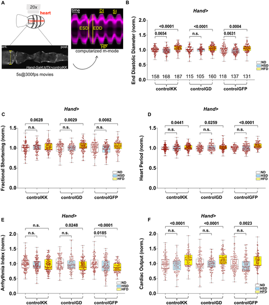
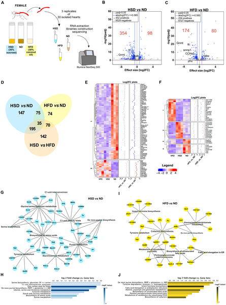
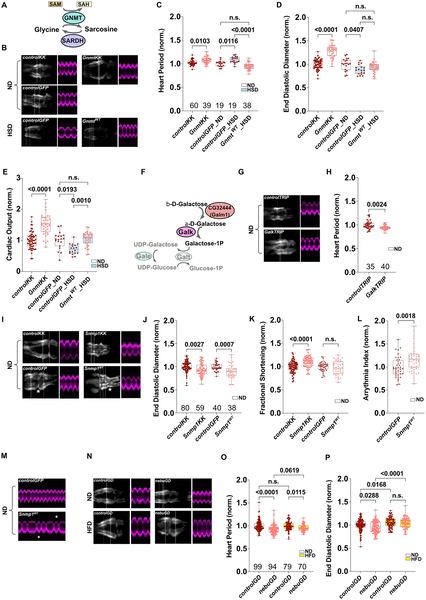
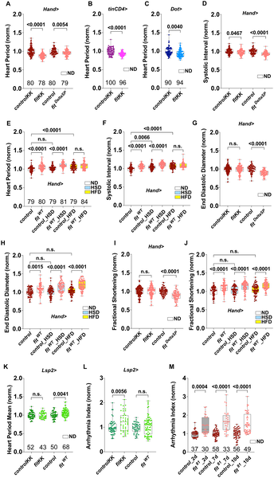

What happens to the heart when the diet is loaded with sugar or fat? While this question is critical for understanding diabetes-related heart disease in humans, it turns out that even tiny fruit flies offer valuable clues. Recent research shows that a fly’s heart doesn’t just pump blood—it also fine-tunes its metabolism and releases hormones to adapt to nutritional stress. These discoveries shed light on the complex ways hearts respond to unhealthy diets and may help us better understand diabetic cardiomyopathy.

> **TL;DR**
> - High sugar and high fat diets cause distinct changes in the fruit fly heart’s gene activity, affecting metabolism and heart function.
> - The fly heart secretes a satiety hormone called Fit that influences both heart performance and feeding behavior, acting as a new type of cardiokine.

Diabetes and obesity are global health challenges linked to poor diet, and one major complication is diabetic cardiomyopathy—a heart condition marked by impaired contraction and structural changes. The causes of these heart problems are complex and not fully understood. Fruit flies (Drosophila melanogaster), despite their simplicity, have hearts with cellular and molecular features resembling those of mammals. They have become a powerful model for studying how diet affects heart function. Previous studies showed that feeding flies diets rich in sugar or fat leads to metabolic disturbances and heart dysfunction similar to those seen in diabetic patients. Building on this, researchers sought to pinpoint the molecular changes in the fly heart that occur early during exposure to high sugar or fat, to better understand the heart’s adaptive responses.

The researchers fed female fruit flies either a normal diet, a high sugar diet (HSD) for 10 days, or a high fat diet (HFD) for a shorter period (3 days of HFD after 7 days normal diet). They then used a non-invasive live imaging technique to measure heart function in intact flies, capturing parameters like heart size, contraction efficiency, rhythm, and blood flow. Next, they dissected hearts and performed RNA sequencing to analyze gene expression changes induced by the diets. They focused on genes involved in metabolism and secreted proteins, and used genetic tools to manipulate specific genes in the heart to test their roles in cardiac adaptation.

Both high fat and high sugar diets altered heart function, with high fat causing more pronounced changes such as heart enlargement and increased contraction strength. Gene expression analysis revealed hundreds of genes whose activity changed in response to diet. Notably, genes involved in core metabolic pathways like one-carbon metabolism and galactose processing were downregulated, indicating a fine-tuning of heart metabolism under nutritional stress. The study also uncovered that the heart acts as a secretory organ by modulating the expression of genes encoding secreted proteins. Among these, the researchers identified the Fit gene, which produces a satiety hormone previously known to regulate feeding. They showed that Fit is expressed in fly heart cells and acts as a cardiokine—modulating heart function locally and influencing feeding behavior remotely. Manipulating Fit levels in the heart affected both cardiac performance and food intake, highlighting its dual role.

This research expands our understanding of the heart as more than a mechanical pump—it is a dynamic organ that adapts metabolically and communicates systemically through hormones. Identifying the Fit hormone as a cardiokine in flies opens new avenues for exploring how the heart influences whole-body metabolism and behavior, especially under dietary stress. Since many metabolic pathways are conserved between flies and humans, these findings may inform future studies on diabetic cardiomyopathy mechanisms and potential therapeutic targets. Understanding how the heart adapts to excess sugar and fat could ultimately help in developing strategies to prevent or treat heart complications in diabetes and obesity.

While fruit flies provide a valuable and genetically tractable model, their physiology differs from humans in important ways. The duration and severity of dietary challenges in flies are shorter and less complex than chronic human conditions. Also, the identified hormone Fit and its functions need further validation in mammalian systems before drawing direct clinical implications. The study focused on early molecular changes, so long-term effects and interactions with other organs remain to be explored. Nonetheless, these findings offer a foundational step toward unraveling the heart’s adaptive responses to nutritional stress.

## Figures

*Heart function in female flies was measured after 10 days on normal or high-sugar diets and 3 days on a high-fat diet, showing changes in heart size and activity.*

*High fat or sugar diets change heart gene activity, affecting metabolism and key biological pathways.*

*This figure shows how glycine metabolism and related enzymes affect heart function and sugar processing in fruit flies.*

*Cardiac Fit gene affects heart performance, size, and function in flies under normal and high-sugar/fat diets, with effects varying by cell type and age.*

## Sources

- [Metabolism fine tuning and cardiokines secretion represent adaptative responses of the heart to High Fat and High Sugar Diets in flies](https://journals.plos.org/plosgenetics/article?id=10.1371/journal.pgen.1012189)
- DOI: [10.1371/journal.pgen.1012189](https://doi.org/10.1371/journal.pgen.1012189)
