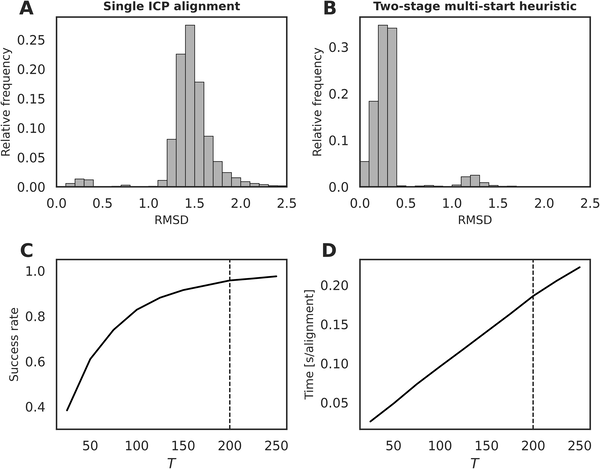
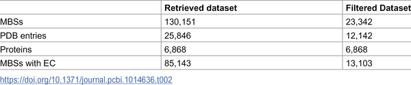
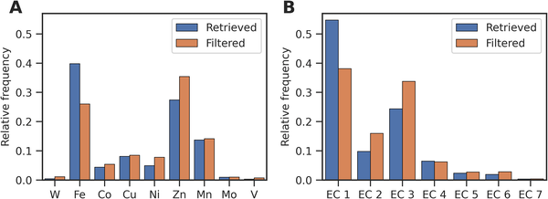

Metals play crucial roles in the structure and function of countless proteins, yet understanding how these metal-binding sites evolve and influence drug interactions remains a challenge. What if we could map these tiny metal neighborhoods across thousands of proteins to uncover hidden evolutionary connections and anticipate unexpected drug side effects? A new study introduces a computational approach that aligns metal-binding sites as atomic point clouds, creating a network that reveals surprising relationships among proteins and their interactions with medicines.

> **TL;DR**
> - The study represents metal-binding sites as 3D atomic point clouds and aligns over 23,000 such sites from the Protein Data Bank using a refined iterative closest point algorithm, building a large similarity network.
> - This network uncovers evolutionary insights by linking proteins with similar metal-binding geometries despite low sequence similarity and predicts 528 potential drug off-target interactions, including known and novel cases.

Proteins that bind metals are essential for many biological processes, from stabilizing protein structure to catalyzing chemical reactions. Traditionally, scientists compare entire protein sequences or folds to understand function and evolution, but metal-binding sites often remain conserved even when overall protein sequences diverge. These sites are small, complex arrangements of atoms that coordinate metal ions, making them difficult to analyze with standard alignment methods focused on whole proteins. With tens of thousands of protein structures now available, a method that compares these local metal-binding environments directly could reveal new biological insights and help predict how drugs might interact with unintended protein targets.

The researchers collected over 23,000 metal-binding sites from experimentally determined protein structures in the Protein Data Bank. Each site was represented as a fixed-size point cloud of 65 protein atoms surrounding the metal ion, capturing not only the immediate metal coordination but also nearby structural context. They applied an advanced iterative closest point (ICP) algorithm, enhanced with a multi-start coarse-to-fine strategy and robust loss functions, to align these atomic point clouds pairwise. This approach minimized alignment errors and avoided local minima that can trap standard ICP methods. The resulting pairwise similarity scores were used to construct a large network where nodes represent metal-binding sites and edges connect structurally similar sites.

The network analysis revealed that metal-binding sites cluster strongly according to the type of metal ion they coordinate and their enzymatic functions. Conserved families of metalloenzymes formed tight subnetworks, including unusual members like a dinickel metformin hydrolase. Interestingly, many connections linked proteins with nearly identical metal-binding geometries despite very low sequence similarity, suggesting either local conservation amid divergent evolution or convergent evolution toward similar metal coordination. By overlaying known drug-binding information, the network identified drugs whose targets are densely connected and predicted 528 drug off-target interactions across 88 drugs and 151 human proteins. This included known off-targets such as matrix metalloproteinase inhibitors binding to ADAM/ADAMTS proteins, as well as novel candidates for further study.

This work offers a scalable and precise way to compare metal-binding sites at the atomic level, advancing our understanding of metalloprotein evolution beyond what sequence or global structure comparisons can reveal. The similarity network serves as a valuable resource for identifying conserved functional motifs and exploring evolutionary relationships that might otherwise remain hidden. Importantly, the approach also provides a practical tool for drug discovery and safety by predicting off-target interactions that could lead to side effects. As metalloproteins are involved in numerous diseases and therapeutic targets, this method helps bridge structural biology and pharmacology in a meaningful way.

While the atomic point cloud representation captures detailed local geometry, it excludes solvent molecules and non-protein heteroatoms, which can influence metal-binding site function. The method relies on high-quality crystallographic data and fixed-size neighborhoods, which may not capture all functional nuances. The predicted drug off-targets are based on structural similarity and network proximity but require experimental validation to confirm biological relevance. Additionally, the moderate correlation between protein sequence and metal-binding site geometry means that some evolutionary relationships remain complex and multifaceted. Future work integrating dynamic and biochemical data could further enhance these insights.

## Figures

*Comparison of single vs. multi-start ICP methods shows multi-start improves alignment accuracy and speed for matching 3D point clouds.*

*Overview of key features in the collected and refined MBS datasets.*

*Shows how metal types and enzyme classes are distributed before and after removing duplicate data in the dataset.*

## Sources

- [Metal binding site alignment enables network-driven discovery of recurrent geometries across sequence-divergent proteins and drug off-targets](https://journals.plos.org/ploscompbiol/article?id=10.1371/journal.pcbi.1014636)
- DOI: [10.1371/journal.pcbi.1014636](https://doi.org/10.1371/journal.pcbi.1014636)
