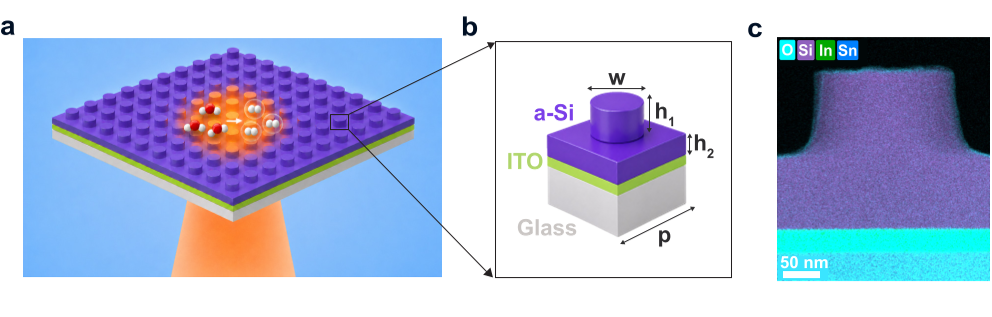
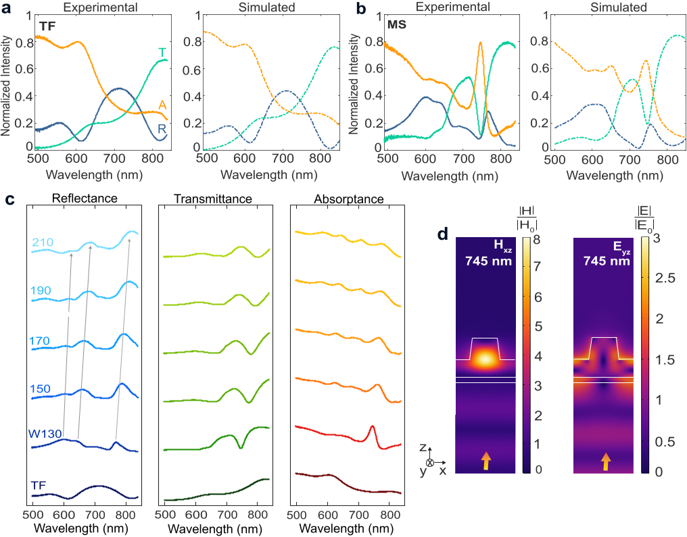
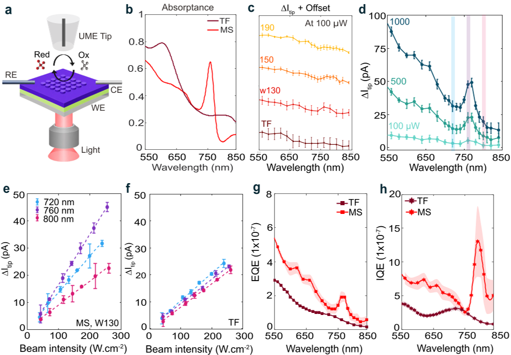
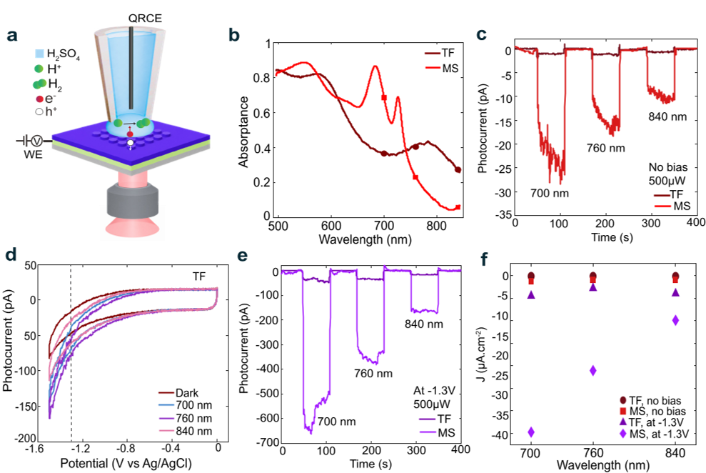

What if a wafer-thin layer of silicon, patterned with tiny nanoscale pillars, could turn sunlight into fuel with up to 20 times greater efficiency? Imagine harnessing the power of engineered light waves, trapped and amplified within a carefully designed silicon surface, to supercharge the chemical reactions that produce clean hydrogen. Recent research reveals that these so-called amorphous silicon metasurfaces can encode photochemical activity in ways previously unattainable, opening new frontiers in solar fuel generation.

> **TL;DR**
> - Amorphous silicon metasurfaces patterned with nanoscale resonators can achieve over 80% light absorption near the silicon band edge, far surpassing unpatterned films.
> - This resonant light trapping leads to up to 21-fold enhancement in hydrogen evolution rates, without added co-catalysts, demonstrating stable and efficient solar-to-fuel conversion.

*Note: this summary is based on a preprint — research shared ahead of formal peer review.*

Converting sunlight directly into chemical fuels like hydrogen is a promising strategy for renewable energy storage and clean fuel production. However, designing photoelectrodes that efficiently absorb sunlight, transport charge carriers, and catalyze chemical reactions simultaneously remains a major challenge. Traditional silicon photoelectrodes often require thick layers to capture enough light, but this thickness hampers charge transport and reduces efficiency. Nanostructured designs can help by increasing surface area and scattering light, but controlling where and how light drives chemical reactions at the nanoscale has been difficult. This is where metasurfaces—engineered arrays of nanoscale structures—come into play, enabling precise control over light-matter interactions.

Researchers fabricated metasurfaces by patterning 220-nanometer-thick amorphous silicon films into square arrays of cylindrical nanoresonators on transparent conductive glass substrates. By tuning the diameter, height, and spacing of these nano-pillars, they engineered optical resonances—specifically Mie-type and guided-mode resonances—that confine and enhance electromagnetic fields within the silicon layer. Using a combination of optical spectroscopy, full-wave electromagnetic simulations, and advanced microscopy techniques like photo-scanning electrochemical microscopy (photo-SECM), they measured how these resonances affect local photochemical activity. They also performed hydrogen evolution experiments under photocatalytic and photoelectrochemical conditions to quantify improvements in solar-to-fuel conversion efficiency.

The metasurfaces exhibited absorptance above 80% near the silicon band edge (~760 nm), compared to less than 30% for unpatterned films of the same thickness. Photo-SECM measurements revealed that the resonant modes spatially and spectrally encoded chemical reactivity, resulting in a tenfold increase in internal quantum efficiency near the band edge. Importantly, hydrogen evolution rates increased by up to 21 times under photocatalytic conditions and 15 times under photoelectrochemical bias, even after accounting for the increased surface area from nanostructuring. Ultrafast transient reflectivity studies confirmed that these enhancements arise from photon-driven carrier dynamics rather than photothermal effects. The metasurfaces also demonstrated stability over more than 10 hours of continuous operation in aqueous environments.

This work establishes amorphous silicon metasurfaces as a versatile, stable, and efficient platform for resonantly programmed photocatalysis without the need for additional co-catalysts or passivation layers. By precisely engineering light absorption and carrier dynamics at the nanoscale, these metasurfaces overcome fundamental trade-offs in traditional photoelectrode design. The ability to tailor photochemical activity spectrally and spatially opens new pathways for optimizing solar fuel devices and could accelerate the development of scalable, low-cost hydrogen production technologies. Moreover, leveraging silicon—a widely available and well-understood material—facilitates integration with existing semiconductor manufacturing processes.

While the results are promising, this study is currently a preprint and has not yet undergone peer review, so further validation is needed. The experiments focus on model redox reactions and hydrogen evolution under controlled laboratory conditions; scaling up and integrating these metasurfaces into practical devices will require additional engineering. Also, long-term durability beyond the tested 10-hour window and performance under real solar illumination conditions remain to be demonstrated. Nonetheless, the fundamental insights into resonant light-matter interactions and their impact on photocatalysis provide a strong foundation for future research.

## Figures

*Illustration of a silicon-based nano-structured surface designed to boost light-driven chemical reactions using tiny cylindrical resonators. — Figure from Elif Nur Dayi et al., [CC BY 4.0](http://creativecommons.org/licenses/by/4.0/), caption edited.*

*Optical tests show how thin films and patterned surfaces absorb and reflect light differently, with detailed light behavior near tiny pillars. — Figure from Elif Nur Dayi et al., [CC BY 4.0](http://creativecommons.org/licenses/by/4.0/), caption edited.*

*Photo-SECM tests show a-Si metasurfaces boost light-driven chemical reactions, especially near 760 nm, with up to 10x higher efficiency than thin films. — Figure from Elif Nur Dayi et al., [CC BY 4.0](http://creativecommons.org/licenses/by/4.0/), caption edited.*

*Light-driven measurements show that specially designed silicon surfaces boost hydrogen production better than plain films under different light colors. — Figure from Elif Nur Dayi et al., [CC BY 4.0](http://creativecommons.org/licenses/by/4.0/), caption edited.*

## Sources

- [Metaphotonic Catalysis: Amorphous silicon metasurfaces encode photochemical activity](https://arxiv.org/abs/2608.02354)
- DOI: [10.48550/arxiv.2608.02354](https://doi.org/10.48550/arxiv.2608.02354)

*This article reuses and adapts text and figures from the original research by Elif Nur Dayi et al., available via arXiv Chemical Physics, under the [CC BY 4.0](http://creativecommons.org/licenses/by/4.0/) license.*
