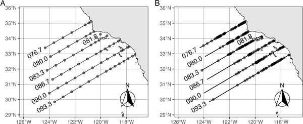
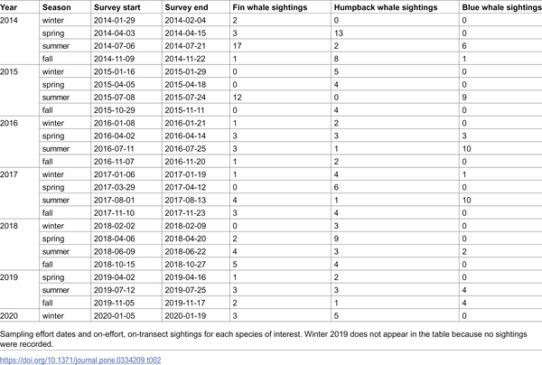
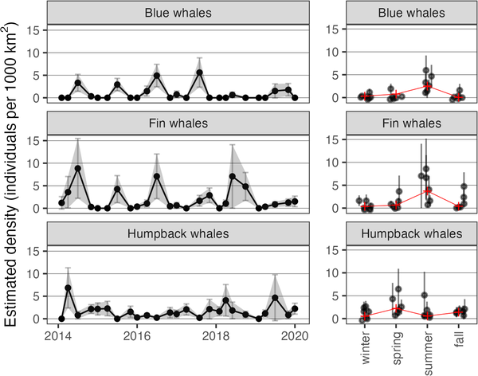

Imagine trying to find some of the largest animals on Earth—blue, fin, and humpback whales—in the vast Pacific Ocean. Now, picture doing this not by spotting the whales themselves, but by examining the tiniest ocean inhabitants: microbes and small plankton. Recent research has uncovered that these microscopic communities hold surprising clues about where these majestic giants gather, opening new doors for understanding and protecting marine ecosystems.

> **TL;DR**
> - Microbial and small plankton communities in ocean water samples can predict the density of baleen whales with remarkable accuracy in the Southern California Current Ecosystem.
> - This approach links whales to their broader ecological habitat, including potential prey and microbial associates, and could improve conservation efforts by enhancing whale distribution models.

Baleen whales such as blue, fin, and humpback whales are iconic marine mammals that migrate long distances to feed in productive ocean regions like the California Current Ecosystem (CCE). Their presence is closely tied to the availability of prey like krill and small fish, which in turn depend on complex microbial and plankton communities. However, directly surveying whales is challenging due to their wide-ranging movements and low encounter rates. Understanding where whales are and why they choose certain areas is critical for conservation, especially in regions with heavy human activity such as shipping and military operations.

To explore whether tiny ocean life can serve as a proxy for whale presence, researchers analyzed six years of data (2014–2020) from the California Cooperative Oceanic Fisheries Investigations (CalCOFI). They combined visual line transect surveys of blue, fin, and humpback whales with environmental DNA (eDNA) metabarcoding of microbial and small plankton communities collected from seawater samples. Using genetic markers targeting 16S and 18S ribosomal RNA genes, they identified the composition of prokaryotic and eukaryotic microbes as well as small zooplankton. Statistical models then linked these planktonic community profiles to whale density estimates, allowing the team to test how well microscopic organisms predicted whale presence across seasons and years.

The study found that specific planktonic communities were strong predictors of whale densities, explaining 81–99% of the variability in whale counts. These models could estimate whale numbers to within about one individual per 1,000 square kilometers, outperforming simpler prediction methods by up to 65%. Some of the microbial taxa identified may be directly associated with whales as parasites or part of their skin and respiratory microbiomes. Others likely reflect the food web supporting whale prey, such as krill and small fish. This suggests that the microbial and plankton communities together form an “ecological habitat” that supports baleen whales, linking microscopic and large marine life in a complex ecological web.

By demonstrating that microbial and plankton communities can serve as reliable indicators of baleen whale density, this research offers a novel tool for marine monitoring and conservation. It bridges microbiology and marine mammal ecology, providing a fresh perspective on how large animals interact with their microscopic environment. Such predictive models could improve management decisions in regions where whales face risks from human activities, helping to protect these threatened species more effectively. Moreover, understanding these ecological connections deepens our appreciation of the intricate relationships that sustain ocean ecosystems.

While the findings are promising, the exact ecological roles and interactions of the microbial and plankton taxa identified remain to be fully understood. Some taxa may be incidental or influenced by other environmental factors not captured in the study. Further research is needed to clarify how these communities function collectively and how changes in ocean conditions might affect both microbes and whales. Additionally, the approach currently applies to a well-studied and productive region; its applicability to other ocean areas with different ecological dynamics requires investigation.

## Figures

*Map showing where NCOG samples were taken and baleen whales were spotted along CalCOFI routes from 2014-2020.*

*Number of whale sightings per cruise for different whale species.*

*Estimated number of baleen whales per 1000 km² shown over years and seasons, with seasonal averages highlighted in red.*

## Sources

- [Microbial and small zooplankton communities predict density of baleen whales in the southern California Current Ecosystem](https://journals.plos.org/plosone/article?id=10.1371/journal.pone.0334209)
- DOI: [10.1371/journal.pone.0334209](https://doi.org/10.1371/journal.pone.0334209)
