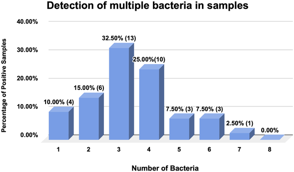
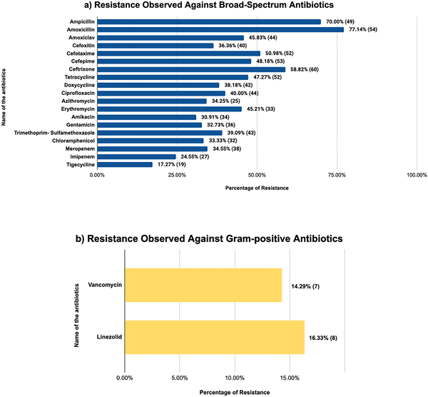
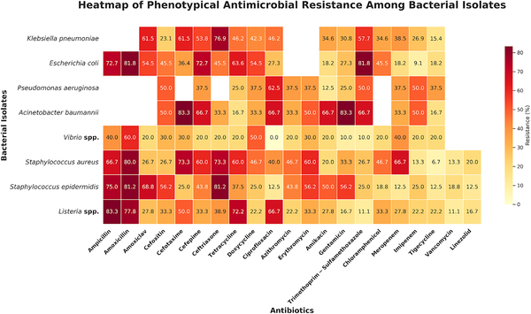

Electrolyte drinks are a staple for many people seeking quick hydration and replenishment of essential minerals. But what if your favorite refreshing beverage harbors invisible threats—bacteria that not only contaminate the drink but also resist multiple antibiotics? Recent research from Dhaka, Bangladesh, uncovers this unsettling possibility, revealing that widely consumed electrolyte drinks may carry multidrug-resistant bacteria, posing a hidden health risk to consumers.

> **TL;DR**
> - All tested electrolyte drink samples from Dhaka contained bacteria, with 40% exceeding safe microbial limits and 55% showing signs of fecal contamination.
> - Many bacteria isolated were resistant to multiple antibiotics, including broad-spectrum drugs, highlighting a serious public health concern.

Electrolyte drinks are designed to restore vital minerals like sodium and potassium lost through sweating or dehydration. Originally favored by athletes, these beverages have become popular among the general public for hydration and energy. However, their composition—rich in water, sugars, and minerals—can create an environment conducive to microbial growth if manufacturing and handling are not carefully controlled. While contamination of beverages is a known issue worldwide, little research has focused specifically on electrolyte drinks, especially in regions like Bangladesh where regulatory oversight may be limited. This study addresses that gap by examining the microbiological quality of local electrolyte drinks sold in Dhaka, assessing both the presence of harmful bacteria and their resistance to antibiotics.

Researchers collected 40 samples from nine local electrolyte drink brands across Dhaka, ensuring each was sealed and within its expiration date. Using membrane filtration and enrichment broths, they cultured bacteria present in the drinks. Identification combined classical microbiological techniques with molecular methods, including PCR to confirm bacterial species. The team tested bacterial isolates for susceptibility to a range of antibiotics using the standardized Kirby-Bauer disk diffusion method. They also screened for genes known to confer resistance to critical antibiotics. Additional tests evaluated the bacteria’s ability to break down red blood cells (hemolysis) and resist human serum, indicators of pathogenic potential.

The results were striking: every sample contained bacteria, and 40% exceeded the aerobic plate count limits recommended by the U.S. FDA for juices. More than half the samples showed fecal contamination above safe thresholds set by the FAO. Both Gram-negative bacteria—such as Klebsiella pneumoniae, Escherichia coli, and Vibrio species—and Gram-positive bacteria—including Staphylococcus aureus and Listeria species—were found, often multiple species in the same sample. Importantly, many isolates exhibited multidrug resistance, particularly to broad-spectrum antibiotics like amoxicillin and ceftriaxone. About a quarter of the bacteria were hemolytic, and a significant portion resisted human serum, suggesting they could survive in the human body and potentially cause disease. Genetic testing confirmed the presence of antibiotic resistance genes in several isolates.

These findings raise important concerns about the safety of electrolyte drinks sold in Dhaka and potentially similar markets. The presence of multidrug-resistant bacteria in beverages consumed widely by the public could contribute to the spread of antibiotic resistance, a global health threat. Contaminated drinks also pose direct risks of foodborne illness, especially for vulnerable populations such as children, the elderly, or immunocompromised individuals. This study highlights the urgent need for improved manufacturing hygiene, regulatory oversight, and consumer awareness to ensure these popular hydration products do not become vehicles for harmful pathogens.

While the study provides valuable insights, it is limited to samples from Dhaka and may not represent all electrolyte drinks available in Bangladesh or other countries. The sample size, though sufficient to reveal contamination trends, is relatively small. Additionally, the study focuses on culturable bacteria and known resistance genes, potentially overlooking other microbes or resistance mechanisms. Further research with larger sample sizes and broader geographic scope would help clarify the extent of this issue. Nonetheless, these results underscore the importance of microbiological testing and regulation for beverage safety.

## Figures

*This figure shows the percentage of samples containing multiple types of bacteria, with sample counts included in parentheses.*

*Bar charts show antibiotic resistance percentages in bacteria, excluding natural resistance, for broad spectrum (110 samples) and Gram-positive (31 samples).*

*Heatmap showing how bacteria resist different antibiotics, with blank spots where tests weren't done or not needed.*

## Sources

- [Microbiological quality assessment of potential pathogenic bacteria and multidrug resistance patterns in commercial electrolyte drinks in Dhaka, Bangladesh](https://journals.plos.org/plosone/article?id=10.1371/journal.pone.0336888)
- DOI: [10.1371/journal.pone.0336888](https://doi.org/10.1371/journal.pone.0336888)
