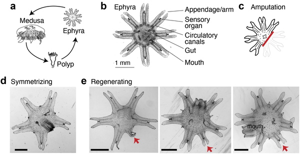
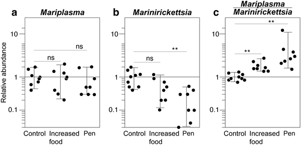
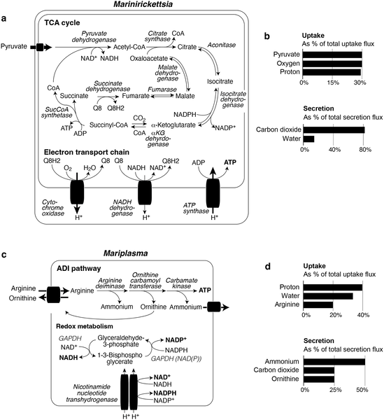
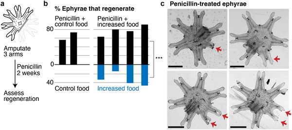

What if tiny microbes living on an animal decide whether it can regrow lost limbs? In an intriguing twist on regeneration biology, scientists studying the moon jellyfish Aurelia coerulea have uncovered that changes in the jellyfish’s microbiome—its community of microbial symbionts—combined with an amino acid called arginine, can activate the jellyfish’s ability to regrow lost arms. This discovery opens a new window into how nutrients and microbes might influence regeneration in animals that typically show limited regrowth.

> **TL;DR**
> - Increasing nutrient availability in moon jellyfish alters their microbiome, reducing certain bacteria that compete with the host for resources and promoting appendage regeneration.
> - The regeneration process involves upregulation of the host’s arginine biosynthesis pathway, and supplementing jellyfish with arginine itself can enhance limb regrowth.

Regeneration—the ability to regrow lost or damaged body parts—is a fascinating but unevenly distributed trait across the animal kingdom. While some animals like salamanders and hydras regenerate limbs or body parts readily, others, including many jellyfish stages, show limited or no appendage regrowth. Nutrient availability has long been known to influence regeneration, with better-fed animals often showing improved healing and regrowth. The moon jellyfish Aurelia coerulea is a useful model for studying these effects because its ability to regenerate varies across its life cycle: sessile polyps regenerate well, but free-swimming juvenile ephyrae usually do not. Previous work showed that feeding these ephyrae more can partially activate regeneration, but the underlying mechanisms remained unclear. Given the growing appreciation of how microbiomes influence animal health and metabolism, researchers asked whether shifts in the jellyfish’s microbial community might play a role in this nutrient-driven regeneration.

The research team collected Aurelia coerulea polyps and induced them to metamorphose into ephyrae, the juvenile free-swimming stage with eight distinct arms. They amputated three arms from these ephyrae and then raised them under different feeding conditions: low food and increased food. They also treated some jellyfish with antibiotics to mimic microbiome changes and supplemented others with arginine, an amino acid. To understand microbial changes, they used quantitative PCR to measure bacterial species abundance and performed genome-scale metabolic modeling of the dominant bacterial symbionts. On the host side, they conducted transcriptomic analyses to identify gene expression changes related to regeneration. Regeneration was assessed two weeks post-amputation by imaging and measuring arm regrowth.

The study found that increasing nutrient availability shifted the jellyfish’s microbiome composition, notably reducing the abundance of a bacterial symbiont called Marinirickettsia, which competes with the host for metabolic resources. Antibiotic treatment that mimicked this microbiome shift also significantly enhanced appendage regeneration. Transcriptomic data revealed that genes involved in the arginine biosynthetic pathway—such as argininosuccinate synthase and carbamoyl phosphate synthase—were upregulated in regenerating animals. Moreover, directly supplementing the water with arginine promoted arm regrowth, indicating that arginine plays a key role in activating regeneration. These results suggest a model where nutrient-driven microbiome changes reduce microbial competition, freeing metabolic resources that the host reallocates to regeneration, with arginine as a critical metabolic signal or building block.

This work highlights a novel link between microbiome composition, nutrient availability, and regeneration in an animal not known for robust appendage regrowth. It suggests that microbes living on or in animals can influence their capacity to heal and regrow by modulating metabolic interactions. The identification of arginine as a metabolic factor promoting regeneration adds to our understanding of the biochemical pathways involved. While these findings are currently limited to jellyfish, they open intriguing questions about whether similar microbiome-metabolism-regeneration interactions exist in other animals, including those of medical interest. Understanding these connections could eventually inform strategies to enhance tissue repair or regeneration in broader biological contexts.

It is important to note that this study focuses on a single jellyfish species and life stage, and the regeneration observed is partial and limited. The microbiome changes and arginine effects were demonstrated under controlled laboratory conditions, and natural environmental factors may influence these dynamics differently. Also, while the metabolic modeling and gene expression data support the proposed mechanism, direct causal links between specific microbial functions and host regeneration remain to be fully established. Finally, extrapolating these findings to other animals, especially humans, requires caution, as regeneration mechanisms and microbiomes vary widely across species.

## Figures

*Moon jelly ephyrae regrow arms better with more nutrients, showing partial regeneration within weeks after injury.*

*More food or penicillin changes microbiome makeup by lowering Marinirickettsia levels in jellyfish after seven days.*

*Diagrams show key bacterial metabolic reactions and main substances taken in or released, making up 90% of their activity.*

*Penicillin helps sea creatures regrow lost arms faster, especially with more food, shown two weeks after cutting.*

## Sources

- [Microbiome modulation in regeneration in jellyfish](https://journals.plos.org/plosone/article?id=10.1371/journal.pone.0355863)
- DOI: [10.1371/journal.pone.0355863](https://doi.org/10.1371/journal.pone.0355863)
