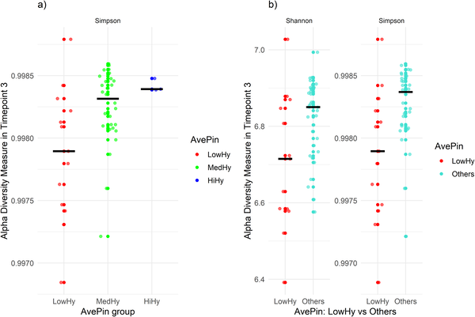

Honey bees are more than just pollinators; they are complex social creatures with remarkable behaviors that help protect their colonies from threats. One such behavior, known as hygienic behavior, allows worker bees to detect and remove diseased or mite-infested brood, limiting the spread of harmful parasites like Varroa destructor. But could tiny microbes living inside the bees’ guts be influencing this crucial social defense? Recent research sheds light on how the diversity of gut bacteria in honey bees might be linked to their ability to fight off these deadly mites.

> **TL;DR**
> - Honey bee colonies with stronger hygienic behavior tend to have more diverse gut microbiota, especially later in the season.
> - Certain beneficial bacteria, like Lactobacillus and Bifidobacterium, are more abundant in highly hygienic colonies, suggesting a microbial role in enhancing disease resistance and mite tolerance.

Varroa destructor mites are one of the most serious threats to honey bee health worldwide. These parasitic mites weaken bees by feeding on their fat bodies and spreading viruses, leading to colony decline and losses. Beekeepers and researchers have long focused on breeding bees that exhibit hygienic behavior—the ability to detect and remove infected or infested brood—to naturally reduce mite populations. Meanwhile, scientists have discovered that the gut microbiota of honey bees plays a vital role in their immunity and overall health. However, the connection between these microscopic gut communities and social immune behaviors like hygiene has remained unclear.

To explore this connection, researchers studied 77 honey bee colonies from a breeding program selected for docility, honey production, and hygienic behavior since 2015. They collected gut samples from worker bees at three points during the active season—June, July, and October 2021—and analyzed the bacterial communities using high-throughput DNA sequencing targeting the 16S rRNA gene. Hygienic behavior was measured through the pin test, where capped brood cells are pierced with a needle and the percentage of brood removed by workers within 24 hours is recorded. Colonies were classified into low, medium, and high hygiene groups based on average pin test scores from March and July. Statistical analyses examined how gut microbiota diversity and composition related to these hygiene categories across the different time points.

The study found significant seasonal patterns linking gut microbiota diversity to hygienic behavior. In October, colonies with higher hygienic scores exhibited greater alpha diversity—meaning a richer and more even mix of gut bacteria—compared to less hygienic colonies. Earlier in July, differences in the overall composition of gut bacteria (beta diversity) were notable between hygiene groups. Importantly, beneficial lactic acid bacteria such as Lactobacillus, Bifidobacterium, and Bombilactobacillus were more abundant in highly hygienic colonies during July. These microbes are known to support immune function and may contribute to enhanced resistance against brood diseases and Varroa mites. No significant diversity differences were observed in June, suggesting the relationship strengthens as the season progresses.

These findings highlight a potential biological link between the gut microbiota and social immune defenses in honey bees. By identifying specific bacterial taxa associated with hygienic behavior, the research opens new avenues for improving colony health through microbiota-informed breeding strategies. Enhancing beneficial gut microbes could complement traditional selection for hygienic traits, helping beekeepers develop more resilient colonies capable of naturally controlling Varroa infestations. This integrated approach could reduce reliance on chemical treatments and support sustainable apiculture, which is vital for global food security and ecosystem health.

While the study reveals intriguing associations between gut microbiota diversity and hygienic behavior, it does not establish causation. It remains unclear whether diverse microbiota directly influence hygienic behavior or if both traits are shaped by other factors such as genetics or environmental conditions. The research focused on a single breeding population in one geographic region, so results may vary elsewhere. Additionally, microbiota analyses were performed on pooled gut samples from worker bees, which may mask individual variability. Future studies are needed to experimentally test the functional roles of these microbes and to explore how manipulating gut communities might enhance social immunity and Varroa resistance.

## Figures

*Fig 1 shows diversity levels at time 3 across hygiene groups, comparing low hygiene to others, with medians marked by black bars.*

## Sources

- [Microbiota diversity and hygienic behavior in a honey bee breeding population: Insights into Varroa resistance](https://journals.plos.org/plosone/article?id=10.1371/journal.pone.0346605)
- DOI: [10.1371/journal.pone.0346605](https://doi.org/10.1371/journal.pone.0346605)
