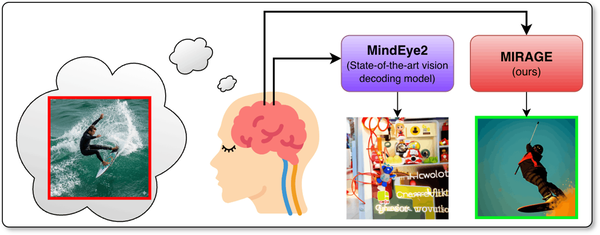
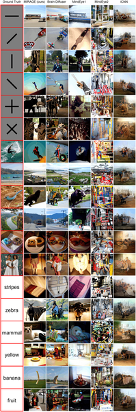

What if we could see the pictures inside your mind? Imagine a technology that doesn’t just capture what you’re looking at but reveals the images you conjure in your imagination. This is the frontier of brain decoding, and a new method called MIRAGE is bringing us closer than ever to making mental images visible.

> **TL;DR**
> - MIRAGE is a novel brain decoding method that reconstructs mental images from fMRI brain scans more accurately than previous models.
> - Unlike models optimized only for decoding seen images, MIRAGE is explicitly designed to handle the noisier, subtler brain signals of imagination by combining linear decoding with multi-modal features.

Decoding what a person is seeing from brain activity has seen impressive progress in recent years, thanks to advances in functional magnetic resonance imaging (fMRI) and artificial intelligence. However, the real challenge lies in decoding mental imagery—the internal, private visualizations our brains create without any external input. Mental images are fainter and noisier in brain signals compared to actual vision, making them harder to reconstruct. Previous state-of-the-art models that excelled at reconstructing seen images often struggled when applied to mental imagery. This gap has limited practical applications, such as brain-computer interfaces for patients who cannot communicate verbally.

MIRAGE (Mental Image Reconstruction using Advanced Generative ModEls) tackles this challenge by combining a linear decoding backbone with multi-modal inputs that include both text and image features. This approach feeds into a diffusion model that generates images from brain activity patterns measured by 7T fMRI. Unlike more complex, non-linear models that risk overfitting to noise, MIRAGE’s simpler architecture is more robust to the low signal-to-noise ratio typical of mental imagery. The team trained MIRAGE on large datasets of brain responses to seen images but designed it specifically to generalize well to internally generated mental images.

When tested on the NSD-Imagery dataset, which includes brain scans of subjects imagining images, MIRAGE outperformed previous methods in reconstructing mental images. Human raters consistently judged MIRAGE’s reconstructions as more faithful to the imagined content than those from other models. The reconstructions captured both simple and complex stimuli, preserving key structural details and semantic content. For example, MIRAGE successfully reconstructed images of a surfer, donuts, and animals that matched the subjects’ mental images. Importantly, the model’s success was linked to its use of low-dimensional image features and guidance from text-based and multi-level image features, which helped it bridge the gap between vision and imagination.

This work marks a significant step toward practical brain-computer interfaces that can externalize mental imagery, potentially transforming communication tools for people with disorders of consciousness or communication impairments. By showing that large-scale datasets of seen images can be leveraged to decode mental images—provided the right model architecture—MIRAGE opens new avenues for research and applications in neuroscience, psychology, and medicine. It also deepens our understanding of how the brain represents imagined content, highlighting the importance of robustness and multi-modal integration in decoding internal experiences.

While MIRAGE represents state-of-the-art performance on mental image reconstruction, the task remains challenging due to the inherently low signal-to-noise ratio of mental imagery in fMRI data. The reconstructions, though impressive, are still approximations and may not capture the full richness or precision of a person’s mental image. Additionally, evaluations rely on relatively small datasets and human ratings, which can be subjective. Future work will need to expand datasets, improve model generalization, and explore real-time decoding to move closer to practical applications.

## Figures

*Comparison of MIRAGE and MindEye2 methods reconstructing imagined images from brain scans.*

*Fig 2 shows the best image reconstructions from different methods based on imagined pictures, highlighting their quality using various metrics.*

## Sources

- [MIRAGE: Robust multi-modal architectures translate fMRI-to-image models from vision to mental imagery](https://journals.plos.org/ploscompbiol/article?id=10.1371/journal.pcbi.1014263)
- DOI: [10.1371/journal.pcbi.1014263](https://doi.org/10.1371/journal.pcbi.1014263)
