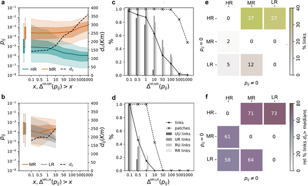

Did you know that tracking every step you take might not be necessary to predict how diseases spread? During the COVID-19 pandemic, mobile phone data became an invaluable tool for understanding how people move and how infections travel between communities. But exactly how detailed does this mobility data need to be to accurately forecast an epidemic’s path? A recent study using data from nearly 10 million mobile phone users in Senegal sheds light on this question, revealing that less detailed data about where people spend their time can actually provide better predictions — all while better protecting individual privacy.

> **TL;DR**
> - Tracking every individual movement in mobile phone data does not improve epidemic spread predictions.
> - Aggregated data capturing where people spend most of their time—like home, work, or school—suffices to model spatial disease transmission accurately.

Human mobility is a key driver of infectious disease spread. When people travel from one place to another, they can carry pathogens with them, seeding new outbreaks. Traditional sources of mobility data, such as census records or transportation statistics, often lack the fine detail or timeliness needed during fast-moving epidemics. Mobile phones, which generate continuous geolocated data, offer a rich new window into human movement patterns. However, there has been an important open question: which aspects of this mobility data are truly necessary to capture the spatial dynamics of disease spread? And how detailed does the data need to be to inform accurate epidemic models? Answering these questions is crucial not only for improving public health responses but also for balancing data utility with privacy concerns.

Researchers analyzed mobile phone records from 9.5 million users in Senegal, representing about 80% of the population. They created three types of mobility networks from these data, each with different levels of detail: (1) a high-resolution network tracking every individual displacement between consecutive locations; (2) a medium-resolution network capturing the amount of time individuals spend in all visited locations; and (3) a low-resolution network identifying only the most-visited location for each user, such as home or work. These networks were integrated into a metapopulation epidemic model that simulates disease spread between connected municipalities. The model accounted for transmission from residents, visitors, and returning travelers and tested scenarios with varying pathogen transmissibility, from controlled outbreaks to highly contagious diseases.

Contrary to what one might expect, the study found that preserving every individual movement did not improve the epidemiological relevance of the mobility data. High-resolution tracking fragmented long-range trips and underestimated key spatial connections important for disease spread. In contrast, the medium- and low-resolution approaches, which focus on where people spend sustained periods of time, more accurately reproduced the spatial invasion patterns of epidemics. Including additional daily activities beyond primary locations like home, work, or school provided little extra epidemiological information. Essentially, aggregated indicators capturing time spent at major activity locations were sufficient to predict how diseases spread across space.

These findings have important implications for epidemic modeling and data governance. They suggest that mobility data can be aggregated to a lower resolution without sacrificing predictive accuracy. This means that mobile phone data providers can share useful information for public health purposes while better protecting individual privacy. In a world increasingly concerned about data security and surveillance, knowing that less detailed data can still inform effective epidemic response is a valuable insight. It also helps guide future data sharing policies and modeling efforts, ensuring they are both scientifically sound and ethically responsible.

While this study provides strong evidence from a large real-world dataset in Senegal, the findings may vary depending on the geographic context, disease characteristics, and mobility patterns of other populations. The models focused on certain types of pathogens and transmission scenarios, so further research is needed to confirm how broadly these conclusions apply. Additionally, although aggregated mobility data reduces privacy risks, careful governance and transparency remain essential to maintain public trust and ethical standards in data use.

## Figures

*This figure compares link differences and distances between HR, MR, and LR methods across 12 datasets, showing link types and unique connections.*

## Sources

- [Mobility data resolution needed to inform predictive models of spatial epidemic spread from mobile phone data](https://journals.plos.org/ploscompbiol/article?id=10.1371/journal.pcbi.1014427)
- DOI: [10.1371/journal.pcbi.1014427](https://doi.org/10.1371/journal.pcbi.1014427)
