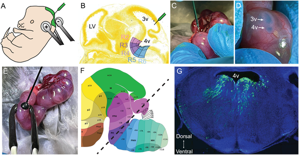
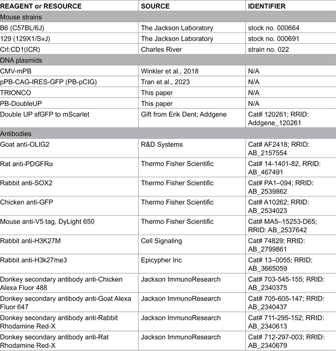
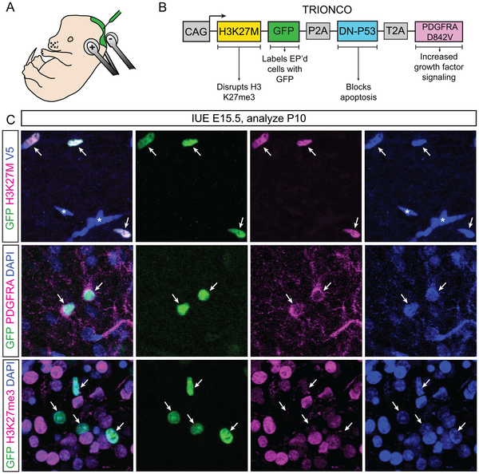
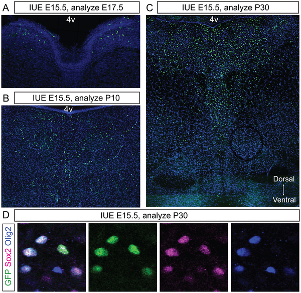

Diffuse midline glioma (DMG) is a devastating brain cancer that primarily affects children and is almost always fatal. One particularly aggressive form, pontine DMG, grows diffusely in the brainstem’s pons region, making it nearly impossible to treat with current therapies. Scientists have long struggled to study this disease in the lab because of the lack of animal models that accurately mimic how these tumors develop in the human brain. Now, a team of researchers has introduced a new mouse model that uses a clever electrical technique to introduce cancer-driving mutations directly into the developing brainstem of mouse embryos. This breakthrough could open new doors for understanding how pontine DMG forms and for testing potential treatments.

> **TL;DR**
> - A novel triple-electrode in utero electroporation method precisely delivers cancer-related genes into the developing mouse pons, creating brain tumors that resemble pediatric pontine DMG.
> - This single-plasmid approach simplifies genetic manipulation and produces diffuse brainstem tumors in immunocompetent mice, providing a valuable tool to study tumor development and test therapies.

Pediatric brain tumors are the leading cause of cancer-related death in children, with high-grade gliomas being particularly aggressive. Pontine diffuse midline glioma (formerly known as DIPG) is driven by a mutation in histone H3 (H3.3K27M) that disrupts normal gene regulation in neural progenitor cells. This mutation, combined with other genetic changes, causes tumors to grow diffusely in the brainstem, a critical area controlling vital functions. Because these tumors develop during early brain formation and grow in a sensitive location, treatment options are extremely limited, and survival rates remain dismal. Animal models that faithfully reproduce the tumor’s development in the brainstem are essential for advancing research but have been difficult to establish.

To overcome these challenges, the researchers adapted an in utero electroporation technique, which uses brief electrical pulses to introduce DNA into specific brain cells of mouse embryos still developing in the womb. They innovated by using a triple-electrode configuration to precisely target neural progenitor cells lining the fourth ventricle, the fluid-filled cavity adjacent to the developing pons. Instead of multiple separate DNA constructs, they engineered a single plasmid called TRIONCO that carries three key oncogenes associated with pontine DMG: the H3.3K27M mutation, a dominant-negative p53 mutation that blocks cell death, and an activated PDGFRA gene that promotes cell growth. Injecting this plasmid into the fourth ventricle at embryonic day 15.5 and applying the triple-electrode pulses led to stable integration of these cancer-driving genes into the progenitor cells that give rise to the pons.

As the embryos developed, the electroporated cells formed large, diffuse tumors in the brainstem that closely resembled human pontine DMG both in location and molecular characteristics. Imaging showed that tumor cells spread extensively within the pons region, increasing in number from just a few cells shortly after electroporation to thousands by postnatal day 30. The tumors displayed hallmark features of pediatric DMG, including expression of the mutant H3K27M protein and loss of normal histone methylation patterns. This model successfully mimics the tumor’s developmental timing, location, and genetic drivers in an immunocompetent mouse, providing a powerful platform for studying tumor biology and testing new treatments.

This work represents a significant advance in modeling a deadly childhood brain cancer that has long eluded effective study. By precisely targeting the developing pons with a single plasmid encoding multiple oncogenic mutations, the researchers created a robust and reproducible mouse model of pontine DMG. Unlike previous models relying on transplanting human tumor cells into adult mice, this approach captures tumor initiation and progression in the natural developmental context. The model’s fidelity to human disease and compatibility with an intact immune system make it a valuable tool for unraveling the biology of DMG and accelerating the search for effective therapies against this universally fatal cancer.

While this mouse model marks a major step forward, it remains a model system with inherent limitations. The electroporation technique targets a subset of progenitor cells and may not capture the full heterogeneity of human tumors. Additionally, mouse brain development differs in some respects from humans, which could influence tumor behavior. Further studies will be needed to validate therapeutic findings in other models and ultimately in clinical trials. Nonetheless, this method provides a critical platform to deepen our understanding of pontine DMG and to test potential treatments in a controlled, reproducible setting.

## Figures

*Using triple electrodes, DNA is injected into mouse embryos' brain ventricles to target and study specific brain regions during development.*

*Using triple electrodes, DNA was injected into mouse embryos' brain ventricles to target and label specific brain regions during development.*

*Images show successful delivery and expression of cancer-related proteins in mouse brains using a special DNA tool and electrical pulses.*

*Mice with TRIONCO show growing brain tumors with pDMG traits, spreading from few cells at E17.5 to thousands by P30 in the pons region.*

## Sources

- [Modeling diffuse midline glioma through triple-electrode in utero electroporation of the developing mouse pons](https://journals.plos.org/plosone/article?id=10.1371/journal.pone.0351079)
- DOI: [10.1371/journal.pone.0351079](https://doi.org/10.1371/journal.pone.0351079)
