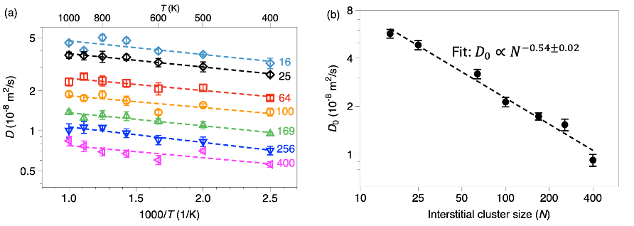
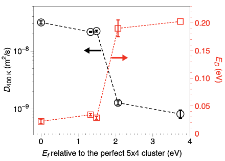
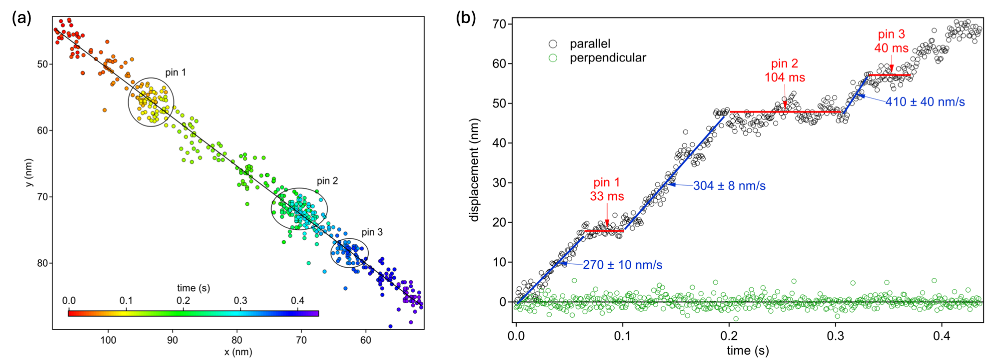

When metals like nickel are exposed to radiation, their atoms don’t just sit still. Instead, tiny defects form and move in a complex atomic dance that can weaken the material over time. Understanding how these defects behave at the smallest scales is crucial for designing metals that can better withstand harsh environments like nuclear reactors and spacecraft. Recent research combining powerful computer simulations with cutting-edge electron microscopy has unveiled new details about how these atomic defect clusters form, change shape, and migrate inside irradiated nickel.

> **TL;DR**
> - Radiation creates clusters of extra atoms called self-interstitial atoms (SIAs) in nickel, which form distinct loop structures with different stability and mobility.
> - Using molecular dynamics simulations and high-speed electron microscopy, researchers observed how these loops move through a relay-like mechanism, influencing the material’s durability under radiation.

*Note: this summary is based on a preprint — research shared ahead of formal peer review.*

Nickel and its alloys are widely used in nuclear energy systems because of their strength and resistance to corrosion at high temperatures. However, when bombarded by energetic particles, such as neutrons in a reactor, atoms in the metal can be displaced, creating defects. Among these defects, self-interstitial atoms—extra atoms squeezed into the crystal lattice—tend to cluster and form loops. These loops can either be sessile (immobile) Frank loops or glissile (mobile) perfect loops. The mobility of these loops plays a key role in how radiation damage evolves over time, affecting the metal’s structural integrity. Yet, many questions remained about the atomic-level details of loop formation, stability, and migration.

To investigate these phenomena, the researchers used molecular dynamics (MD) simulations, a computational method that models atomic interactions and movements over time. They simulated nickel crystals with varying numbers of extra atoms to observe how SIAs cluster and evolve. To complement simulations, they employed high-speed in situ transmission electron microscopy (TEM), capturing videos at over 1,000 frames per second to directly observe defect cluster motion in nickel specimens prepared by focused ion beam methods. This combination allowed them to validate simulation predictions and gain real-time insight into defect dynamics at unprecedented temporal resolution.

The simulations revealed that SIAs initially form disordered clusters of dumbbell-shaped pairs of atoms. Over time, these clusters evolve into either sessile Frank loops, which are faulted and relatively immobile, or glissile perfect loops, which are more ordered and capable of rapid one-dimensional migration. Perfect loops become increasingly compact and ordered as they grow, and are thermodynamically favored over Frank loops beyond a certain size (14 or more SIAs). The team discovered that perfect loops migrate via a non-rigid, row-wise relay mechanism, where groups of atoms move in sequence rather than the entire loop moving rigidly. Experimentally, TEM videos showed intermittent loop motion with velocities higher than previously reported, although still slower than the intrinsic mobilities predicted by simulations, indicating that real materials present a complex energy landscape with mobile and pinned states.

These insights deepen our understanding of how radiation-induced defects behave at the atomic scale in nickel, a metal critical to nuclear and aerospace applications. Knowing the conditions under which defect clusters form and move helps improve predictive models of material degradation under irradiation. This knowledge can guide the development of more radiation-tolerant alloys, enhancing the safety and longevity of nuclear reactors and spacecraft components exposed to harsh radiation environments. Moreover, the combination of advanced simulations and ultrafast microscopy sets a new standard for studying dynamic processes in materials science.

While the study provides valuable atomic-scale insights, it focuses on idealized nickel crystals and defect clusters under controlled conditions. Real-world materials often contain impurities, complex microstructures, and varying irradiation conditions that can influence defect behavior. Additionally, the experimental observations were limited to features induced by focused ion beam preparation, which may differ from defects formed during actual reactor operation. Future work will need to explore these complexities and extend observations to other alloys and irradiation scenarios to fully translate these findings into practical materials design.

## Figures

*Diffusion rates of tiny loop clusters change with size, showing consistent energy barriers but slower movement as clusters grow larger. — Figure from Ajay Annamareddy et al., [CC BY 4.0](http://creativecommons.org/licenses/by/4.0/), caption edited.*

*More compact and ordered perfect-loop structures move faster and need less energy to diffuse at 400 K, showing better mobility with structural relaxation. — Figure from Ajay Annamareddy et al., [CC BY 4.0](http://creativecommons.org/licenses/by/4.0/), caption edited.*

*Fig. 10 shows a loop moving over time, highlighting spots where it gets stuck and then moves again in different directions. — Figure from Ajay Annamareddy et al., [CC BY 4.0](http://creativecommons.org/licenses/by/4.0/), caption edited.*

## Sources

- [Morphology and Dynamics of Self-interstitial Clusters in Irradiated Nickel](https://arxiv.org/abs/2609.01879)
- DOI: [10.48550/arxiv.2609.01879](https://doi.org/10.48550/arxiv.2609.01879)

*This article reuses and adapts text and figures from the original research by Ajay Annamareddy et al., available via arXiv Materials Science, under the [CC BY 4.0](http://creativecommons.org/licenses/by/4.0/) license.*
