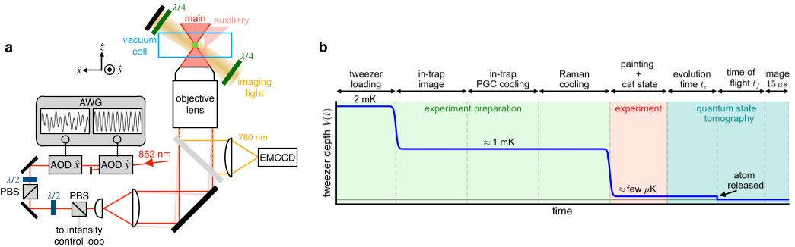
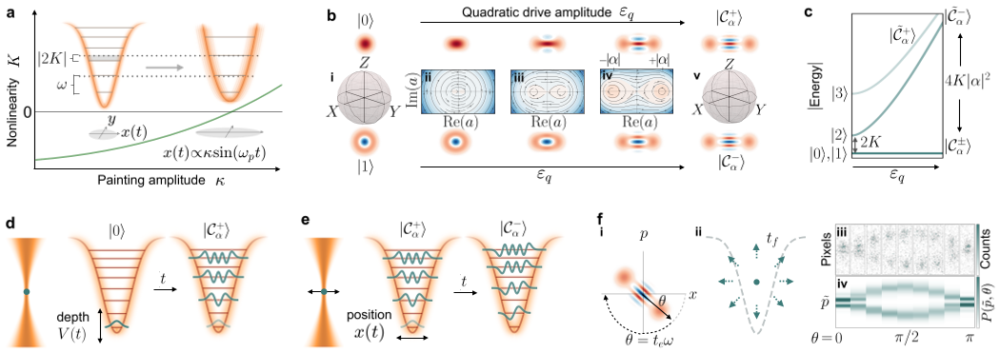
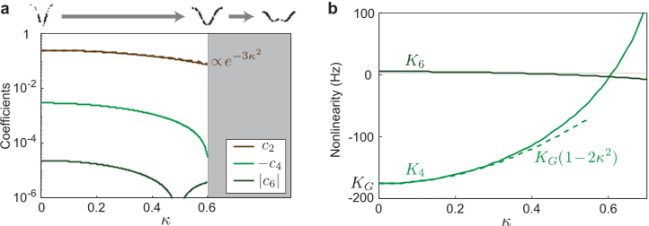
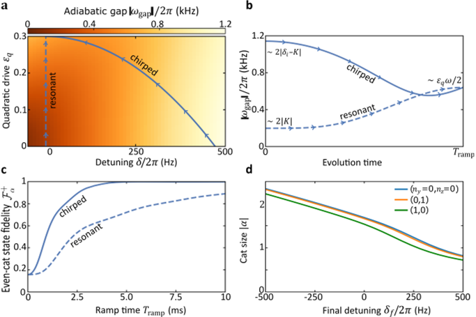

Imagine trapping a single atom in a tiny spotlight of laser light and coaxing it into a quantum state that is, in a sense, both here and there at the same time — a so-called Schrödinger cat state. This is no ordinary cat but a quantum superposition of distinct states, a resource that could help build more powerful and error-resistant quantum technologies. Recently, scientists demonstrated how to create such exotic states using the motion of an atom confined in an optical tweezer, a tightly focused laser beam that acts like a microscopic trap. This breakthrough leverages the atom’s own motion and the intrinsic nonlinearity of the trap to realize what are called motional Kerr-cat states, marking a new frontier in quantum control.

> **TL;DR**
> - Scientists generated Schrödinger cat states encoded in the quantized motion of a single neutral atom trapped in an optical tweezer by exploiting the trap’s intrinsic Kerr nonlinearity.
> - These motional Kerr-cat states show enhanced robustness against fluctuations and offer a new platform for quantum error correction and quantum-enhanced sensing.

*Note: this summary is based on a preprint — research shared ahead of formal peer review.*

Schrödinger cat states are quantum superpositions of states that would be distinct or even contradictory in classical physics — like a cat being simultaneously alive and dead. They are valuable for quantum computing and precision measurements because they can encode information in a way that is more resilient to errors and noise. Traditionally, creating such states requires coupling an oscillator to an auxiliary nonlinear element, such as atomic spins or superconducting circuits. Neutral atoms trapped in optical tweezers have emerged as a versatile platform for quantum science, but until now, their intrinsic motional nonlinearity — known as the self-Kerr effect — had not been harnessed to generate cat states. This work fills that gap by demonstrating how the motion of a single atom in a carefully modulated optical potential can be controlled to produce these delicate quantum superpositions.

The researchers began by trapping a single rubidium-87 atom in a tightly focused laser beam, forming an optical tweezer with a nearly Gaussian potential. The atom’s motion along one spatial dimension behaves like a quantum harmonic oscillator with a slight anharmonicity — a deviation from perfect harmonic motion — that introduces a Kerr nonlinearity. By dynamically modulating the trap’s depth and position at specific frequencies, they engineered quadratic and linear drives that selectively couple motional states of the atom. This allowed them to adiabatically transform the atom’s motional ground state into even- or odd-parity Kerr-cat states. They also employed a technique called “painting” — rapidly oscillating the trap position at high frequency — to tune the anharmonicity of the potential, enabling control over the size of the cat states. To verify the states, they performed time-of-flight quantum-state tomography, measuring the atom’s momentum distribution after release from the trap to reconstruct the quantum state’s Wigner function and density matrix.

The team successfully prepared high-fidelity motional Kerr-cat states with fidelities comparable to those achieved in superconducting quantum circuits. They demonstrated control over both even- and odd-parity cat states and showed that these states are intrinsically robust against fluctuations in the trap frequency, which typically degrade the fidelity of simpler motional states like Fock states. By tuning the trap’s anharmonicity via painting, they accessed a range of cat sizes, tailoring the quantum superpositions for different potential applications. Their results establish the Kerr nonlinearity of optical tweezers as a powerful and species-independent resource for engineering non-Gaussian quantum states, expanding the toolbox for quantum information processing and sensing with neutral atoms.

This work represents a significant advance in quantum state engineering by harnessing the intrinsic motional Kerr nonlinearity of neutral atoms in optical tweezers — a platform already prominent in quantum science. The ability to generate and control motional Kerr-cat states opens new pathways for implementing quantum error-correcting codes, such as grid states, which are crucial for fault-tolerant quantum computing. Furthermore, arrays of such non-Gaussian states could enhance quantum sensing capabilities beyond classical limits. Because the approach is spin- and species-independent, it holds promise for broad applicability across atomic and molecular systems, and potentially even levitated nanoparticles. This new paradigm enriches the quantum control landscape and brings us closer to practical quantum technologies leveraging motional degrees of freedom.

While the demonstration is promising, the preparation fidelities, especially for odd-parity cat states, are currently limited by technical factors such as displacement noise in the linear drive and imaging-related measurement errors. The experiments were performed with a single atom in a single optical tweezer, and scaling up to large arrays with consistent control remains a challenge. Additionally, the abstract quantum nature of Kerr-cat states and their motional encoding may complicate integration with other quantum platforms. Further research is needed to optimize state preparation, reduce noise sources, and explore practical implementations of error correction and sensing protocols using these motional cat states.

## Figures

*Diagram shows how laser beams trap atoms and the timing of trapping, control, and measurement steps in the experiment. — Figure from Steven K. Pampel et al., [CC BY 4.0](http://creativecommons.org/licenses/by/4.0/), caption edited.*

*We create and measure special quantum states of atoms in optical tweezers by tuning trap properties and tracking their motion over time. — Figure from Steven K. Pampel et al., [CC BY 4.0](http://creativecommons.org/licenses/by/4.0/), caption edited.*

*Figure shows how changing the painting amplitude tunes the trap's shape and nonlinear behavior from harmonic to double-well potential. — Figure from Steven K. Pampel et al., [CC BY 4.0](http://creativecommons.org/licenses/by/4.0/), caption edited.*

*This figure shows how adjusting drive amplitude and detuning helps create high-fidelity cat states with controlled size and stability. — Figure from Steven K. Pampel et al., [CC BY 4.0](http://creativecommons.org/licenses/by/4.0/), caption edited.*

## Sources

- [Motional Kerr-Cat States of an Atom in an Optical Tweezer](https://arxiv.org/abs/2607.18579)
- DOI: [10.48550/arxiv.2607.18579](https://doi.org/10.48550/arxiv.2607.18579)

*This article reuses and adapts text and figures from the original research by Steven K. Pampel et al., available via arXiv Quantum Physics, under the [CC BY 4.0](http://creativecommons.org/licenses/by/4.0/) license.*
