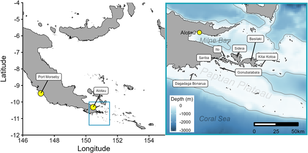
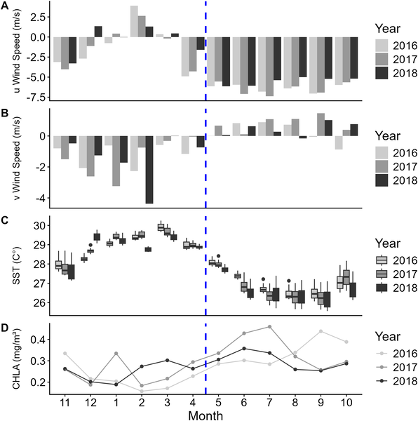
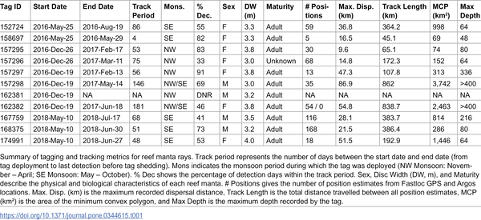
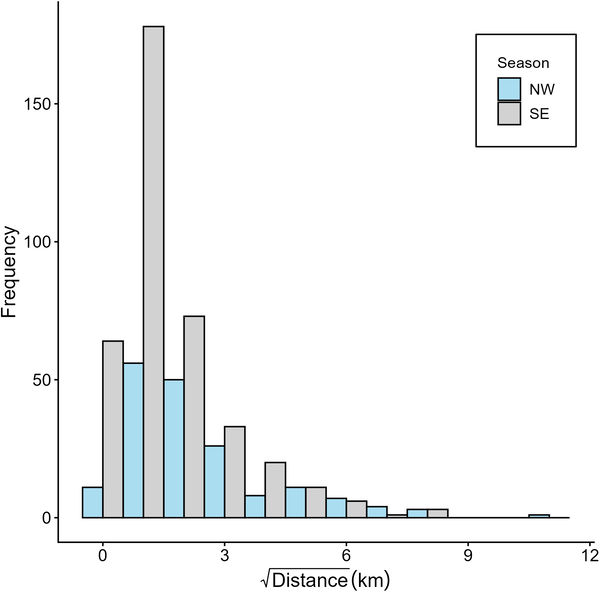

Imagine gliding alongside one of the ocean’s most graceful giants — the reef manta ray — as it moves through the tropical waters of Papua New Guinea. These majestic rays are elusive and roam vast underwater landscapes, but until recently, little was known about how they use their habitat or respond to changing ocean conditions in this biodiverse region. Thanks to innovative satellite tagging technology, scientists have begun to uncover the secret lives of reef manta rays in the Samarai Islands, tracking their movements and diving behavior across seasons. This research not only deepens our understanding of these fascinating creatures but also helps shape sustainable tourism and conservation efforts in the region.

> **TL;DR**
> - Reef manta rays in Papua New Guinea show strong site fidelity, mostly staying within 10 km of their tagging sites but occasionally traveling up to nearly 87 km.
> - Their diving behavior changes with seasonal ocean conditions, diving deeper when the ocean’s mixed layer is shallower, demonstrating behavioral adaptability.

The reef manta ray (Mobula alfredi) is a large, pelagic marine ray found throughout tropical and subtropical Indo-Pacific waters. While these rays are known to be highly mobile, their fine-scale movement patterns and habitat use in Papua New Guinea had not been studied before. Papua New Guinea’s Samarai Islands, part of the Milne Bay Province, are home to a previously undocumented population of reef manta rays. Understanding how these rays move and use their environment is critical because they face threats such as fishing bycatch, habitat disturbance, and vessel traffic. Moreover, manta rays are a cornerstone of marine ecotourism, which can provide economic benefits to local communities if managed sustainably.

Between 2016 and 2018, researchers deployed satellite tags on ten adult reef manta rays at two reef cleaning stations in the Samarai Islands. These tags, attached with minimal disturbance, recorded location, depth, and temperature data over periods ranging from 4 to 181 days. The tags transmitted data via the Argos satellite system, allowing scientists to track the rays’ horizontal movements and vertical diving behavior. The study covered two monsoonal periods — the northwest monsoon (November to April) and the southeast monsoon (May to October) — enabling analysis of seasonal effects. Environmental data such as sea surface temperature, chlorophyll concentration (a proxy for productivity), and oceanographic profiles were integrated to understand habitat preferences and behavioral responses.

The tracking data revealed that reef manta rays in this region exhibit strong site attachment, with 75% of their recorded locations within 10 kilometers of their tagging sites. Occasionally, individuals traveled farther, with the longest recorded displacement being nearly 87 kilometers. Interestingly, there was no consistent difference in horizontal movement between the two monsoon seasons. The rays showed a clear preference for shallow waters around the Samarai Islands and the nearby Papuan Plateau, areas characterized by elevated chlorophyll-a levels indicating higher productivity. Vertically, the manta rays adjusted their diving depths in response to oceanographic changes: they dove deeper when the mixed layer depth was shallow, suggesting behavioral plasticity to seasonal environmental variation.

These findings provide the first detailed insight into the movement ecology and habitat use of reef manta rays in Papua New Guinea, filling a crucial knowledge gap. Understanding their spatial behavior and environmental preferences informs conservation strategies to protect these vulnerable animals from threats like fishing and shipping traffic. Additionally, the data can guide the development of sustainable manta ray tourism in the Samarai Islands, balancing economic benefits with ecological protection. This research highlights how combining animal tracking with oceanographic data can reveal complex behavioral adaptations in marine species.

While the study tracked ten individuals over multiple months, the sample size remains limited and may not capture the full range of behaviors within the population. Tag shedding and variable data transmission also constrained some analyses. The movement patterns observed are consistent with known manta ray ecology but focused on a specific regional population, so caution is needed when generalizing to other areas. Further long-term studies incorporating larger sample sizes and additional environmental variables would strengthen understanding of how reef manta rays respond to changing ocean conditions and human impacts.

## Figures

*Map showing Eastern Papua New Guinea and Milne Bay with coastal outlines and national borders.*

*Seasonal wind patterns, sea temperatures, and chlorophyll levels from 2016-2018 show changes between NW and SE Monsoons in the study area.*

*Overview of tagging and tracking data collected from reef manta rays.*

*Tagged reef manta rays in Papua New Guinea moved varying distances during NW and SE Monsoons, shown with adjusted data for clearer patterns.*

## Sources

- [Movement, residency, and behavioral plasticity of reef manta rays in the Samarai Islands of Papua New Guinea](https://journals.plos.org/plosone/article?id=10.1371/journal.pone.0344615)
- DOI: [10.1371/journal.pone.0344615](https://doi.org/10.1371/journal.pone.0344615)
