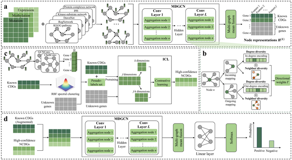
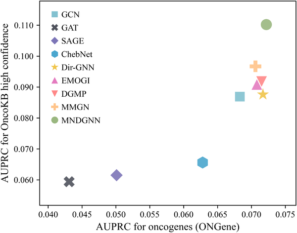

Cancer is driven by a small set of genes whose mutations push cells to grow uncontrollably, but pinpointing these cancer driver genes amid thousands of others is a daunting challenge. What if artificial intelligence could map the complex, multi-layered interactions between genes and reveal the hidden culprits fueling tumor growth? Recent advances in graph neural networks now allow researchers to integrate diverse biological data and capture the directional flow of gene regulation, offering a sharper lens to identify these critical genes.

> **TL;DR**
> - A new computational model, MNDGNN, integrates multiple biological networks and multi-omics data using directed graph neural networks to better capture gene regulatory relationships.
> - By combining data augmentation strategies to address limited known cancer driver genes, MNDGNN improves prediction accuracy and identifies candidate genes enriched in cancer-related pathways.

Cancer arises when certain genes—called cancer driver genes—acquire mutations that give cells a growth advantage, leading to tumor development. While large-scale sequencing projects have cataloged many mutations, only a fraction actively drive cancer progression. Existing computational methods often analyze gene interactions using a single biological network, which limits their ability to capture the complex, multi-faceted, and directional nature of gene regulation. Moreover, the scarcity of experimentally validated cancer driver genes poses challenges for training accurate predictive models. Addressing these issues requires integrating multiple types of biological networks and data, while accounting for the directionality of gene interactions and overcoming label scarcity.

Researchers developed MNDGNN, a multiplex networks-based directed graph neural network, to tackle these challenges. The model integrates six different biological networks—including protein-protein interactions, protein complexes, signaling pathways, and regulatory networks—each enriched with multi-omics data such as gene mutation rates, DNA methylation, and gene expression changes across 16 cancer types. Unlike previous approaches that treat gene interactions as undirected, MNDGNN explicitly models the directionality of regulatory relationships, capturing how signals flow through gene networks. To learn effective gene representations, the model incorporates neighbor diversity and degree diversity at each graph convolutional layer, enabling nuanced weighting of incoming and outgoing gene interactions. To address the limited number of known cancer driver genes, the team employed a data augmentation strategy that combines positive-sample enhancement using spectral clustering with negative-sample inference via contrastive learning, balancing the training data and improving robustness.

Experimental evaluation on a pan-cancer dataset showed that MNDGNN outperformed existing state-of-the-art methods in key metrics such as AUROC, AUPRC, and F1 score. The model not only successfully identified known cancer driver genes but also predicted novel candidates that are strongly connected to established drivers and significantly enriched in cancer-related pathways. This suggests that MNDGNN captures meaningful biological signals and can provide a prioritized list of genes for further experimental validation and therapeutic exploration.

By integrating multi-omics data with multiplex biological networks and explicitly modeling the directionality of gene regulation, MNDGNN represents a significant step forward in computational cancer genomics. Its improved accuracy and robustness in identifying cancer driver genes can accelerate the discovery of new therapeutic targets and enhance precision oncology efforts. Moreover, the approach exemplifies how advanced AI techniques like directed graph neural networks can unravel the complexity of biological systems, offering insights that single-network or undirected models might miss.

While MNDGNN shows promising improvements, it relies on the quality and completeness of available biological networks and multi-omics data, which may vary across cancer types. The model’s predictions require experimental validation to confirm the functional roles of newly identified candidate genes. Additionally, the complexity of cancer biology means that driver gene identification is only one piece of the puzzle; integrating these findings with clinical and other molecular data will be essential to translate computational predictions into effective therapies.

## Figures

*MNDGNN processes biological data through multiple steps to learn gene features and predict cancer driver genes accurately.*

*Comparison of how well different methods perform on the OncoKB and ONGene cancer gene databases.*

## Sources

- [Multiplex networks-based directed graph neural network for cancer driver gene identification](https://journals.plos.org/ploscompbiol/article?id=10.1371/journal.pcbi.1014275)
- DOI: [10.1371/journal.pcbi.1014275](https://doi.org/10.1371/journal.pcbi.1014275)
