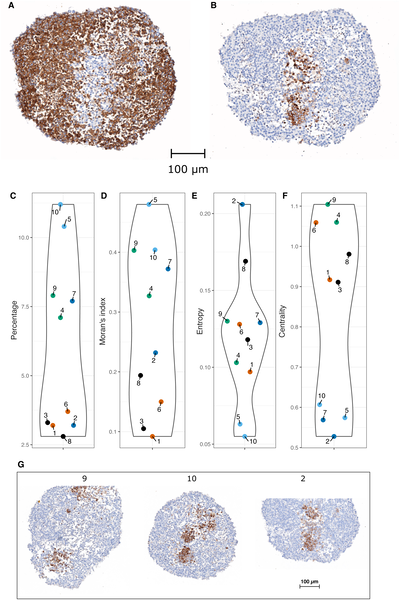
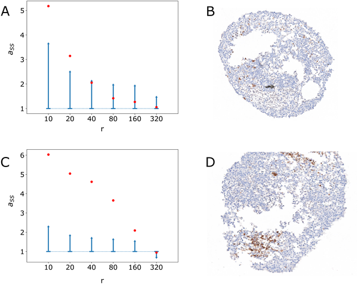
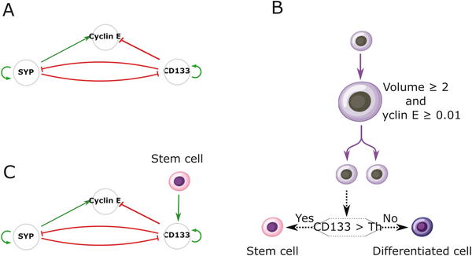
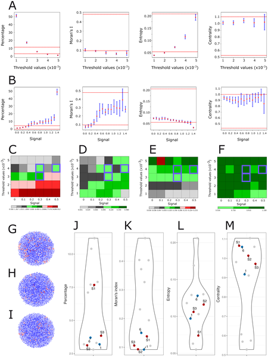

How do cancer stem cells arrange themselves inside tumors? This question is crucial because the spatial organization of these cells can influence tumor growth and treatment resistance. A recent study using patient-derived 3D tumor models—called tumoroids—and advanced computational simulations sheds light on the hidden signals that cause cancer stem cells to cluster in neuroblastoma, a common pediatric cancer. The key player? A tiny, short-range diffusive signal exchanged between stem cells that orchestrates their arrangement in three-dimensional space.

> **TL;DR**
> - Cancer stem cells in neuroblastoma tumoroids tend to cluster spatially, a pattern confirmed by detailed immunohistochemical analysis.
> - A novel multiscale computational model shows that only a short-range diffusive signaling mechanism among stem cells can reproduce the observed 3D clustering, highlighting a critical biological process.

Neuroblastoma is the most common solid tumor in children under five, arising from the sympathetic nervous system. Despite advances, effective treatments remain limited, especially for high-risk cases. Researchers have developed patient-derived tumoroids—three-dimensional cultures grown from tumor cells—that faithfully mimic the original tumor’s structure and cellular diversity. Within these tumoroids, cancer stem cells, marked by the protein CD133, are thought to drive tumor growth and relapse. Understanding how these stem cells organize spatially could reveal new therapeutic avenues. However, the mechanisms guiding their arrangement have been unclear, partly because tumors are complex systems where molecular, cellular, and spatial factors interact dynamically.

To unravel these mechanisms, the research team combined experimental and computational approaches. They first generated neuroblastoma tumoroids from patient samples and used immunohistochemistry to map the spatial distribution of CD133-positive cancer stem cells. They observed that these stem cells tend to cluster rather than distribute randomly. To explore what rules might generate such patterns, they developed a multiscale agent-based model named Simuscale. This model simulates individual cells as agents with internal gene regulatory networks that stochastically determine cell fate—stem or differentiated—and proliferation. Crucially, the model incorporates cell-to-cell signaling that can be local (contact-based) or diffusive over short ranges. By iteratively testing different signaling rules, the model aimed to reproduce the experimentally observed spatial patterns.

The simulations revealed that without any spatial signaling rules, stem cells failed to cluster, resulting in random distributions unlike the tumoroids. Adding simple spatial rules, such as signaling only through direct cell contact or differences in cell adhesion, only marginally improved the match to experimental data. The breakthrough came when the model included a short-range diffusive signal emitted by stem cells that promotes stemness in neighboring cells. This mechanism led to realistic three-dimensional clusters of stem cells closely resembling those seen in the tumoroids. Quantitative measures of clustering—such as Moran’s I and entropy indices—confirmed the model’s success in capturing the spatial organization. This suggests that a short-range pro-stem cell signal is a critical driver of cancer stem cell spatial structure in neuroblastoma.

This study highlights the power of combining patient-derived 3D tumor models with sophisticated computational simulations to uncover biological processes that are difficult to observe directly. The identification of a short-range diffusive signaling mechanism among cancer stem cells not only advances our understanding of tumor architecture but also points to potential targets for disrupting stem cell niches. Since cancer stem cells are often implicated in therapy resistance and relapse, interventions that interfere with their spatial organization or signaling could improve treatment outcomes for neuroblastoma, a cancer that still poses significant clinical challenges.

While the model successfully reproduces key spatial features of cancer stem cell clustering, it remains a simplification of the complex tumor microenvironment. The exact molecular identity of the diffusive signal is not specified and requires experimental validation. Additionally, the model focuses on a specific pediatric tumor and stem cell marker (CD133), so its generalizability to other cancers or stem cell populations needs further investigation. Finally, translating these insights into therapies will require detailed studies to confirm the signaling pathways and their druggability in vivo.

## Figures

*Images show stem cells marked by proteins in tissue, with charts measuring their distribution and clustering across samples.*

*Graphs show stem cell clustering by radius in two images, with confidence intervals and actual images displayed for comparison.*

*A model shows how three genes control cell growth and fate, with stem cell signals affecting gene activity and cell division decisions.*

*This figure shows how cell differentiation and signaling affect stem cell patterns using four key measures compared to real experimental data.*

## Sources

- [Multiscale modeling of the spatial structure of stem cells in neuroblastoma patient-derived tumoroids reveals a critical role for a short-range diffusive process](https://journals.plos.org/ploscompbiol/article?id=10.1371/journal.pcbi.1014137)
- DOI: [10.1371/journal.pcbi.1014137](https://doi.org/10.1371/journal.pcbi.1014137)
