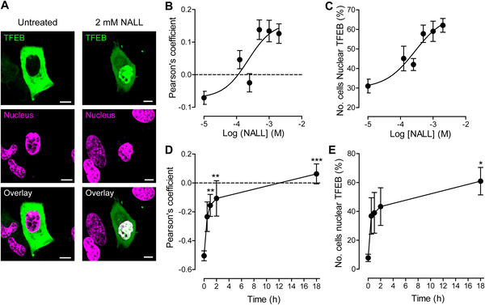
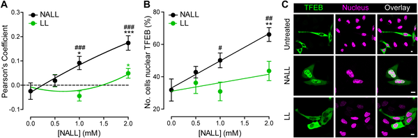
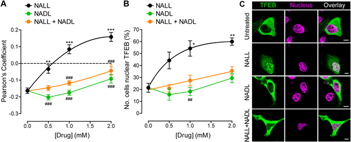

Imagine a tiny molecular switch inside our cells that controls the recycling centers responsible for breaking down and clearing waste. In a rare but devastating neurological disorder called Niemann-Pick disease type C (NPC), this switch goes haywire, disrupting cellular housekeeping and leading to severe symptoms. Now, researchers have uncovered how an FDA-approved drug, levacetylleucine, can directly reset this master switch, restoring balance in cells and offering hope for treating NPC and potentially other neurological disorders.

> **TL;DR**
> - Levacetylleucine directly modulates Transcription Factor EB (TFEB), a key regulator of lysosomal function, by altering its location within cells in a way that restores cellular balance.
> - This drug’s effect is stereospecific: only the L-enantiomer activates TFEB properly, while the D-enantiomer does not, highlighting the importance of molecular structure in its therapeutic action.

Niemann-Pick disease type C is a rare genetic disorder caused by mutations affecting proteins that normally help transport lipids out of lysosomes—the cell’s recycling centers. When this transport fails, lipids accumulate, lysosomes enlarge, and cellular waste clearance is impaired, especially harming neurons. Levacetylleucine (marketed as Aqneursa™) is the only FDA-approved monotherapy for NPC. It is an acetylated form of the amino acid L-leucine, designed to cross the blood-brain barrier efficiently and enter cells via monocarboxylate transporters. Inside cells, it is metabolized to release L-leucine, which supports energy production and indirectly improves lysosomal function. However, until now, the direct cellular mechanisms behind its therapeutic effects were not fully understood.

To investigate levacetylleucine’s direct effects, researchers used cultured HeLa cells, a widely used human cell line, including a genetically engineered NPC1 knockout model that mimics the disease’s lysosomal dysfunction. They introduced fluorescently tagged TFEB to track its movement between the cytoplasm and nucleus—a key indicator of its activation state. Using live-cell imaging and biochemical assays, they treated cells with various forms of acetylleucine and measured TFEB localization and lysosomal markers. They also confirmed that HeLa cells express the necessary transporters and enzymes to metabolize levacetylleucine, ensuring relevance to the drug’s action.

The study revealed that levacetylleucine rapidly and bidirectionally modulates TFEB activity depending on the cellular context. In healthy HeLa cells, levacetylleucine promotes TFEB activation by moving it into the nucleus, where it can stimulate genes that enhance lysosomal and autophagy pathways. Conversely, in NPC1-deficient cells, where TFEB is already overactive and predominantly nuclear due to lysosomal stress, levacetylleucine reduces nuclear TFEB levels, restoring a more balanced distribution between nucleus and cytoplasm. This homeostasis-restoring effect occurs at drug concentrations relevant to clinical use. Importantly, these effects were stereospecific: only the L-enantiomer of acetylleucine was active, while the D-enantiomer and racemic mixtures showed no effect or even antagonistic properties.

These findings provide the first direct mechanistic insight into how levacetylleucine exerts therapeutic effects in NPC by modulating TFEB, the master regulator of lysosomal function. By normalizing TFEB activity, the drug helps restore lysosomal health and cellular recycling capacity, which are critical for neuronal survival. Understanding this stereospecific, bidirectional modulation opens new avenues for refining treatments not only for NPC but also for other neurodegenerative and neurodevelopmental disorders linked to lysosomal dysfunction. This mechanistic clarity strengthens the rationale for levacetylleucine’s clinical use and may guide development of next-generation therapies targeting TFEB pathways.

While this study advances our understanding of levacetylleucine’s cellular actions, it was conducted in cultured HeLa cells, which, although useful, are not neurons and may not fully replicate the complex brain environment. The NPC1 knockout model mimics some aspects of the disease but cannot capture all in vivo dynamics. Further research in neuronal models and in patients is needed to confirm how these cellular mechanisms translate to therapeutic outcomes. Additionally, the stereospecific effects underscore the importance of precise drug formulation and dosing. As with all early mechanistic studies, these findings should be integrated cautiously with clinical data.

## Figures

*NALL treatment moves TFEB protein into the cell nucleus in HeLa cells, increasing with higher doses and longer exposure times.*

*NALL moves TFEB into the cell nucleus more effectively than L-leucine in HeLa cells after 18 hours of treatment.*

*NALL, the L-form enantiomer, most effectively moves TFEB into the nucleus of HeLa cells compared to other forms.*

## Sources

- [N-acetyl-L-leucine normalizes Transcription Factor EB activity by stereospecific bidirectional modulation in a HeLa cell model of Niemann-Pick disease type C](https://journals.plos.org/plosone/article?id=10.1371/journal.pone.0353834)
- DOI: [10.1371/journal.pone.0353834](https://doi.org/10.1371/journal.pone.0353834)
