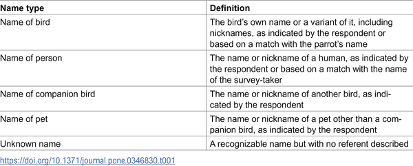
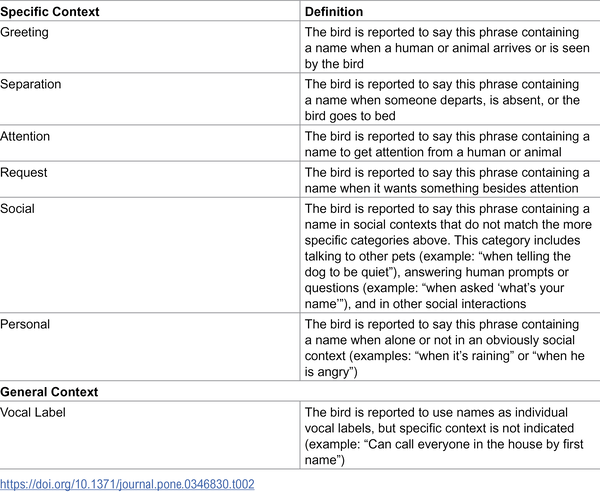
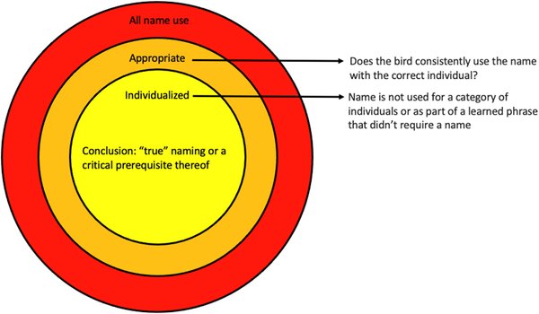

Did you know some parrots can learn and use human names just like we do? These remarkable birds don’t just mimic sounds—they often use names to greet, seek attention, and communicate socially with their human companions and other pets. Recent research sheds light on how companion parrots incorporate names into their vocal repertoire, revealing surprising insights into their social intelligence and communication skills.

> **TL;DR**
> - Nearly half of surveyed companion parrots use human or animal names in their vocalizations, often in contextually appropriate ways.
> - Parrots sometimes apply names as individualized vocal labels, indicating a sophisticated ability to recognize and refer to specific individuals.

Humans rely heavily on proper names to organize social interactions, using them to address and refer to individuals uniquely. Scientists have long wondered whether animals use similar naming systems. While many species recognize individuals by voice or signature sounds, clear evidence that animals use names as humans do has been elusive. Parrots, known for their exceptional vocal learning skills, offer a unique window into this question because they can learn and produce human words and phrases. Studying companion parrots provides an opportunity to explore whether these birds use names not just as sounds to mimic, but as meaningful labels to communicate about specific individuals.

To investigate this, researchers collected data through the “What Does Polly Say?” online survey, which gathered reports from over a thousand parrot owners worldwide. Participants described the words and phrases their parrots used, including any names. From 884 birds with word data, nearly half (413) were reported to use names in their vocalizations. The researchers categorized these names by type—such as the parrot’s own name, names of humans, other birds, or pets—and analyzed the context in which names were used, like greetings, separations, or requests. Multiple observers carefully scored the data to identify whether parrots used names appropriately and individually, meaning the bird applied a specific name to the correct individual rather than using it generically.

The survey revealed that companion parrots commonly use names in a variety of social situations. For example, parrots greeted people by name when they arrived, said names when someone left, and called out names to get attention. Some parrots even used their own names to seek attention, a behavior not typical in human language but interesting in its own right. Importantly, many parrots showed evidence of individualized name use—applying the correct name only to the intended person or animal, and not as a general category label. This suggests parrots can learn and use names as vocal labels, communicating specifically about or to particular individuals.

These findings highlight the advanced vocal and cognitive abilities of parrots, showing they can incorporate human-like naming conventions into their communication. This expands our understanding of animal social cognition and vocal learning, demonstrating that parrots don’t just mimic words randomly—they can use names in socially meaningful ways. The study also opens new avenues for exploring how animals label individuals vocally, a complex behavior previously thought to be uniquely human. Understanding these abilities in parrots enriches our appreciation of animal intelligence and the depth of their social lives.

It’s important to note that this study relied on survey data reported by parrot owners, which can introduce biases and lacks the experimental control of laboratory studies. The interpretations of parrots’ vocalizations and contexts are based on human observations and may not fully capture the birds’ understanding. While the evidence for name use is compelling, it does not conclusively prove that parrots grasp all aspects of human naming conventions. Further controlled research is needed to explore the cognitive mechanisms behind parrots’ name use and how widespread this ability is across species.

## Figures

*Table showing different types of names parrots use when they talk.*

*Table showing different situations where parrots used phrases with names.*

*How parrots use names correctly and personally, based on reports from their owners.*

## Sources

- [Name use by companion parrots](https://journals.plos.org/plosone/article?id=10.1371/journal.pone.0346830)
- DOI: [10.1371/journal.pone.0346830](https://doi.org/10.1371/journal.pone.0346830)
