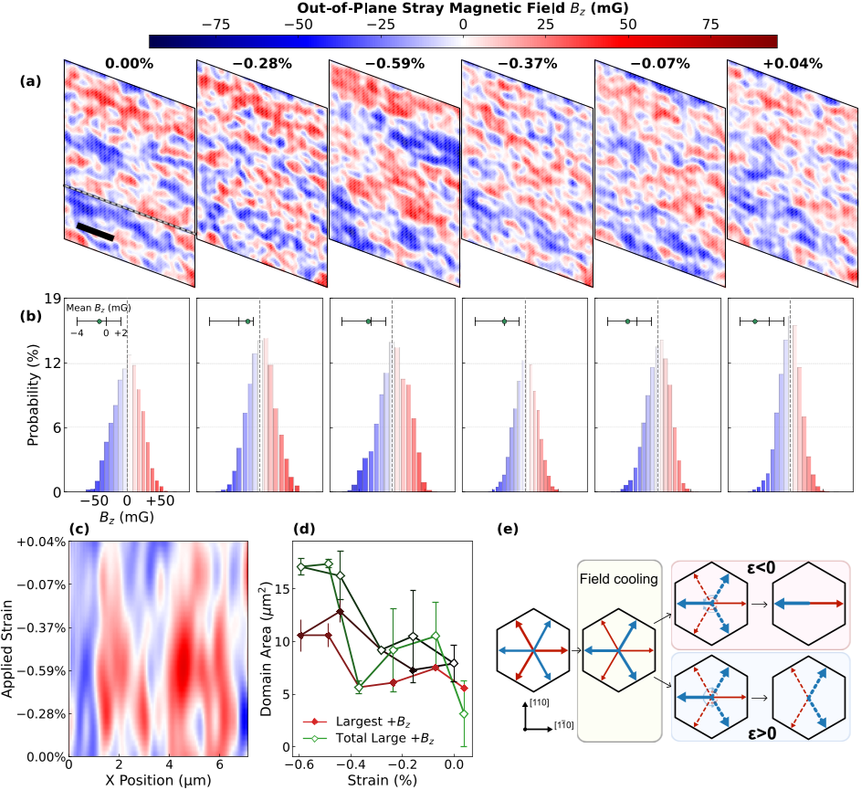

Imagine being able to control tiny magnetic regions inside a crystal simply by squeezing or stretching it. This is the promise of altermagnets, a new class of magnetic materials that could revolutionize how we store and manipulate information in spintronic devices. Recently, scientists have taken a major step forward by directly imaging how mechanical strain changes the magnetic domain patterns in α-MnTe at the nanoscale, revealing surprising behaviors that could pave the way for strain-programmable magnetic memories.

> **TL;DR**
> - Using advanced scanning magnetometry combined with precise strain control, researchers visualized how compressive strain causes magnetic domains in α-MnTe to merge and grow, while tensile strain fragments them into new, metastable patterns.
> - These strain-driven domain transformations exhibit hysteresis, meaning the magnetic texture remembers its strain history, highlighting domain connectivity and topology as key factors in strain-controlled magnetic memory.

*Note: this summary is based on a preprint — research shared ahead of formal peer review.*

Altermagnets are a recently discovered category of magnetic materials that blend features of antiferromagnets—materials with no net magnetization—and ferromagnets, which have spin-polarized electrons. This unique combination makes altermagnets promising for spintronics, a technology that uses electron spin rather than charge to process and store information. Unlike traditional ferromagnets, altermagnets avoid stray magnetic fields that can interfere with device operation. Among these materials, α-MnTe stands out because it exhibits collinear compensated magnetic order at room temperature and displays momentum-dependent spin splitting, a property useful for spintronic functionalities. However, controlling the magnetic order in altermagnets, particularly at the nanoscale, remains a challenge. Mechanical strain—applying controlled pressure or tension—offers a promising route to manipulate their magnetic domains without large magnetic fields, but the microscopic details of how strain reorganizes these domains were not well understood until now.

To explore how strain affects magnetic domains in α-MnTe, the researchers combined two cutting-edge techniques. First, they used scanning nitrogen-vacancy (NV) magnetometry, which employs a diamond probe containing a single atomic-scale NV center to sensitively detect stray magnetic fields at the nanoscale. This allowed them to map the out-of-plane magnetic field distribution above the sample surface with high spatial resolution. Second, they integrated a piezo-driven uniaxial strain cell capable of applying precise, tunable strain along a specific crystallographic direction—the nearest-neighbor Mn-Mn bond axis—while imaging. By correlating atomic force microscopy (AFM) topography scans with NV magnetometry, they quantified the exact strain applied and tracked the evolution of magnetic domains in bulk α-MnTe crystals at room temperature through a full strain cycle from zero strain to compression, slight tension, and back.

The NV magnetometry images revealed a complex landscape of magnetic domains that changed dramatically with strain. Under increasing compressive strain, the magnetic domains with a particular out-of-plane moment sign coalesced, growing larger and reducing the density of domain walls. This indicated that strain drives domain boundaries to move and merge compatible domains, favoring a strain-selected magnetic configuration. However, when the strain was released and swept toward tension, the domain network did not simply revert. Instead, the large connected domains fragmented into a new metastable arrangement, showing pronounced hysteresis—the magnetic texture retained memory of the strain history. This behavior highlights that domain connectivity and topology are crucial carriers of strain-induced magnetic memory in α-MnTe. The researchers illustrated these changes with spatial maps and statistical analyses of domain sizes, confirming that strain tuning can dynamically reshape magnetic textures at the nanoscale.

These findings provide the first direct nanoscale visualization of how mechanical strain controls magnetic domain evolution in an altermagnet, unveiling microscopic pathways involving domain coalescence and hysteretic fragmentation. By establishing domain-boundary motion and metastability as central mechanisms, this work opens a route toward strain-programmable altermagnetic textures. Such control is vital for developing reconfigurable spintronic devices that operate without stray magnetic fields and with low energy consumption. The demonstrated ability to manipulate magnetic memory through mechanical means could inspire new device architectures where strain acts as a versatile handle for information storage and processing, advancing the field of spintronics.

While the study offers compelling insights, it focuses on the out-of-plane stray magnetic field component, which cannot uniquely determine the full in-plane Néel-vector orientation due to symmetry constraints. Therefore, the local continuous rotation of the Néel vector under strain remains unresolved. Additionally, the experiments were conducted at room temperature on bulk crystals with relatively modest strain ranges to avoid sample damage. Practical spintronic applications will require further research to understand domain dynamics under device-relevant conditions, including at smaller scales, different temperatures, and under electrical control. Nonetheless, the approach and findings provide a valuable foundation for future exploration of strain-controlled altermagnetic devices.

## Figures

*Magnetic field changes in a material were tracked during stretching and compressing, showing how strain shifts magnetic domain sizes and orientations. — Figure from Alex L. Melendez et al., [CC BY 4.0](http://creativecommons.org/licenses/by/4.0/), caption edited.*

![Graph shows how domain wall density and magnetic field spread change with strain along \[110\], comparing early and later measurements.](./figure-2.png)
*Graph shows how domain wall density and magnetic field spread change with strain along [110], comparing early and later measurements. — Figure from Alex L. Melendez et al., [CC BY 4.0](http://creativecommons.org/licenses/by/4.0/), caption edited.*

## Sources

- [Nanoscale Imaging of Strain-Controlled Altermagnetic Domains in α-MnTe](https://arxiv.org/abs/2607.26495)
- DOI: [10.48550/arxiv.2607.26495](https://doi.org/10.48550/arxiv.2607.26495)

*This article reuses and adapts text and figures from the original research by Alex L. Melendez et al., available via arXiv Materials Science, under the [CC BY 4.0](http://creativecommons.org/licenses/by/4.0/) license.*
