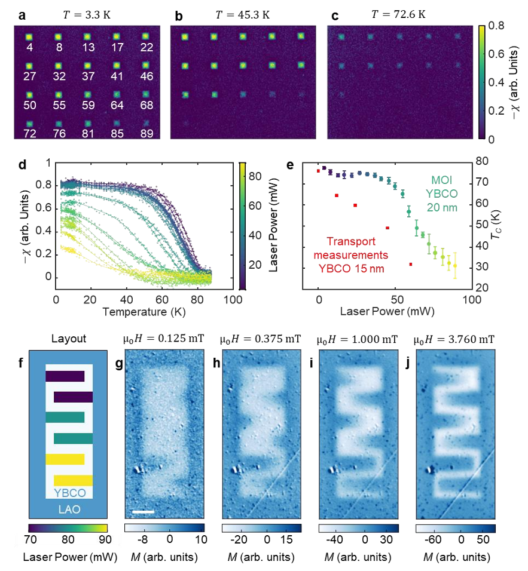
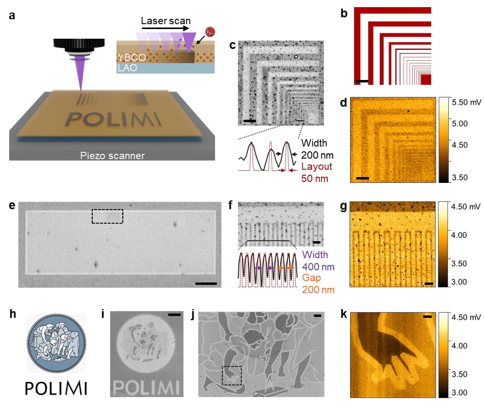
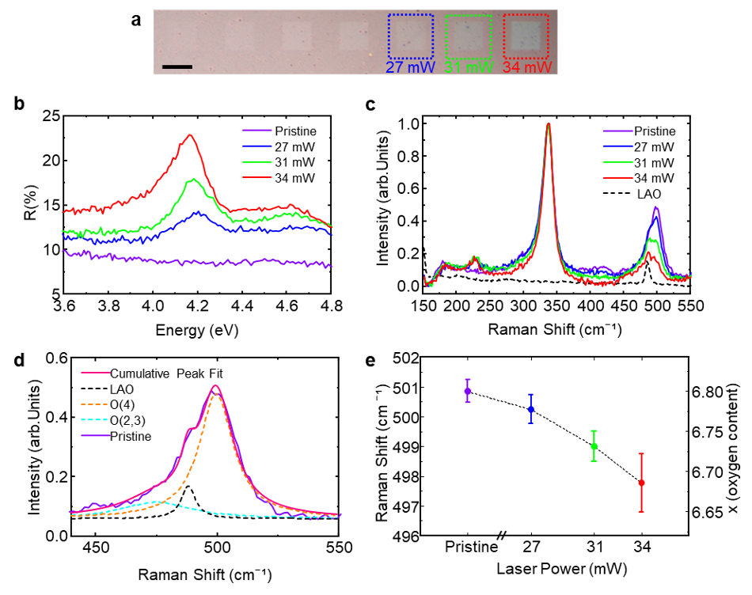
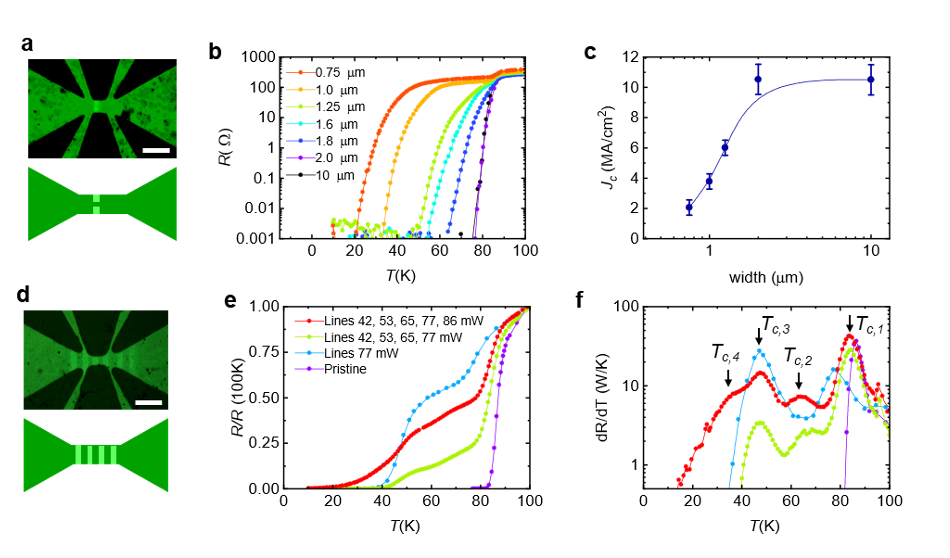

Imagine being able to 'draw' superconducting circuits with a laser, shaping where electricity flows without resistance at the scale of just a few hundred nanometers. This is no longer science fiction. Researchers have developed a groundbreaking method to precisely tune superconductivity in thin films of a high-temperature superconductor by using a focused laser beam to control oxygen atoms at the nanoscale. This advancement could pave the way for more scalable and flexible quantum technologies and ultra-efficient electronic devices.

> **TL;DR**
> - A focused laser beam can locally adjust the oxygen content in YBCO thin films, finely tuning their superconducting properties with sub-micrometer precision.
> - This maskless, non-destructive laser writing method enables scalable fabrication of complex superconducting nanostructures, potentially benefiting quantum computing and low-power electronics.

*Note: this summary is based on a preprint — research shared ahead of formal peer review.*

Yttrium Barium Copper Oxide (YBCO) is a celebrated high-temperature superconductor known for its ability to conduct electricity without resistance at temperatures up to 92 K, achievable with liquid nitrogen cooling. This makes it a promising candidate for next-generation quantum devices, superconducting sensors, and energy-efficient electronics. However, fabricating nanoscale structures in YBCO has been challenging because conventional nanofabrication techniques often damage its delicate crystal structure, degrading its superconducting properties. Since YBCO’s superconductivity strongly depends on its oxygen content, controlling oxygen atoms precisely at the nanoscale offers a promising route to engineer its electronic phases and device functionalities.

The researchers employed a maskless direct laser writing technique using a focused continuous-wave 405 nm diode laser scanned across YBCO thin films under ambient conditions. By varying the laser power and exposure time, they induced controlled oxygen depletion in targeted regions without physically damaging the crystal lattice. This approach allows grayscale patterning—creating continuous variations in superconducting properties rather than just on/off states—over large areas with sub-micrometer spatial resolution. The team characterized the patterned films using scanning electron microscopy, electrostatic force microscopy, Raman spectroscopy, and cryogenic magneto-optical imaging to correlate local oxygen content with superconducting behavior.

The laser writing produced sharp, nanoscale patterns with widths down to about 200 nm, confirmed by electron microscopy and electrostatic force microscopy. These patterns exhibited locally reduced oxygen levels, leading to a decrease in charge carrier density and superconducting critical temperature (Tc). Magneto-optical imaging revealed that regions exposed to higher laser powers lost superconductivity at progressively lower temperatures, enabling spatial tuning of superconductivity across the film. The team demonstrated complex geometries, including meandering superconducting paths and grayscale logos, showcasing precise control over superconducting and normal-state properties. Raman spectroscopy confirmed that laser power directly influences oxygen depletion, validating the method’s mechanism.

This laser-based oxygen tuning technique presents a scalable, non-destructive way to engineer superconducting nanostructures with unprecedented spatial precision. By circumventing the damage caused by traditional nanofabrication methods, it opens new possibilities for integrating YBCO into advanced quantum circuits, superconducting sensors, and low-power electronics. The ability to continuously modulate superconducting properties at the nanoscale could also facilitate explorations of complex electronic phases in cuprates, deepening our understanding of high-temperature superconductivity. Ultimately, this approach could accelerate the development of practical devices that harness the unique advantages of high-Tc superconductors.

While promising, this technique currently requires careful optimization of laser parameters to achieve desired oxygen stoichiometry without over-depleting oxygen and fully suppressing superconductivity. The minimum feature size demonstrated is around 200 nm, which, though impressive, may limit some applications requiring even finer resolution. Additionally, the long-term stability of the laser-induced oxygen patterns under operational conditions remains to be studied. Further research is needed to integrate this method with device fabrication workflows and to explore its compatibility with other superconducting materials.

## Figures

*Images show how laser power affects magnetic behavior and superconductivity in tiny YBCO squares as temperature and magnetic field change. — Figure from Irene Biancardi et al., [CC BY 4.0](http://creativecommons.org/licenses/by/4.0/), caption edited.*

*A laser scans YBCO films to create tiny oxygen patterns, shown in detailed images and a grayscale logo design at nanoscale precision. — Figure from Irene Biancardi et al., [CC BY 4.0](http://creativecommons.org/licenses/by/4.0/), caption edited.*

*Laser-patterned squares show changes in light reflection and oxygen levels, revealing how laser power affects material structure and oxygen content. — Figure from Irene Biancardi et al., [CC BY 4.0](http://creativecommons.org/licenses/by/4.0/), caption edited.*

*Images and graphs show how tiny patterns control the temperature at which materials stop conducting electricity. — Figure from Irene Biancardi et al., [CC BY 4.0](http://creativecommons.org/licenses/by/4.0/), caption edited.*

## Sources

- [Nanoscale Spatial Tuning of Superconductivity in Cuprate Thin Films via Direct Laser Writing](https://arxiv.org/abs/2601.09513)
- DOI: [10.1002/adfm.77288](https://doi.org/10.1002/adfm.77288)

*This article reuses and adapts text and figures from the original research by Irene Biancardi et al., available via Advanced Functional Materials (2026): e77288, under the [CC BY 4.0](http://creativecommons.org/licenses/by/4.0/) license.*
