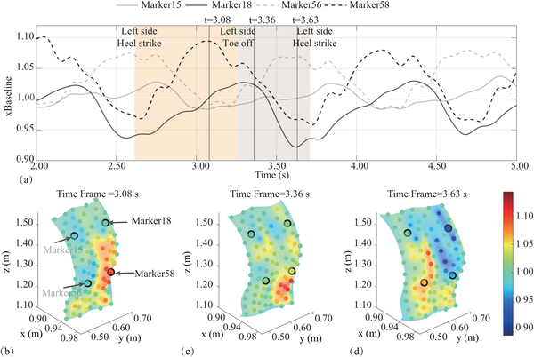
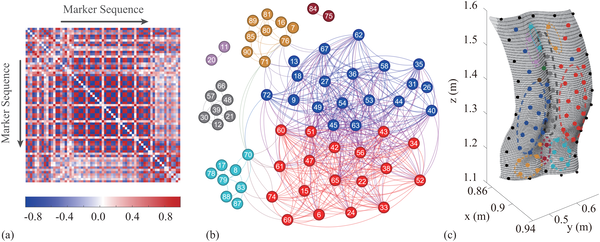
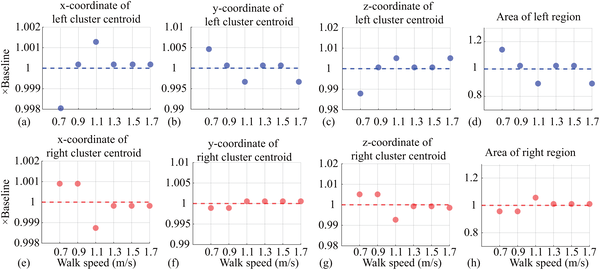

Have you ever wondered how your back moves as you take each step? It turns out that the skin on your back doesn’t just stretch and compress randomly—it follows a surprisingly coordinated and rhythmic dance. Scientists have now discovered that your trunk moves as a modular system with synchronized regions working together during walking. This new understanding could pave the way for better diagnosis and treatment of common back problems without invasive procedures.

> **TL;DR**
> - The human back’s skin surface deforms in distinct, synchronized regions during walking, reflecting underlying musculoskeletal coordination.
> - Using network analysis on skin deformation data, researchers identified stable modular patterns that persist across different walking speeds, revealing the trunk as a dynamic, coordinated system rather than rigid segments.

The human trunk plays a vital role in maintaining balance and enabling movement, yet its complex biomechanics during walking remain poorly understood. Traditional models often simplify the torso into rigid parts, overlooking the continuous and nuanced deformations that occur. This gap limits our ability to understand and treat spinal disorders like low back pain and scoliosis, which affect millions worldwide. While imaging techniques like MRI provide detailed anatomy, they capture only static snapshots, missing the dynamic interplay during motion. To address this, researchers have turned to the skin surface as a non-invasive window into the trunk’s underlying mechanics, leveraging advances in surface topography and computational analysis.

In this study, scientists placed a dense array of reflective markers across the backs of volunteers and recorded the subtle changes in skin surface area as participants walked at various speeds. By tracking how local patches of skin stretched or compressed over time, they generated detailed maps of surface deformation. They then applied network science techniques, specifically community detection algorithms, to analyze correlations between these skin movements. This approach allowed them to identify ‘synchronous deformation regions’—clusters of skin areas that moved together rhythmically, revealing the trunk’s modular organization during gait.

The analysis revealed that the back’s skin does not behave as a uniform sheet but rather as a set of distinct, synchronized modules. Two large clusters on either side of the spine showed anti-phase deformation patterns—when one side stretched, the other compressed—mirroring the natural twisting and balancing motions of walking. A stable midline cluster aligned with the spine acted as a boundary between these lateral regions. Additionally, researchers found long-range connections linking distant parts of the back, such as the shoulder and hip areas, indicating coordinated cross-body interactions. Importantly, these modular patterns remained consistent across walking speeds from slow to brisk, highlighting their robustness and physiological significance.

This novel framework offers a fresh perspective on trunk biomechanics by treating the back as a dynamic, modular system rather than rigid segments. Because it relies on non-invasive skin surface measurements, it holds promise for developing practical tools to assess and monitor spinal function in clinical settings. For example, deviations from these typical modular patterns could serve as early indicators of conditions like scoliosis or low back pain. Ultimately, this approach could inform more precise rehabilitation strategies tailored to an individual’s unique movement patterns, improving outcomes and reducing reliance on invasive diagnostics.

While these findings are promising, the study represents a proof-of-concept with a relatively small sample size. Further research involving larger and more diverse populations, including patients with spinal disorders, is needed to validate the clinical utility of this method. Additionally, integrating this surface-based approach with internal imaging and muscle activity data could deepen understanding of the complex interactions driving trunk motion. As with any new technique, careful calibration and standardization will be essential to translate these insights into routine clinical practice.

## Figures

*Skin on the back stretches and compresses in a repeating pattern as we walk, shown at key moments in a walking step.*

*Heatmap and network analysis reveal distinct synchronized regions and functional clusters in marker data, mapped onto spatial areas with color-coded boundaries.*

*Cluster positions and sizes stay consistent across walking speeds, showing the method reliably tracks movement patterns.*

## Sources

- [Network analysis of surface deformation reveals trunk modularity and synchronization during gait](https://journals.plos.org/ploscompbiol/article?id=10.1371/journal.pcbi.1014388)
- DOI: [10.1371/journal.pcbi.1014388](https://doi.org/10.1371/journal.pcbi.1014388)
