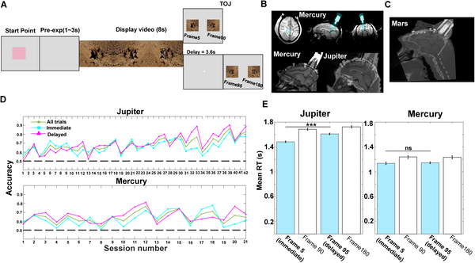
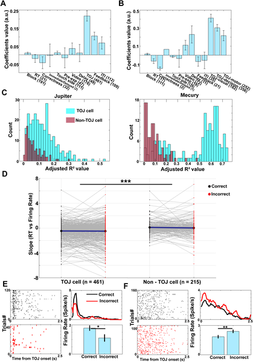
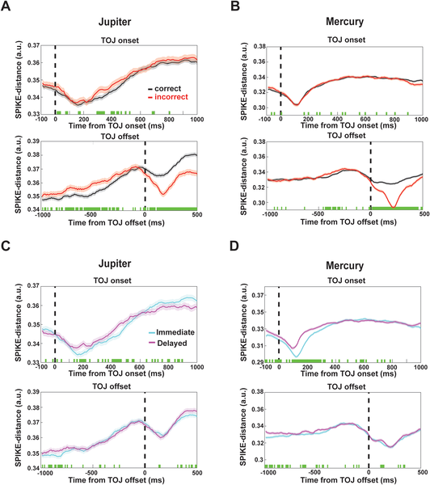
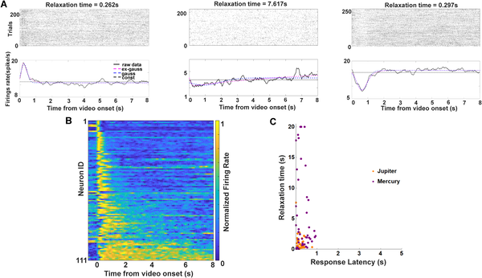

Have you ever wondered how your brain remembers the order in which things happened? Whether recalling what you ate for breakfast before or after checking your phone, your brain keeps track of time in ways scientists are still uncovering. A surprising new study shows that a less-studied brain region in monkeys, the medial posterior parietal cortex, helps encode and retrieve memories about the sequence of events, shedding light on how our brains organize experiences over time.

> **TL;DR**
> - Neurons in the medial posterior parietal cortex (mPPC) of macaques exhibit evolving activity patterns that represent the flow of time during event encoding.
> - During memory retrieval, coordinated neural synchrony in the mPPC predicts how well monkeys judge the temporal order of events.

Previous research on how the brain remembers the order of events has mostly focused on the hippocampus and prefrontal cortex, regions well known for their roles in memory and decision-making. However, the medial posterior parietal cortex (mPPC), located near the back and middle of the brain, has received less attention despite evidence suggesting it contributes to temporal context and memory retrieval. Understanding how the mPPC supports temporal order memory could fill important gaps in our knowledge of how the brain encodes the flow of time within experiences.

To explore this, researchers recorded electrical activity from hundreds of neurons in the mPPC of macaque monkeys as they watched short, naturalistic videos. After viewing, the monkeys performed a temporal order judgment task: they were shown two still frames from the video and had to choose which frame appeared earlier. The experiments included immediate and delayed testing conditions to assess memory over different time spans. The team used multi-unit electrophysiology to capture population-level neural activity and applied statistical models to isolate memory-related signals from sensory or motor influences. They also controlled for eye movements to ensure neural effects were not driven by visual scanning behaviors.

The study found that during video viewing (encoding), ensembles of neurons in the mPPC showed gradually changing activity patterns that reflected the unfolding temporal context of the events. When the monkeys later retrieved these memories to judge the order of frames, the neurons exhibited coordinated, synchronous firing that predicted the monkeys’ accuracy. Importantly, the similarity between neural activity patterns during encoding and retrieval on a trial-by-trial basis correlated with successful temporal order judgments. These results suggest that the mPPC forms dynamic temporal representations during experience and reinstates them during memory retrieval to guide decision-making.

These findings expand our understanding of temporal order memory by highlighting the mPPC as a critical hub that links extended experiences with retrieval processes. Unlike simple sensory or motor responses, the mPPC’s population-level dynamics appear to integrate temporal information across seconds, supporting how memories are organized in time. This insight complements existing knowledge about the hippocampus and prefrontal cortex, suggesting a broader network involved in encoding and recalling the sequence of events. Such advances could eventually inform approaches to memory disorders where temporal sequencing is impaired.

While the study provides robust evidence from well-controlled experiments in macaques, it focuses on a specific brain region and task with naturalistic but constrained stimuli. How these findings translate to humans and more complex real-world memories remains to be explored. Additionally, the neural recordings capture population-level activity but cannot fully resolve the contributions of individual neuron types or circuit mechanisms. Future research could investigate how the mPPC interacts with other brain areas during temporal memory and how these dynamics develop over longer timescales.

## Figures

*Monkeys watched videos, then chose which image came first; brain scans show where electrodes recorded their brain activity during the task.*

*Neurons in mPPC show strongest activity changes during TOJ tasks, especially in early, retrieval, and response phases of the task.*

*Brain cell activity synchrony rises during correct memory tasks, especially when tested immediately, showing how timing affects recall success.*

*Neurons show varied response times and decay rates during video viewing, reflecting how the brain processes and remembers visual events over seconds.*

## Sources

- [Neural population dynamics and temporal context cells in macaque medial parietal cortex support temporal order memory](https://journals.plos.org/plosbiology/article?id=10.1371/journal.pbio.3003759)
- DOI: [10.1371/journal.pbio.3003759](https://doi.org/10.1371/journal.pbio.3003759)
