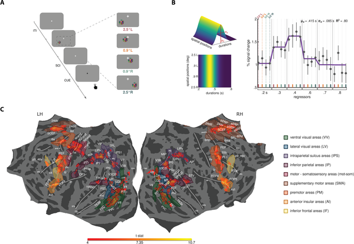
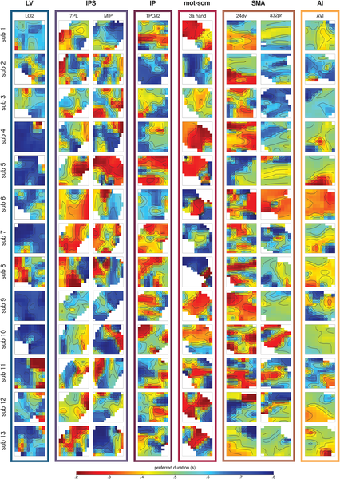
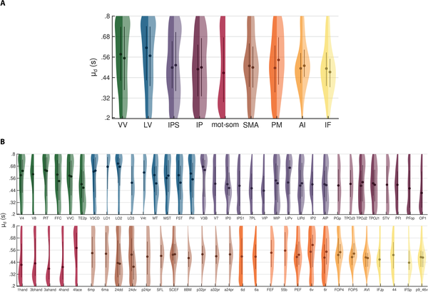

Have you ever wondered how your brain knows when a flash of light lasts just a fraction of a second? Time perception, especially for very brief intervals, is a fundamental part of how we experience the world, yet understanding how the brain accomplishes this feat remains a challenge. Recent research using ultra-high-resolution brain imaging has begun to unravel the neural code that allows us to perceive, categorize, and subjectively experience visual durations.

> **TL;DR**
> - Distinct populations of neurons across the cortex are tuned to specific visual durations, from very short to longer fractions of a second.
> - These neuronal populations are organized hierarchically, with some brain areas encoding precise durations, and others representing categorical or subjective perceptions of time.

Time is woven into every moment of our lives, yet the brain’s mechanisms for tracking brief moments—on the order of hundreds of milliseconds—are complex and distributed. Previous research identified a network of brain regions involved in timing, but how these areas represent time, and how this relates to our subjective experience, was unclear. Some neurons respond selectively to specific durations, but whether these responses differ across brain regions or align with how we perceive time was not well understood. This study aimed to clarify these questions by examining how different parts of the cortex encode visual durations and how these neural codes relate to our perception.

Researchers recruited thirteen healthy adults who performed a visual duration categorization task while undergoing functional magnetic resonance imaging (fMRI) at ultra-high field strength (7 Tesla). Participants viewed brief visual stimuli—colored noise patches lasting between 0.2 and 0.8 seconds—and judged whether each was shorter or longer than a reference duration of 0.5 seconds. The team used advanced modeling techniques to analyze brain activity patterns and identify neuronal populations tuned to specific durations, regardless of where on the screen the stimulus appeared. They focused on multiple well-defined cortical areas spanning visual, parietal, motor, and frontal regions to map how duration preferences varied across the brain.

The study revealed a fascinating hierarchy of duration tuning across the cortex. In parietal and premotor areas, as well as the caudal supplementary motor area (SMA), neurons were tuned to a broad range of discrete durations, forming topographic maps where neighboring neurons preferred similar durations. In contrast, more frontal regions—including the rostral SMA, inferior frontal cortex, and anterior insula—showed neuronal preferences centered around the average duration of 0.5 seconds. These frontal areas’ tuning correlated with participants’ subjective boundary for categorizing durations as short or long, suggesting these regions encode categorical and subjective aspects of time perception. Moreover, correlations between neuronal preferences across areas indicated a hierarchical organization, progressing from precise duration encoding in sensory-motor regions to more abstract, categorical representations in frontal cortex.

This work provides a mechanistic framework for how the brain transforms raw temporal information into flexible perceptual categories. By identifying distinct neuronal populations that encode discrete durations and others that reflect subjective timing judgments, the study advances our understanding of the neural basis of time perception. These insights could inform future research into disorders where time perception is altered, such as Parkinson’s disease or schizophrenia, and may contribute to developing interventions targeting timing deficits. Furthermore, the hierarchical organization uncovered here aligns with broader principles of sensory processing, where early brain regions encode precise stimulus features and higher areas integrate this information into meaningful percepts.

While the study offers compelling evidence for hierarchical duration tuning, it focused exclusively on visual durations within a narrow range (0.2 to 0.8 seconds) and a specific task context. Whether similar neural coding principles apply to other sensory modalities or longer time intervals remains to be explored. Additionally, the sample size was modest, and the findings rely on correlational fMRI data, which cannot establish causal relationships. Future studies combining different methodologies, such as electrophysiology or brain stimulation, could further elucidate how these neuronal populations contribute to time perception and behavior.

## Figures

*Participants compared brief visual durations shown in different screen spots to a reference time, responding after a color cue during trials.*

*Maps show brain areas' preferred time durations from 0.2s (red) to 0.8s (blue) across different regions and participants.*

*Violin plots show how brain areas differ in preferred time durations, with colors marking regions and sides showing left and right brain hemispheres.*

## Sources

- [Neuronal populations across the cortex underlie discrete, categorical, and subjective representations of visual durations](https://journals.plos.org/plosbiology/article?id=10.1371/journal.pbio.3003704)
- DOI: [10.1371/journal.pbio.3003704](https://doi.org/10.1371/journal.pbio.3003704)
