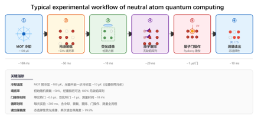
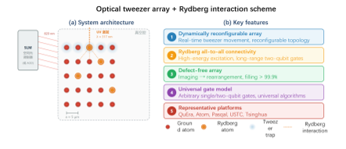
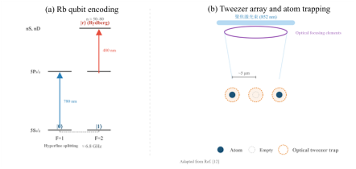
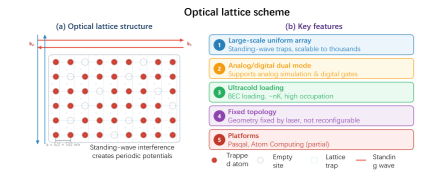

Imagine controlling thousands of individual atoms, each acting as a tiny quantum bit, arranged and manipulated with beams of light to perform calculations far beyond the reach of today's computers. This is the promise of neutral atom quantum computing—a rapidly advancing technology that leverages the strange and powerful properties of atoms excited to exotic states called Rydberg states. In recent years, researchers have made remarkable progress, scaling up to thousands of qubits and demonstrating key steps toward fault-tolerant quantum machines.

> **TL;DR**
> - Neutral atom quantum computers use laser traps to hold and control thousands of atoms, encoding quantum information in their internal states and exploiting strong interactions between highly excited Rydberg states to perform quantum logic gates.
> - Recent breakthroughs include arrays of over 6,000 atoms, continuous operation of 3,000-qubit systems, demonstrations of quantum error correction, and architectures moving toward fault tolerance, though challenges remain in scalability, error management, and system engineering.

*Note: this summary is based on a preprint — research shared ahead of formal peer review.*

Quantum computing aims to harness quantum mechanics to solve problems that are intractable for classical computers. Various physical systems serve as quantum bits (qubits), including superconducting circuits, trapped ions, and photons. Neutral atom quantum computing stands out for its scalability and flexibility: atoms are identical natural qubits, can be trapped and arranged in large, reconfigurable arrays at room temperature, and benefit from long coherence times. Since around 2020, this platform has seen explosive growth, moving from hundreds to thousands of qubits, and from basic demonstrations to logical qubits and error correction experiments.

At the heart of neutral atom quantum computing are optical tweezers—highly focused laser beams that create tiny traps for single atoms, typically rubidium or cesium. These atoms encode qubits in their hyperfine ground states, which are stable and coherent over seconds. To perform quantum gates, atoms are excited via two-photon transitions to Rydberg states, where their electrons orbit far from the nucleus, producing extremely strong dipole-dipole interactions. These interactions enable the Rydberg blockade effect: when one atom is excited to a Rydberg state, it prevents nearby atoms from being excited, allowing entangling gates such as the controlled-phase (CZ) gate. Dynamic rearrangement of atoms using movable tweezers allows flexible connectivity between qubits, overcoming limitations of fixed nearest-neighbor coupling found in other platforms.

The field has achieved remarkable milestones: arrays with over 6,100 atoms have been realized, and continuous operation of 3,000-qubit systems has been demonstrated. Researchers have used these systems to simulate complex quantum models like the Kitaev honeycomb model, and to implement quantum error correction codes such as the toric code. Encoding rates exceeding 50% and fault-tolerant architectures are now within reach. Innovations in atom rearrangement, including AI-driven simultaneous repositioning of thousands of atoms, have dramatically improved the speed and scalability of defect-free array preparation.

Neutral atom quantum computing offers a promising route toward scalable, fault-tolerant quantum machines without the need for extreme cryogenic environments. Its ability to dynamically reconfigure qubit connectivity and to trap thousands of identical qubits could accelerate progress toward practical quantum advantage in simulation, optimization, and cryptography. The platform’s recent advances in error correction and logical qubit implementation mark critical steps beyond proof-of-principle demonstrations, bringing real-world quantum computing closer to reality.

Despite impressive progress, significant challenges remain. Balancing scalability with gate fidelity is an ongoing struggle, as larger arrays increase complexity and error sources. Implementing full quantum error correction requires improvements in measurement, feedback, and atom loss mitigation. Engineering robust, industrial-grade laser and control systems that can operate at scale is still a hurdle. Additionally, establishing long-distance quantum interconnections to link multiple neutral atom processors is an open problem. While the field is advancing rapidly, practical fault-tolerant quantum computing is still a work in progress.

## Figures

*This figure shows how cold atoms are trapped, arranged, and manipulated with lasers to perform quantum computing in about 100 milliseconds. — Figure from Junchao Wang et al., [CC BY 4.0](http://creativecommons.org/licenses/by/4.0/), caption edited.*

*A laser beam is split into many focused spots to create a grid of tiny light traps that can control individual atoms. — Figure from Junchao Wang et al., [CC BY 4.0](http://creativecommons.org/licenses/by/4.0/), caption edited.*

*Rubidium atoms are trapped in laser-made spots and used as quantum bits, with lasers exciting them to special high-energy states. — Figure from Junchao Wang et al., [CC BY 4.0](http://creativecommons.org/licenses/by/4.0/), caption edited.*

*Two laser beams create a standing wave that traps atoms in a regular pattern, forming a large, uniform array for experiments. — Figure from Junchao Wang et al., [CC BY 4.0](http://creativecommons.org/licenses/by/4.0/), caption edited.*

## Sources

- [Neutral Atom Quantum Computing: Principles, Routes, Progress, and Challenges](https://arxiv.org/abs/2608.05010)
- DOI: [10.48550/arxiv.2608.05010](https://doi.org/10.48550/arxiv.2608.05010)

*This article reuses and adapts text and figures from the original research by Junchao Wang et al., available via arXiv Quantum Physics, under the [CC BY 4.0](http://creativecommons.org/licenses/by/4.0/) license.*
